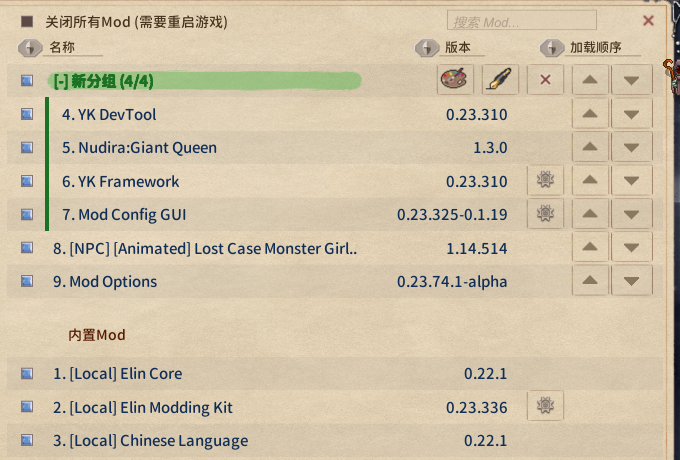

# Mod Config

Every mod can have its own config page, opened from its row in the mod viewer. A BepInEx plugin gets one generated from its `Config.Bind` entries; a plugin can also implement `IModConfig` and lay the page out itself.



The generated page:


## Your own layout: `IModConfig`

A plugin that implements `IModConfig` is **no longer** given the generated page. It builds its own in
`OnBuildConfig`:

| Extension (`using EModding;`) | What you get |
|-|-|
| `note.AddAll(Config)` | the whole generated page, sections included |
| `note.Add(entry)` | one entry, the widget picked by its type |
| `note.AddSlider(entry, min, max, label = null)` | a slider over the range given here, whatever the entry declares; a value outside the range is shown clamped and left alone until dragged |
| `note.AddDropdown(entry, values, label = null)` | a dropdown over these choices, for any entry type; a current value missing from the choices is listed first |

All of them read and write the entry directly and honour `SaveOnConfigSet`; labels go through `Lang.Get`. The page is rebuilt every time it is shown, so do not cache widget references; keep state that is not a `ConfigEntry` in your own fields and read and write it in the callbacks.

```cs
using System.Collections.Generic;
using BepInEx;
using BepInEx.Configuration;
using EModding;

[BepInPlugin("author.example", "Example", "1.0.0")]
public class ExamplePlugin : BaseUnityPlugin, IModConfig {
	public ConfigEntry<bool> enabled;
	public ConfigEntry<int> count;
	public ConfigEntry<string> preset;
	public string mode = "B", name = "hello";

	void Awake() {
		enabled = Config.Bind("General", "Enabled", true);
		count = Config.Bind("General", "Count", 5);
		preset = Config.Bind("General", "Preset", "b");
	}

	public void OnBuildConfig(UINote note) {
		note.AddHeader("General");
		note.Add(enabled);                                   // toggle
		note.AddSlider(count, 0, 100, "How many");           // slider, no AcceptableValueRange needed
		note.AddDropdown(preset, ["a", "b", "c"]); // fixed choices

		note.AddHeader("Advanced");

		// values that are not a ConfigEntry use the plain UINote methods
		var modes = ["A", "B", "C"];
		var dd = note.AddDropdown("Mode");
		dd.SetList(modes.IndexOf(mode), modes, (m, i) => m, (i, m) => mode = m, false);
		note.AddText("Which mode to use.", FontColor.Passive);

		UIButton b = null;
		b = note.AddButton("Name: " + name, () => Dialog.InputName("Name", name, (cancel, text) => {
			if (cancel) return;
			name = text;
			b.mainText.text = "Name: " + text;
		}, Dialog.InputType.Chat));

		note.AddTopic("Version", Info.Metadata.Version.ToString());
		note.AddButtonLink("Project page", "https://example.com/");
	}
}
```

Only want a few things after the generated page? Write `note.AddAll(Config);` first, then append to it.


To have your own state take part in the reset button, add a delegate to the package's `onResetConfig`. The BepInEx entries are already wired (every entry in `Config`, drawn on the page or not), so handle only your own here:

```cs
void Start() {
	var pkg = ModUtil.FindFileProviderPackage(new FileInfo(Info.Location));
	if (pkg != null) {
        pkg.onResetConfig += () => mode = "B";
    }
}
```

## `UINote` cheat sheet

| Method | What you get |
|-|-|
| `AddHeader(string)` / `AddHeaderTopic(string)` | section header (the one the generated page uses) / small heading |
| `AddToggle(string label, bool isOn, Action<bool>)` | toggle, returns `UIButton` (`interactable` disables it) |
| `AddSlider(float value, Func<float,string> action, float min = 0, float max = 1, bool isInt = false)` | slider; `action` writes the value and returns the label, and is also called once while building with the initial value clamped to the range; returns `Slider` |
| `AddDropdown(string label)` | label on the left, dropdown on the right, returns `UIDropdown`; fill it with `SetList(index, list, getName, onChange, notify: false)` |
| `AddButton(string text, Action)` | full-width button, returns `UIButton` |
| `AddText(string)` / `AddText(string, FontColor.Passive)` | body text, wraps and grows; `"NoteText_small"` is a fixed 20px single line and overflows on more |
| `AddTopic(string label, string value)` | label on the left, value on the right |
| `AddButtonLink(string text, string url)` | link |
| `Space(int height)` | empty row |
| `AddImage(Sprite)` / `AddPrefab(string path)` | image / your own prefab |
