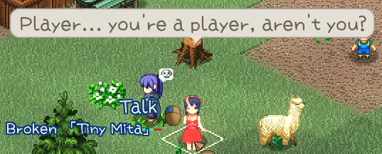

# SourceChara

## 表の説明

<LinkCard t="SourceCard/Chara" u="https://docs.google.com/spreadsheets/d/1CJqsXFF2FLlpPz710oCpNFYF4W_5yoVn/edit?gid=1953808581#gid=1953808581" />

ソーステーブルを作成するときは、**必ず公式ソーステーブルの最初の3行をそのままコピー**して、4行目以降にデータを入力してください。列の順番は絶対に変えないでください。

|列|タイプ|説明|
|-|-|-|
|id|テキスト|その項目を唯一無二に識別するための最重要IDです。キャラ表内で他のすべての項目と区別するために使われます。このIDがバニラや他のMODのIDと被った場合、最後に読み込まれたテーブルが優先されます。スペースは絶対に入れず、必要なら`snakecase`（例：`mymod_chara_yajyuu_senpai`）を使うことをおすすめします。|
|_id|整数|図鑑での表示順を決める数値です。重複しても問題ありません。|
|name_JP|テキスト|ゲーム内で実際に表示される日本語の名前です。|
|name|テキスト|ゲーム内英語名です。他の言語はSourceLocalization.jsonで対応します。|
|aka_JP|テキスト|ゲーム内で表示される二つ名・肩書きの日本語表記です。|
|aka|テキスト|二つ名・肩書きの英語表記です。他の言語はSourceLocalization.jsonで対応します。|
|idActor|テキスト|PCCパーツを使って描画するかどうかを制御します。例：`pcc,unique,jure` と書くと、`pcc/unique/jure`からPCCパーツを読み込みます。|
|sort|テキスト|SourceCharaでは使用していません。|
|size|テキスト|このキャラが占めるタイルサイズです。通常は空欄。`2,2`のように指定すると2×2タイルを占有し、押し出されなくなります。|
|_idRenderData|テキスト|スプライトシートの参照先を制御します。`chara`/`chara_L`などは**Texture Replace**のテクスチャと`tiles`のタイルIDを使用（スロットに限りがあり上書きされる可能性あり）。`@chara`は**Texture**内にある同じIDのテクスチャを直接使用します。MODキャラは**必ず**`@chara`を使用してください。|
|tiles|整数|スプライトシートのタイルID、またはMODキャラの場合は[skinset](../15_Texture%20Mods/skins)です。|
|tiles_snow|整数|雪マップで使用する代替タイルIDです。MODキャラは[テクスチャバリエーション](../15_Texture%20Mods/variation)を使用してください。|
|colorMod|整数|主に`100`と組み合わせて使用し、グレースケールのスプライトに`mainElement`の色を乗せる機能です。|
|components|テキスト|SourceCharaでは使用していません。|
|defMat|テキスト|SourceCharaでは使用していません。|
|LV|整数|キャラの「危険度」。マップの危険度に応じた生成判定、選択コスト（奴隷商人・調教師）、種族/職業ごとの基礎ステータス生成に影響します。|
|chance|整数|マップ生成確率の補正値（販売リストにも影響する可能性あり）。初期値は`100`です。|
|quality|整数|`0–2`：通常モンスター。`3`：ユニークモンスター（卵入手可能だが友達・捕獲・調教不可）。`4`：ユニークキャラ（卵のみ。友達にはなれるが捕獲・調教不可）。|
|hostility|テキスト|プレイヤー・味方・傍観者に対する性格。空欄だと`Hostile`（敵対）。`Neutral`は攻撃されない限り先制攻撃しない。`Friend`は味方に対して敵対的な対象を攻撃し、プレイヤーが怒っているときも攻撃します。|
|biome|テキスト|指定した床タイプでの生成率が上昇（場合により2倍）、それ以外では低下（場合により半減）します。例：`Water`にすると水上の床を強く好みます。|
|tag|テキスト|既知のタグ：`mini`（スプライト半分サイズ）、`noRandomProduct`（幸運の太鼓で下着が出ない可能性）、`random_color`（`colorMod=100`時に髪の色をランダム化）、`randomFish`、`staticSkin`（性別によるスプライト割り当てを固定）、`snow`（雪マップを好む）、`water`（水タイルを好む）など。|
|trait|テキスト|複雑な特性の羅列です。特性ドキュメントと`Trait*`クラスの実装を参照してください。|
|race|テキスト|SourceRaceの種族IDを指定します。|
|job|テキスト|SourceJobの職業ID。省略時は`none`になります。|
|tactics|テキスト|割り当てられた職業のデフォルト戦術を上書きします。|
|aiIdle|テキスト|待機時のAI行動を追加・上書きします。例：`Stand`（完全に動かず攻撃されても反応しない）、`Root`（攻撃されるか勧誘されるまで動かない）。|
|aiParam|テキスト|3つの数値（敵との理想距離、毎ターンその距離に移動する確率、まれに使う再移動確率）。|
|actCombat|テキスト|戦闘中に使用可能なSourceElementのIDをカンマ区切りで指定。`/N`で使用確率を固定できます。バフ系は`/pt`を付けるとパーティ全体に効果（味方バフのみ）。例：`ActThrowPotion/30,SpWeakness,SpSpeedDown,SpWisdom/50/pt`。省略時は確率100。|
|mainElement|テキスト|主要属性親和性。`Fire`、`Cold`、`Lightning`、`Darkness`、`Nether`、`Sound`、`Chaos`、`Poison`、`Cut`、`Acid`、`Impact`から選択。|
|elements|テキスト|受動的なSourceElementをカンマ区切りで指定。`/N`でレベル・数値を設定可能。`0`や負の値で種族からの継承を無効化・調整できます。例：`invisibility/1`（有効）、`invisibility/0`（継承無効）、`antidote/-30`（肉に毒を付与）など。|
|equip|テキスト|職業のランダム装備テンプレートを上書きします（**種族のEQが空でない場合のみ有効**）。例：盗賊職業に`equip=Archer`とすると弓兵装備になりますが、犬種族のように種族EQが空の場合は装備が生成されません。|
|loot|テキスト|追加ドロップアイテム（Thing/ThingVのID）をカンマ区切りで指定。後ろに`/N`を付け、20で+1%のドロップ率になります。例：`medal/500`=25%、`medal/3000`=150%（確定1個＋50%でもう1個）。|
|category|テキスト|ほとんどの項目はデフォルトの`chara`を使用します。|
|filter|テキスト|SourceCharaでは使用していません。|
|gachaFilter|テキスト|ガチャで最初にカテゴリ（resident/livestock/Unique/defaultなど）を選び、このフィルターで条件に合うキャラを抽出します。例：livestockカテゴリではlivestockタグを持つものだけが対象になります。|
|tone|テキスト|日本語テキストの会話トーン修飾子です。|
|actIdle|テキスト|非戦闘時の特殊行動。例：`readBook`（ランダム本を生成・読書・削除）、`buffMage`（定期的に`spResElement`や`spHero`などのバフ魔法を唱える）など。|
|lightData|テキスト|SourceCharaでは使用していません。発光色を設定できます。|
|idExtra|テキスト|SourceCharaでは使用していません。追加の描画データ。|
|bio|テキスト|スラッシュ区切りの値（空白なし）：`gender`（`m`/`f`/`n`、必須）、`birthyear`（任意）、`height`（任意）、`weight`（任意）、`chara_tone.xlsx`の`tone`（任意）、`chara_talk.xlsx`の`talk`（任意）。例：`f/51044/152/46/friendly|私|あなた`|
|faith|テキスト|固定の信仰。設定するとゲーム内で変更できなくなります。|
|works|テキスト|SourceHobbyのaliasを指定します。|
|hobbies|テキスト|SourceHobbyのaliasを指定します。|
|idText|テキスト|`CharaText`テーブル内の対応するIDと紐付けます。|
|moveAnime|テキスト|移動アニメーションの種類。`hop`または空欄。|
|factory|テキスト|SourceCharaでは使用していません。|
|components|テキスト|SourceCharaでは使用していません（重複列）。|
|recruitItems|テキスト|特殊な勧誘会話用アイテム。現在はmani専用です。|
|detail_JP|テキスト|SourceCharaでは使用しません。メモ用途としてご自由にどうぞ。|
|detail|テキスト|SourceCharaでは使用しません。メモ用途としてご自由にどうぞ。|

## 人間らしい会話にするには

Race表で`human`または`humanSpeak`タグを付ける以外に、Chara表に`humanSpeak`タグを付けることで、会話時に括弧（）を使わない自然な話し方になります。

## 生成設定

`tag`列を使って生成に関する設定を行えます。

### 特定のエリアに自動生成

キャラを特定のエリアに生成させたい場合は、`addZone_*`タグを使い、`*`の部分を対象エリアの**id**に置き換えてください。`*`のままにするとランダムなエリアに生成されます。

例：スタート地点の原野に生成させる → `addZone_startSite`
テルフィ地下1階に生成させる → `addZone_derphy/-1`

[SourceGame/Zone](https://docs.google.com/spreadsheets/d/16-LkHtVqjuN9U0rripjBn-nYwyqqSGg_/edit?gid=1819250752#gid=1819250752)の**id**列を参考にしてください。

`addZone`タグは1つにつきそのエリアに必ず1体生成されます。
例：`addZone_lumiest,addZone_little_garden,addZone_specwing,addZone_*` と書くと、指定した3エリア＋ランダム1エリアの計4体が生成されます。


### 初期装備・アイテムの追加

生成時に初期装備や所持アイテムを設定できます。`addEq_ItemID#Rarity`と`addThing_ItemID#Count`タグを使用します。

装備を指定する場合は`addEq_ItemID#Rarity`を使います。Rarityは以下のいずれかです：**Random、Crude、Normal、Superior、Legendary、Mythical、Artifact**。省略すると`#Random`になります。

(粗悪,普通,高品質,奇跡,神器,特別製)

例：奇跡級の`BS_Flydragonsword`と通常の`axe_machine`をメインウェポンに設定したい場合
```
addZone_palmia,addEq_BS_Flydragonsword#Legendary,addEq_axe_machine
```

所持アイテムを追加する場合は`addThing_ItemID#Count`を使います。`#Count`を省略すると1個になります。

例：`padoru_gift`を10個、`援軍の巻物`を5個持たせる場合
```
addZone_palmia,addThing_padoru_gift#10,addThing_1174#5
```

### 冒険者として登録する

traitに`AdventurerBacker`を設定すると、そのキャラが冒険者として登録され、冒険者ランキングに表示されるようになります。

## 独自の商人在庫を設定する

`addStock`タグと在庫用JSONファイルを使って、商人独自の在庫を定義できます。

在庫ファイルは`LangMod/**/Data/`フォルダに`stock_識別子.json`という名前で配置します（識別子はキャラIDや任意の文字列でOK）。例：`stock_my_cnpc.json`、`stock_unique_armor.json`

`addStock`タグだけ書くと、そのキャラのIDがそのまま使用されます。複数の在庫を組み合わせることも可能です。
例：`addStock,addStock_unique_items,addStock_unique_armor`

### 在庫ファイルの構造

```json
{
  "Items": [
    {
      "Id": "example_item",
      "Material": "",
      "Num": 1,
      "Restock": true,
      "Type": "Item",
      "Rarity": "Random",
      "Identified": true
    },
    {
      "Id": "example_item_limited",
      "Material": "granite",
      "Num": 1,
      "Restock": false,
      "Type": "Item",
      "Rarity": "Artifact",
      "Identified": true
    }
  ]
}
```

- `Items`：在庫アイテムの配列
- `Id`：必須。ThingのID（一部のタイプではElementのaliasや数字IDも可）
- `Material`：素材名。空欄だとThingに定義されたデフォルト素材を使用
- `Num`：個数（デフォルト1）
- `Restock`：`false`にすると補充されなくなり、1回限りで在庫がなくなる
- `Rarity`：`Random`、`Crude`、`Normal`、`Superior`、`Legendary`、`Mythical`、`Artifact`から選択（デフォルト`Normal`）
- `IdentifyLevel`：鑑定状態（`Identified`、`RequireSuperiorIdentify`、`KnowQuality`、`Unknown`）
- `BlessedState`：祝福状態（`Doomed`、`Cursed`、`Normal`、`Blessed`）

必要のない項目は省略できます。最低限`Id`だけあれば有効です。

### 在庫アイテムの種類

|Type|説明|
|-|-|
|Item|通常のアイテム。素材・レア度・個数に対応|
|Block|ブロック。ブロックaliasと素材から生成|
|Cassette|カセットテープ。`Id`はBGMの数値IDです|
|Currency|通貨。`money`、`money2`、`plat`、`medal`、`influence`、`casino_coin`、`ecopo`などが指定可能|
|Letter|手紙。`Id`は手紙ID、本文は`LangMod/XX/Text/Scroll`に配置|
|Obj|Objオブジェクト。aliasを指定|
|Perfume|香水。ElementのaliasまたはID|
|Plan|計画書。ElementのaliasまたはID|
|Potion|ポーション。ElementのaliasまたはID|
|Recipe|レシピ|
|RedBook|赤本。`Id`は書籍ID、本文は`LangMod/XX/Text/Book`に配置|
|Rod|杖。ElementのaliasまたはID。`Num`で充填回数|
|Rune|ルーン。ElementのaliasまたはID|
|RuneFree|無法のルーン。ElementのaliasまたはID|
|Scroll|巻物。ElementのaliasまたはID|
|Skill|技術書。ElementのaliasまたはID|
|Spell|魔法書。ElementのaliasまたはID|
|Usuihon|薄い本。宗教IDを指定|

## セリフ＆吹き出し

### 状況別吹き出し

特定の状況でキャラの頭上に短いセリフを吹き出しで表示できます。



これらのセリフは**CharaText**テーブルに書き、キャラ側の`idText`欄にそのIDを入れることで紐付けます。


|列|状況|
|-|-|
|calm|普段|
|fov|視界に入ったとき|
|aggro|戦闘開始時|
|dead|死亡時|
|kill|敵を倒したとき|

### 「話がしたい」

キャラに「話がしたい」と話しかけたときの専用会話を追加したい場合は、`LangMod/**/Dialog/`フォルダに`dialog.xlsx`を用意します。

このテーブルの形式はゲーム本体の`Elin/Package/_Elona/Lang/_Dialog/dialog.xlsx`と同じですが、`unique`シートだけ使い、自分のキャラIDの行だけ書けば大丈夫です。


ここでのIDはキャラのIDと完全に一致させてください。

::: warning 注意
dialog.xlsxのデータは5行目から書き始めてください（ソーステーブルの4行目開始とは異なります）。
:::

## 剧情（ドラマ）

選択肢付きの会話や特殊な動作を組み合わせた、深い交流システムです。

剧情に関する詳細は別章に移動しました。

<LinkCard t="剧情" u="/100_Mod Documentation/Custom Whatever Loader/Drama/0_basic.md" />
