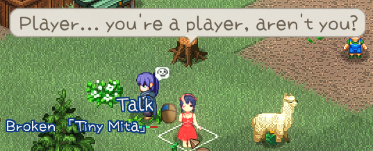

# キャラシート (Chara)

## 表の説明

<LinkCard t="SourceChara" u="https://docs.google.com/spreadsheets/d/1CJqsXFF2FLlpPz710oCpNFYF4W_5yoVn/edit?gid=1953808581#gid=1953808581" />

**ソーステーブルを作成するときは、必ず公式ソーステーブルの最初の3行をそのままコピーし、4行目以降にデータを入力してください。**

::: details 列、空行、空セルについて
**足りない列はエラーも出さずに空の値で埋められます**ので、公式テーブルのヘッダー行はまるごとコピーし、列を削らず、列の順序も変更しないでください。

**`id` が空の行があると、そこでシートの読み込みが打ち切られます。** それ以降の行はすべて読み込まれず、警告も出ません。意図的でない限り、データの区切りに空行を使わないでください。

**空セルは空の値ではありません**。ゲームは3行目のデフォルト値にフォールバックします。`race` は `norland`、`job` は `none`、`category` は `chara`、`_idRenderData` は `chara`、`LV` は `1`、`chance` は `100`、`tiles` と `colorMod` は `0` が既定値です。

3行目のデフォルト値を書き換えれば、それを他のすべての行に適用できます。データは4行目から入力してください。
:::

|列|タイプ|説明|
|-|-|-|
|id|テキスト|その項目を唯一無二に識別するための最重要IDです。キャラ表内で他のすべての項目と区別するために使われます。このIDがバニラや他のMODのIDと被った場合、最後に読み込まれたテーブルが優先されます。スペースは絶対に入れず、必要なら`snakecase`（例：`mymod_chara_yajyuu_senpai`）を使うことをおすすめします。|
|_id|整数|図鑑での表示順を決める数値です。重複しても問題ありません。|
|name_JP|テキスト|ゲーム内で実際に表示される日本語の名前です。|
|name|テキスト|ゲーム内英語名です。他の言語はSourceLocalization.jsonで対応します。|
|aka_JP|テキスト|ゲーム内で表示される二つ名・肩書きの日本語表記です。|
|aka|テキスト|二つ名・肩書きの英語表記です。他の言語はSourceLocalization.jsonで対応します。|
|idActor|テキスト[]|PCCパーツを使って描画するかどうかを制御します。例：`pcc,unique,jure` と書くと、`pcc/unique/jure`からPCCパーツを読み込みます。|
|sort|整数|SourceCharaでは使用していません。|
|size|整数[]|このキャラが占めるタイルサイズです。通常は空欄。`2,2`のように指定すると2×2タイルを占有し、押し出されなくなります。|
|_idRenderData|テキスト|スプライトシートの参照先を制御します。`chara`/`chara_L`などは**Texture Replace**のテクスチャと`tiles`のタイルIDを使用（スロットに限りがあり上書きされる可能性あり）。`@chara`は**Texture**内にある同じIDのテクスチャを直接使用します。MODキャラは**必ず**`@chara`を使用してください。なお空欄は「描画データなし」ではなく、3行目のデフォルト値 `chara`（＝タイルシート方式）にフォールバックします。MODキャラで `@chara` を書かないとスプライトがおかしくなるのはこのためです。|
|tiles|整数[]|スプライトシートのタイルID、またはMODキャラの場合は[skinset](../15_Texture%20Mods/skins)です。|
|tiles_snow|整数[]|雪マップで使用する代替タイルIDです。MODキャラは[テクスチャバリエーション](../15_Texture%20Mods/variation)を使用してください。|
|colorMod|整数|色の彩度補正。主に`100`と組み合わせて使用し、グレースケールのスプライトに`mainElement`の色を乗せる機能です。`0` は着色しないという意味です。|
|components|テキスト[]|SourceCharaでは使用していません。|
|defMat|テキスト|デフォルトの死体素材。SourceBlock 内の Material サブシートの alias 列から選択します。空欄の場合は種族のデフォルト素材を使用します。|
|LV|整数|キャラの「危険度」。マップの危険度に応じた生成判定、選択コスト（奴隷商人・調教師）、種族/職業ごとの基礎ステータス生成に影響します。|
|chance|整数|マップ生成確率の補正値（販売リストにも影響する可能性あり）。初期値は`100`です。|
|quality|整数|レアリティ段階。空欄は `0` として扱われます。**MOD を作る際は `0`・`3`・`4` の中から選んでください。** `0`：通常。`3`：ネームドモンスター（名前の表示時に `《》` で囲まれる；受精卵からは同種が孵化する）。`4`：ユニークキャラ（名前の表示時に `『』` で囲まれる；受精卵からは鶏しか孵化しない；マップの再生成時に重複して生成されない）。`3` と `4` はどちらもモンスターボールでの捕獲もテイムもできませんが、好感度による勧誘は可能です。`0` 以外を指定すると、募集リスト・狩猟クエストの対象・奴隷商人といったランダムな名簿には登場せず、ランダムで伝説級のボスに昇格することもありません。中間の `1`・`2` はゲームが生成時にランダムで与える段階であり（`2` の時点で捕獲不可となり、名前も `『』` で囲まれます）、ソースシートに書くとそのランダム性を無効にするだけなので、指定しないでください。自作アドベンチャーの場合は記入不要です。|
|hostility|テキスト|プレイヤー・味方・傍観者に対する性格。指定できるのは `Enemy` / `Neutral` / `Friend` / `Ally` です（敵対は `Hostile` ではなく `Enemy` と書く点に注意）。空欄だと `Enemy`（敵対）として扱われます。`Neutral`は攻撃されない限り先制攻撃しない。`Friend`は味方に対して敵対的な対象を攻撃し、プレイヤーが怒っているときも攻撃します。|
|biome|テキスト|ランダム生成を特定のバイオームに限定します。指定するとそのバイオームでしか出現せず、空欄なら制限なしです。これは**確率の補正ではなく、通すか通さないかのフィルター**です。バイオームの名前（`Water`、`Sand`、`Plain` など）を書き、**大文字小文字を区別**します。|
|tag|テキスト[]|**行動タグ**（括弧なしの単語）と**生成設定**（括弧付き、後述）の2つを兼ねています。行動タグの値は決まった一覧から選び、綴りは完全に一致していなければならず、**大文字小文字も区別されます**。[行動タグ](#行動タグ)の章およびそれ以降の章を参照してください。|
|trait|テキスト[]|キャラの特性で、`Trait*` クラスに対応します（記入時は `Trait` を省きます）。キャラクターが冒険者の場合は、[冒険者として登録する](#冒険者として登録する)の章を読んでください。**複数書けますが、有効なのは最初の1つだけです**——それ以降は黙って無視されます。|
|race|テキスト|SourceRaceの種族ID列から選択します。空欄の場合は `norland` になります——種族を書かなかったキャラは「種族なし」ではなくノーランドです。|
|job|テキスト|SourceJobの職業ID列から選択。省略時は`none`になります。|
|tactics|テキスト|割り当てられた職業のデフォルト戦術を上書きします。|
|aiIdle|テキスト|待機中の移動の仕方です。未記入だと毎ターン低確率でランダムに歩き回り、`stand` はそれをやめ、`root` はさらに主人に付いていくことも隊長を追いかけることもしなくなります。**すべて小文字である必要があります**——`Stand` と書いても適用されず、キャラはいつも通りランダムに歩き回ります。エラーも出ません。|
|aiParam|整数[]|3つの数値（敵との理想距離、毎ターンその距離に移動する確率、まれに使う再移動確率）。|
|actCombat|テキスト[]|戦闘中に使用可能な能力・魔法を、SourceElementのエントリから選択しカンマ区切りで指定。`/N`で使用確率を固定できます。バフ系は`/pt`を付けるとパーティ全体に効果（味方バフのみ）。例：`ActThrowPotion/30,SpWeakness,SpSpeedDown,SpWisdom/50/pt`。省略時は確率100。|
|mainElement|テキスト[]|主要属性親和性。`Fire`、`Cold`、`Lightning`、`Darkness`、`Mind`、`Nether`、`Nerve`、`Sound`、`Chaos`、`Poison`、`Holy`、`Cut`、`Acid`、`Impact`から選択。**カンマ区切りで複数指定でき**、その場合はキャラの `LV` と各属性の `eleP` による重み付けでランダムに1つ選ばれます。`/N` を付けると属性レベルを指定できます（省略時は `10`）。例：`Poison/80`。値は先頭に `ele` を付けて（`Fire` → `eleFire`）SourceElement の alias 列から検索されるため、**綴りを間違えるとキャラ生成時に例外になります**。|
|elements|テキスト|受動的なもの（専門技能やエンチャントなど）を、SourceElementのエントリから選択しカンマ区切りで指定。`/N`でレベル・数値を設定可能。`0`や負の値で種族からの継承を無効化・調整できます。例：`invisibility/1`（有効）、`invisibility/0`（継承無効）、`antidote/-30`（肉に毒を付与）など。|
|equip|テキスト|職業のランダム装備テンプレートを上書きします。空欄なら職業に従い（Job シートの `equip` 列）、`none` を指定すると装備生成そのものを行いません。実際に効果があるのは3つだけで、いずれも**小文字・大文字小文字を区別**します：`archer`（弓／クロスボウ）、`inquisitor` と `gunner`（銃）。またこの列が空でなければ、種族のEQが空でも装備生成は実行されます。|
|loot|テキスト[]|追加ドロップアイテム（Thing/ThingVのID）をカンマ区切りで指定。**各項目には必ず `/N` が必要です**（書き忘れるとエラーになります）。`N` は**千分率**で、1000未満なら1個ドロップする確率（`medal/500`＝50%）、1000以上なら確定ドロップで `N / 1000` が最低個数、余りがもう1個追加される千分率です（`medal/3000`＝確定3個、`medal/2500`＝2個＋50%で3個目）。プレイヤー勢力のキャラと自作マップではドロップしません。|
|category|テキスト|ほとんどの項目はデフォルトの`chara`を使用します。|
|filter|テキスト[]|SourceCharaでは使用していません。|
|gachaFilter|テキスト[]|このキャラがガチャで引けるかどうかを決めます。**この列が受け付ける値は `resident` と `livestock` の2つだけです**（両方を並べても構いません）。ガチャ側のカテゴリは別の話で、住民を引くときは `resident`、家畜を引くときは `livestock`、ユニークを引くときは `resident` **かつ** `quality` が `4` であることが条件です——`Unique` や `default` というフィルター値は存在しません。|
|tone|テキスト|**この列は読み込まれた後、どこでも使われません。** 書いても効果はありません。実際に効くトーンは `bio` の5番目のセグメントです。|
|actIdle|テキスト[]|非戦闘時の行動。**カンマ区切りで複数指定でき、ゲームは毎回そのうち一つをランダムに選びます**。`readBook`、`buffMage` / `buffThief` / `buffGuildWatch` / `buffHealer`、`torture_snail` / `janitor` / `cast`、`bartender`、`baker`、`butcher`、`banker`、`fisher`。|
|lightData|テキスト|発光色を設定できます。キャラでも有効で、バニラでも `wisp` / `wisp_bright` / `fireplace` が使われています。|
|idExtra|テキスト|追加の描画データ。キャラでも有効です（バニラ：`deep_jellyfish`）。|
|bio|テキスト|スラッシュ区切りの値（空白なし）：`gender`（`m`/`f`/`n`）、`age`、`height`、`weight`、`chara_tone.xlsx`の`tone`、`chara_talk.xlsx`の`talk`。例：`f/51044/152/46/friendly\|私\|あなた`。任意のセグメントは**末尾からのみ**省略できます。詳しくは [bio 列](#bio-列) を参照してください。|
|faith|テキスト|固定の信仰。設定するとゲーム内で変更できなくなります。|
|works|テキスト[]|SourceHobbyの alias 列から選択します。|
|hobbies|テキスト[]|SourceHobbyの alias 列から選択します。|
|idText|テキスト|`CharaText`テーブル内の対応するIDと紐付けます。キャラの頭上に表示される吹き出しについては、[状況別吹き出し](#状況別吹き出し) セクションを参照してください。|
|moveAnime|テキスト|移動アニメーションの種類。`hop`または空欄。|
|factory|テキスト[]|SourceCharaでは使用していません。|
|components|テキスト[]|SourceCharaでは使用していません（重複列）。同名の列がある場合、**後ろにあるほうが優先されます**。|
|recruitItems|テキスト[]|特殊な勧誘会話用アイテム。現在はmani専用です。|
|detail_JP|テキスト|SourceCharaでは使用しません。メモ用途としてご自由にどうぞ。|
|detail|テキスト|SourceCharaでは使用しません。メモ用途としてご自由にどうぞ。|

## bio 列

```
性別 / 年齢 / 身長 / 体重 / トーン / 話題
```

厳密に必須なセグメントはありませんが、任意のセグメントは**末尾からのみ**省略できます。`f////friendly` のような書き方はできません。

性別（`m` / `f` / `n`）については補足が必要です。「空欄」には2つのまったく異なる意味があるからです：

- **列全体を空にする**と、性別を含めてすべてがランダムに生成されます。これはごく普通の書き方です。
- **最初のセグメントだけを空にする**場合 —— たとえば `/17/152/46` —— はランダムに**なりません**。列が空でない限りゲームは必ず最初のセグメントを読み、`n` でも `f` でもない値はフォールバックして**男性**になります。空欄や `M` のような大文字の誤記でも、黙って男性のキャラが生成されます。

表からは見えないことがもう2つあります：

- **年齢は「歳」であって年号ではありません。** ゲームはそこから生まれ年を逆算します（生まれ年 ＝ 現在の年 − 年齢）。身長・体重に単位の定義はなく、ゲームはその2つの数値をそのまま表示します。
- **年齢を書くとランダム立ち絵が無効になります**（`randomPortrait` タグがある場合を除く）。年齢を書くと `Data/PCC/<id>.txt` も読みに行きますが、そちらは気にしなくて構いません。

トーンのセグメントは、さらに `|` で3つに分けられます：

```
トーンid|一人称|二人称
```

`トーンid` は `chara_tone.xlsx` のIDで、空欄なら `default` として扱われます。残りの2つはセリフ中の一人称・二人称を置き換えますが、この置換は**日本語でのみ**行われるため、それ以外の言語では何の効果もありません。

この列は後述の `addBio(ID)` / `bio_ID.json` とは別物です。こちらはキャラを**生成する**ためのパラメータで、あちらはキャラ情報画面に表示される経歴テキストです。

## 行動タグ

`tag` 列に書かれた括弧なしの単語が行動タグです。使えるのは下の一覧にあるものだけで、綴りは完全に一致していなければならず、**大文字小文字も区別されます**。1文字違えばそのタグは存在しないのと同じで、エラーも出ません。

::: warning この一覧はアイテムと共用です
一覧はアイテムとキャラで共用のため、下記のうち `seed`、`gift`、`currency`、`dish_bonus` などはアイテム専用で、キャラに書いても何も起こりません。
:::

```
important, repeatSwing, nonHold, nonPick, canMelee, boss, currency, randomName,
noDrop, hidden, wilds, neg, replica, seed, rareSeed, gift, ignoreUse,
throwWeapon, throwWeaponEnemy, notHumanMeat, noRandomProduct, suicide, kamikaze,
randomSkin, noPortrait, randomPortrait, rareResource, tourism, staticSkin,
godArtifact, noWish, dish_bonus, dish_fail, random_color, noRandomEnc, noMix,
bigFish, noSkinRecipe, animal, human, undead, machine, horror, fish, fairy, god,
dragon, plant, antiSpider, shield, humanSpeak, throwBall, alwaysDropCorpse,
allowDevour, noRide, ride, allowIngredient
```

このうちキャラへの効果がはっきりしているものは次のとおりです。

|タグ|効果|
|-|-|
|`mini`|身長が10分の1になります。|
|`humanSpeak`|会話時に括弧を使いません。次節を参照してください。|
|`randomPortrait`|`bio` に年齢を書いてもポートレートのランダム割り当てを維持します（年齢を書くと通常は無効になります）。|
|`water`|**水棲の行動**：待機中は自ら深水へ向かい、ランダム移動でも深水から陸へ上がりません。下記の生成フィルタタグでもあります。|

### もう一種類のタグ：生成フィルタ

上の表のタグはゲームのコードが直接読み取ります。これとは別に、**コード中には一切現れない**
タグがあります。生成リスト（SpawnList）が名前で絞り込むもので、
「バイオーム → 生成リスト → タグ」という経路をたどります。

```
Snow（雪原バイオーム）  →  生成リスト c_snow  →  タグ snow を要求し、タグ neutral を除外
```

絞り込みでは**キャラ自身の `tag` と、その種族の `tag` の両方**を見ます。どちらか一方で十分です。
よく使われるものは次のとおりです。

|タグ|効果|
|-|-|
|`snow`|雪原バイオームの生成プールに入ります。荒野・ダンジョンのリストからは除外されます。|
|`sand`|砂地バイオームの生成プールに入ります。|
|`water`|水域バイオームの生成プールに入ります。|
|`randomFish`|釣りで釣れるもののプールに入ります。|
|`neutral`|中立キャラの生成プール（来訪者・町の住人など）に入ります。本体で最も多く使われるタグです。|
|`pawn`|従者の生成プールに入ります。|

空欄の場合、タグで絞り込まれるリストにはどれにも入りません。この系統はデータで定義されるため、
Mod が独自の生成リストを同梱して独自のタグ名を作ることもできます。上の表は本体が使っているものだけです。

## 人間らしい会話にするには

Race表で`human`または`humanSpeak`タグを付ける以外に、Chara表に`humanSpeak`タグを付けることで、会話時に括弧（）を使わない自然な話し方になります。

## 生成設定

`tag` 欄を使って、キャラクターの生成条件を細かく設定できます。

::: warning CWL旧フォーマット
CWLフォーマットはWikiから削除されました。互換性は維持されていますが、新しいフォーマットへの移行を推奨します。
:::

Possible tag actions:
+ `addZone(zoneId@level)`
+ `addEq(ItemId#Rarity)` / `addEquipment(ItemId#Rarity)`
+ `addThing(ItemId#Count)`
+ `addFlag(FlagName)` / `addInt(FlagName=1)`
+ `addFlagValue(FlagName=some_value)` / `addStr(FlagName=some_value)`
+ `addBio(BioFileId)` / `addBiography(BioFileId)`
+ `addStock(StockFileId)`
+ `addDrama(DramaFileId)`

詳細は以下で説明します。

### 特定のエリアへ自動生成

キャラクターをエリアに生成するには、ソース行に `addZone(*)` タグを追加し、`*`（アスタリスク）をエリア **id** に置き換えます。アスタリスクのままにするとランダムなエリアに生成されます。また `@n` でエリアの階層を指定することもできます。

例えば、リトルガーデンに生成するには `addZone(little_garden)` を使います。テルフィの地下にも生成したい場合は、もう一つ `addZone(derphy@-1)` タグを追加します。[SourceGame/Zone](https://docs.google.com/spreadsheets/d/16-LkHtVqjuN9U0rripjBn-nYwyqqSGg_/edit?gid=1819250752#gid=1819250752) を確認し、**id** 列を参照してください。


使用する `addZone` タグごとに、その場所にキャラクターが1体生成されます。例えば `addZone(lumiest),addZone(little_garden),addZone(specwing),addZone(*)` とすると、指定した3つのエリアに加えランダムなエリアにもこのキャラクターが（重複して）生成されます。

### 初期装備・アイテムの設定

生成時に特定の装備やアイテムを持たせることができます。

**装備を指定する場合**  
`addEq(アイテムID#希少度)` または `addEquipment(アイテムID#希少度)` を使用します。

希少度は以下のいずれかです：  
Random / Crude / Normal / Superior / Legendary / Mythical / Artifact

**例**（メインウェポンに設定）
```
addEq(BS_Flydragonsword#Legendary),addEq(axe_machine)
```

**アイテムを指定する場合**  
`addThing(アイテムID#個数)` を使用します。個数を省略すると1個になります。

**例**
```
addThing(padoru_gift#10),addThing(1174#5)
```

### 冒険者として登録する

::: warning CWL旧フォーマット
CWLフォーマットは`AdventurerBacker`を使用しています。互換性はありますが、新しいフォーマットへの移行をお勧めします。
:::

キャラクターのtrait列に **`AdventurerCustom`** と記入すると、冒険者ランキングに登録され、冒険者リストに表示されるようになります。

冒険者が勝手に移動するのを防ぎたい場合は、`addFlag(StayHomeZone)` タグを追加してください。

## 独自の商人在庫を設定する

`addStock`タグと在庫用JSONファイルを使って、商人独自の在庫を定義できます。

在庫ファイルは`LangMod/**/Data/`フォルダに`stock_識別子.json`という名前で配置します（識別子はキャラIDや任意の文字列でOK）。例：`stock_my_cnpc.json`、`stock_unique_armor.json`

`addStock`タグだけ書くと、そのキャラのIDがそのまま使用されます。複数の在庫を組み合わせることも可能です。
例：`addStock,addStock(unique_items),addStock(unique_armor)`

### 在庫ファイルの構造
```json
{
  "Items": [
    {
      "Id": "example_item",
      "Material": "",
      "Num": 1,
      "Restock": true,
      "Type": "Item",
      "Rarity": "Random",
      "IdentifyLevel": "Identified"
    },
    {
      "Id": "example_item_limited",
      "Material": "granite",
      "Num": 1,
      "Restock": false,
      "Type": "Item",
      "Rarity": "Artifact",
      "IdentifyLevel": "Identified"
    },
    {
      "Id": "example_item_craftable",
      "Material": "",
      "Num": 1,
      "Restock": false,
      "Type": "Recipe",
      "Rarity": "Random",
      "IdentifyLevel": "Identified"
    },
    {
      "Id": "SpShutterHex",
      "Num": 5,
      "Type": "Spell"
    }
  ]
}
```

::: tip フィールド名の大文字小文字は問いません
ゲームはフィールド名の大文字小文字を区別せずに読み込むため、`Items` と `items`、`Id` と `id` のどちらでも構いません。本ページでは先頭を大文字で統一していますが、既存のMODでは両方の書き方が使われており、どちらのままでも問題ありません。
:::

* `Items`  
  インベントリに並ぶアイテムの配列です。
* `Id`  
  アイテム（Thing）のIDです。この項目は**必須**です。  
  一部の在庫タイプでは、エイリアス・数字ID・名称のいずれも指定できます。  
* `Material`  
  アイテムに使用する素材です。空欄にするとThing側で定義されたデフォルト素材が使われます。  
  デフォルト値：`""`  
* `Num`  
  アイテムの個数です。  
  デフォルト値：`1`  
* `Lv`  
  アイテムのレベルです。`-1` のままなら店のレベルに従い、値を入れるとそれを上書きします。  
  デフォルト値：`-1`  
* `Restock`
  アイテムを補充するかどうかを決めます。  
  `false` にすると限定品扱いになり、1回しか購入できません。  
  デフォルト値：`true`  
* `Type`  
  下記のtype説明表をご参照ください。
* `Rarity`  
  指定できる値：`Random`、`Crude`、`Normal`、`Superior`、`Legendary`、`Mythical`、`Artifact`  
  デフォルト値：`Normal`  
* `IdentifyLevel`  
  アイテムの初期鑑定状態を決めます。  
  指定できる値：`Identified`、`RequireSuperiorIdentify`、`KnowQuality`、`Unknown`  
  デフォルト値：`Identified`  
* `BlessedState`  
  アイテムの祝福状態を決めます。  
  指定できる値：`Doomed`、`Cursed`、`Normal`、`Blessed`  
  デフォルト値：`Normal`  
* `NoCopy`  
  複製できません。  
  デフォルト値：`false`  
* `NoRandomSocket`  
  ランダムなリモートソケットを生成しません。  
  デフォルト値：`false`  
* `Sockets`  
  ソケットとして追加するリモート銃器エンチャントのエイリアス一覧。空文字で空ソケットになります。  
* `PriceCalc`  
  アイテム価格を上書きするための計算式です。  
  パラメータ：`base`（基本価格）、`lv`（アイテムレベル）、`rarity`（レアリティ）  
  例：`"base * 0.2 + lv * 5"`  
* `MapStr`  
  アイテム生成後にマージする追加のmapStr値。  
* `MapInt`  
  アイテム生成後にマージする追加のmapInt値。  
* 任意の項目を省略すれば、デフォルト値が適用されます。  

### 在庫アイテムの種類

|Type|説明|
|-|-|
|Item|通常のアイテム。素材・レア度・個数に対応|
|Block|ブロック。ブロックaliasと素材から生成|
|Cassette|カセットテープ。`Id`はBGMの数値IDです。**存在しないIDを指定してもエラーにならず、黙ってランダムなBGMに差し替えられます。**|
|Currency|通貨。`money`、`money2`、`plat`、`medal`、`influence`、`casino_coin`、`ecopo`などが指定可能|
|Category|カテゴリから生成します。`Id` はカテゴリ名です。|
|Filter|フィルターから生成します。`Id` はフィルター名です。|
|Tag|タグから生成します。`Id` はタグ名です。|
|Letter|手紙。`Id`は手紙ID、本文は`LangMod/XX/Text/Scroll`に配置|
|Map|地図アイテム。`Id`は地図のIDです|
|Perfume|香水。ElementのaliasまたはID|
|Plan|計画書。ElementのaliasまたはID|
|Potion|ポーション。ElementのaliasまたはID|
|Recipe|レシピ|
|RedBook|赤本。`Id`は書籍ID、本文は`LangMod/XX/Text/Book`に配置|
|Rod|杖。ElementのaliasまたはID。`Num`で充填回数|
|Rune|ルーン。ElementのaliasまたはID|
|RuneFree|無法のルーン。ElementのaliasまたはID|
|Scroll|巻物。ElementのaliasまたはID|
|Skill|技術書。ElementのaliasまたはID|
|Spell|魔法書。ElementのaliasまたはID|
|Usuihon|薄い本。宗教IDを指定|

コードエディターを使用していない場合は、[JSONLint](https://jsonlint.com/) を使用して JSON を検証できます。

## セリフ＆吹き出し

### 状況別吹き出し

特定の状況でキャラの頭上に短いセリフを吹き出しで表示できます。



これらのセリフは**CharaText**テーブルに書き、キャラ側の`idText`欄にそのIDを入れることで紐付けます。


|列|状況|
|-|-|
|calm|普段|
|fov|視界に入ったとき|
|aggro|戦闘開始時|
|dead|死亡時|
|kill|敵を倒したとき|

### 「話がしたい」

キャラに「話がしたい」と話しかけたときの専用会話を追加したい場合は、`LangMod/**/Dialog/`フォルダに`dialog.xlsx`を用意します。

このテーブルの形式はゲーム本体の`Elin/Package/_Elona/Lang/_Dialog/dialog.xlsx`と同じですが、`unique`シートだけ使い、自分のキャラIDの行だけ書けば大丈夫です。


ここでのIDはキャラのIDと完全に一致させてください。

::: warning 注意
dialog.xlsxのデータは5行目から書き始めてください（ソーステーブルの4行目開始とは異なります）。
:::

## 剧情（ドラマ）

選択肢付きの会話や特殊な動作を組み合わせた、深い交流システムです。

剧情に関する詳細は別章に移動しました。

<LinkCard t="剧情" u="/10_Source Sheets/drama.md" />

## カスタム伝記

キャラクターにさらに個性を持たせたいときは、`addBio(ID)` タグを使ってオリジナルの伝記を指定できます。  
伝記ファイルはJSON形式で、`LangMod/**/Data/` フォルダ内に `bio_ID.json` という名前で保存してください。IDは伝記ごとの固有の識別子です。

例：`addBio(MyChara)` の場合は `bio_MyChara.json` に対応します。

```json
{
    "Birthday": 11,
    "Birthmonth": 4,
    "Birthyear": 514,
    "Birthplace": "地球",
    "Birthlocation": "咩咩村",
    "Mom": "最高の母",
    "Dad": "最高の父ちゃん",
    "Background": "ここに背景ストーリーを書いてね",
    "FavFood": "mushroom_rare",
    "FavCategory": "mushroom",
    "LikeThing": "stethoscope",
    "LikeHobby": "martial"
}
```

- `FavFood`: Thing表／ThingV表／Food表のID  
- `FavCategory`: Category表のID  
- `LikeThing`: 好きなアイテムのID  
- `LikeHobby`: Element表のalias  

コードエディターを使用していない場合は、[JSONLint](https://jsonlint.com/) を使用して JSON を検証できます。

## ポートレートとテクスチャ

### ポートレート

ポートレート（立ち絵とも呼ばれます）は、キャラクターと会話する際、ポップアップウィンドウの左側に表示される画像です。

ポートレートは `Portrait` フォルダに配置する必要があります。また、`Portrait` フォルダはあなたの[Modパッケージ](../2_Getting%20Started/basic_mod)内に配置してください。

ポートレートの詳細は、[ポートレート](../15_Texture%20Mods/portraits#新規キャラクターmodのポートレート)に移動し、キャラクターModのポートレートのセクションをお読みください。

### テクスチャ（Sprite）

マップ上のキャラクターのテクスチャですが、より正確にはスプライト（Sprite）と呼びます。

MODキャラクターのテクスチャを追加する際、まずソーステーブルの `_idRenderData` 列に `@chara` と入力する必要があります。

キャラクタースプライト（Sprite）は透明な背景の `.png` 画像であり、`Texture` フォルダに配置する必要があります。そして、`Texture` フォルダはあなたの `ゲームのインストールディレクトリ/Elin/Package/カスタムModフォルダ名` に配置します（ここでの `カスタムModフォルダ名` があなたの[Modパッケージ](../2_Getting%20Started/basic_mod)になります）。

通常、キャラクタースプライト（Sprite）のファイル名は `ID.png` とし、IDにはあなたのキャラクターIDを使用します。

また、アニメーションスプライト、より大きなサイズのキャンバス、さまざまな条件下で変化するスプライトバリエーションを使用することもできます。詳細については、メインメニューの `テクスチャMOD` セクションを参照してください。<!--Menu=总目录=メニュー。Texture Mods=贴图模组=テクスチャMOD--> 

### サンプル

ポートレートとテクスチャについては、Tiny Mitaのサンプルを参考にしてください：

<LinkCard t="CWLサンプル：Tiny Mita" u="https://steamcommunity.com/sharedfiles/filedetails/?id=3396774199" i="https://raw.githubusercontent.com/gottyduke/Elin.Plugins/refs/heads/master/CwlExamples/TinyMita/preview.jpg" />
