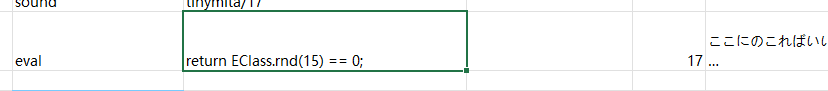
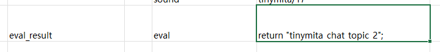

# ドラマ

ドラマは、選択肢や追加アクションを含む豊かな会話システムです。


## 追加方法

キャラクターにデフォルトのドラマを割り当てるには、`LangMod/**/Dialog/Drama/` フォルダ内に `id.xlsx` を配置し、ファイル名をキャラクターIDにしてください（例: `tinymita` キャラクターなら `tinymita.xlsx`）。

別のドラマファイルを使用する場合は、キャラクターのソース行に `addDrama(DramaFileId)` タグを追加します。

C# API の `chara.SetDramaOverride(DramaFileId)` または `chara.ShowDialog(DramaId, step)` も利用可能です。

新しいドラマシートを作成する際は、`Elin/Package/_Elona/Lang/_Dialog/Drama` 内のゲーム内シートを参考にするか、Tiny Mita のサンプルをテンプレートとしてダウンロードしてください。

<LinkCard t="CWL Example: Tiny Mita" u="https://steamcommunity.com/sharedfiles/filedetails/?id=3396774199" i="https://raw.githubusercontent.com/gottyduke/Elin.Plugins/refs/heads/master/CwlExamples/TinyMita/preview.jpg" />

::: tip ホットリロード
ドラマシートはゲーム実行中に編集できます。変更は次にダイアログを開いたときに自動で反映されます。
:::

## 定義

### 行

ドラマシートは上から下へ順に読み込まれ、複数の行で構成されます。各行には以下のフィールドがあります（1行目で定義）。

* **step**：ステップの開始を表します。以降の行はこのステップに属し、次の `step` が出現するまで続きます。
* **jump**：この行の実行後にジャンプする先のステップ。
* **if / if2**：実行前に確認する条件。`if2` がある場合は両方を満たす必要があります。
* **action**：実行するアクション。
* **param**：アクションのパラメータ。
* **actor**：アクションまたは会話行の話者。
  * `?`：`???` と表示。
  * `tg`：ドラマ対象のキャラクター。`actor` が空欄の場合はこれが既定。
  * `narrator`：既定のナレーター。
  * `pc`：プレイヤー。
* **id**：一意の識別子。`text` 行と `choice` 行では<span style="color: red;">必須</span>です。その他の行では不要。
* **text_XX / text_JP / text_EN / text**：会話内容。`XX` は言語コード（例: `text_CN`、`text_ZHTW`）。対応する言語がない場合は `text` がフォールバックとして使用されます。`text_JP` と `text_EN` は必須ですが、翻訳を提供する必要はありません。

（クリックで拡大）


### ステップ

ドラマの流れは複数のステップで構成されます。各ステップには会話・アクション・条件を含む 1 つ以上の行が含まれます。

`main` が既定の開始ステップで、`end` でドラマを終了します。

シート作成時は、内部ステップとの競合を避けるため、ステップ名を `_` または `flag` で始めないようにしてください。

::: details 組み込みステップ
`inject/Unique` アクションを実行すると、多くの組み込みドラマステップが現在のドラマシートに挿入されます。これらを使用するには、単に `jump` ターゲットとして指定するだけです。一部のステップは既定の `inject/Unique` ダイアログで既に使用されているため、通常は自分で再利用する必要はありません。

|ステップ名|用途|
|-|-|
|`_banish`|ドラマを終了|
|`_bye`|ドラマを終了|
|`_toggleSharedEquip`|`tg` の共有装備状態を切り替え|
|`_daMakeMaid`|`tg` をメイドに設定|
|`_joinParty`|`tg` の特性が参加可能ならパーティメンバーに設定（**これは招待ではありません**）|
|`_leaveParty`|`tg` をパーティから外し、拠点エリアへ送る|
|`_makeLivestock`|`tg` を派閥の家畜に設定|
|`_makeResident`|`tg` を派閥の住民に設定|
|`_depart`|`tg` を派閥から除外|
|`_rumor`|噂を見る|
|`_sleepBeside`|`tg` がプレイヤーの隣で寝るかどうかを切り替え|
|`_disableLoyal`|`tg` の忠誠心状態を切り替え|
|`_suck`|`tg` がプレイヤーを吸う（**吸血を優先、次に猫を吸う**）|
|`_insult`|`tg` の挑発状態を切り替え|
|`_makeHome`|現在のエリア分岐を `tg` の家に設定|
|`_invite`|`tg` を仲間として招待を試みる（プレイヤー属性と `tg` の招待可能状態をチェック）。無条件で仲間にするには拡張アクション [`join_party()`](#invoke-式) を使用|
|`_Guide`|プレイヤーを一連の場所へ誘導|
|`_tail`|純粋な肉体関係|
|`_whore`|金銭を伴う肉体関係|
|`_bloom`|`tg` との絆を深める|
|`_buy`|`tg` からアイテムを購入|
|`_buyPlan`|`tg` から研究図面を購入|
|`_give`|`tg` にアイテムを渡す|
|`_blessing`|パーティに祝福を付与|
|`_train`|`tg` とスキル訓練を行う|
|`_changeDomain`|`tg` の領域を変更|
|`_revive`|死亡した仲間を復活させる|
|`_buySlave`|`tg` から奴隷を購入|
|`_trade`|`tg` とアイテムを交換|
|`_identify`|`tg` でアイテムを鑑定|
|`_identifyAll`|`tg` で全アイテムを鑑定|
|`_identifySP`|`tg` の上級スキルでアイテムを鑑定|
|`_bout`|決闘を申し込む|
|`_news`|マップ上にランダムダンジョンを生成|
|`_heal`|プレイヤーを治療|
|`_food`|`tg` から食料を購入|
|`_deposit`|`tg` に預金|
|`_withdraw`|`tg` から引き出し|
|`_copyItem`|`tg` でアイテムを複製|
|`_extraTax`|追加税を納める|
|`_upgradeHearth`|ハースストーンをアップグレード|
|`_sellFame`|名声を売却|
|`_investZone`|現在のエリアに投資|
|`_investShop`|`tg` の商店に投資|
|`_changeTitle`|プレイヤーの称号を変更|
|`_buyLand`|現在のエリアマップを拡張|
|`_disableMove`|`tg` を移動不可にする|
|`_enableMove`|`tg` を移動可能にする|
:::

## テキスト

`text_JP`、`text_EN`、`text_XX`列のテキストは会話イベントとして使用され、プレイヤーはクリックかキー入力で進める必要があります。アクションで特に指定がない限り、アクション行とテキスト行は結合しないでください。

### ランダム話題

`$topic`は`chara_talk.xlsx`に定義された話題からランダムに1行を選びます。ファイルはElinのデフォルトである`Package/_Elona/Lang/JP/Data/chara_talk.xlsx`か、`LangMod/**/Data/chara_talk.xlsx`のいずれかです。例として`$sup`は以下のいずれかをランダムに再生します。
```
何だ？
何か？
おお？
あれ？
ねえ！
おお。
あれ。
ねえ？
```

### 置換変数

| テキスト | 値 |
|--------|--------|
| `#tg_his` | `tg` の所有代名詞 |
| `#tg_him` | `tg` の目的格代名詞 |
| `#tg` | `tg` キャラクター名 |
| `#last_choice` | 前回の選択肢のテキスト |
| `#newline` | 改行文字 |
| `#costHire` | `tg` を雇用するためのコスト（数値、ローカライズ済み） |
| `#self` / `#me` | キャラクター `tg` のフルネーム（称号を含む） |
| `#his` | `tg` の所有代名詞 |
| `#him` | `tg` の目的格代名詞 |
| `#1` ～ `#5` | 外部変数 `refDrama1` ～ `refDrama5`（数値は自動フォーマット） |
| `#god` | 神の名前（`tg` が空でなければその信仰に基づき、空の場合はランダムな宗教） |
| `#player` / `#title` | プレイヤーの称号 |
| `#zone` | 現在のゾーン名 |
| `#guild_title` | 現在のストーリーに関連するギルドの称号 |
| `#guild` | 現在のストーリーのギルド名 |
| `#race` | プレイヤーの種族名 |
| `#pc` | プレイヤーの略称 |
| `#pc_full` | プレイヤーのフルネーム（称号を含む） |
| `#pc_his` | プレイヤーの所有代名詞 |
| `#pc_him` | プレイヤーの目的格代名詞 |
| `#pc_race` | プレイヤーの種族 |
| `#aka` | プレイヤーの別名 |
| `#bigdaddy` | ローカライズ文字列 `"bigdaddy"` |
| `#festival` | 祭りの名前（ゾーンに祭りがあればその名前、なければ汎用） |
| `#brother2` | 「兄弟」または「姉妹」（プレイヤーの性別に応じて） |
| `#brother` | 兄弟/姉妹のランダムな呼称（`bro` または `sis` リストからランダム） |
| `#onii2` | お兄ちゃん/お姉ちゃんのランダムな呼称（リスト `onii2` / `onee2`） |
| `#onii` | お兄ちゃん/お姉ちゃんのランダムな呼称（リスト `onii` / `onee`） |
| `#gender` | プレイヤーの性別に対応するランダムな呼称（`gendersDrama` リスト） |
| `#he` | 「彼」または「彼女」（プレイヤーの性別に応じて） |
| `#He` | 同上、先頭文字が大文字のもの |

### 動的コンテンツ

`#eval <C#スクリプト>` で始まる記述は、C#スクリプトを実行して文字列を返します。これによりテキストを動的に生成できます。

## アクション

**テキスト行** が最も一般的で、`id`・`text` 列（および任意で `if` 条件）のみを持ちます。実行時はプレイヤーの入力（クリックまたはキー押下）が必要です。

**アクション行**（`choice` を除く）は入力なしで自動実行されます。同一行に `action` と `text` の両方がある場合、`text` は通常無視されます。

例: テキスト行の後にアクション行を配置した場合、テキスト行をクリックして進めるまでアクションは実行されません。

::: details 組み込みアクション
|アクション|パラメータ|説明|
|-|-|-|
|`inject`|`Unique`|「話そう」と多くの便利なステップを挿入|
|`choice`||直前のテキスト行に選択肢を追加。`text` と `jump` が必要|
|`choice/bye`||既定の別れ選択肢を挿入|
|`cancel`||右クリック／ESC キーの動作を設定。`jump` が必要（通常は `end`）|
|`setFlag`|フラグ名,値(省略可)|フラグを設定。値省略時は 1|
|`reload`||ドラマを再読み込みしてフラグ変更を反映。`jump` が必要（通常は `main`）。開発時のホットリロードとは異なります|
|`enableTone`||ドラマ全体で会話トーン変換を有効化|
|`addActor`||後で使用するドラマキャラクターを追加。`text` で名前を上書き可能。`actor` セルに新しい ID を入力すると自動実行。`actor` には[キャラクターID][character-id-link]が必要|
|`invoke`|メソッド名|メソッドを呼び出す（すべて本体側でハードコード）|
|`setBG`|画像名(省略可)|背景画像を設定。空欄でクリア。**Texture** フォルダでカスタム PNG を提供可能|
|`BGM`|BGM ID|指定 BGM に切り替え。カスタム BGM は[音声/BGM ページ](../20_Sound%20Mods/0_sound)を参照|
|`stopBGM`||BGM を停止して続行しない|
|`lastBGM`||BGM を停止し、直前の BGM を再開|
|`sound`|音声 ID|指定音声を再生。カスタム音声は[音声/BGM ページ](../20_Sound%20Mods/0_sound)を参照|
|`wait`|秒数|指定秒数だけ実行を一時停止（アニメーション完了待ちに便利）|
|`alphaIn` `alphaOut`|秒数|透明度トランジション（秒）|
|`alphaInOut`|秒数,待機時間|`alphaIn` → 待機 → `alphaOut`|
|`fadeIn` `fadeOut`|秒数,`white`/`black`(省略可)|フェードトランジション（秒）|
|`fadeInOut`|秒数,待機時間,`white`/`black`(省略可)|`fadeIn` → 待機 → `fadeOut`|
|`hideUI`|遷移時間|HUD をトランジション付きで非表示（終了時に復元）|
|`hideDialog`||ダイアログを非表示にしてカットシーン作成。テキスト行は強制表示されるため `wait` と併用|
|`end`||即座にドラマ終了（`end` ステップへの `jump` と同等）|
|`addKeyItem`|[重要アイテム ID](https://docs.google.com/spreadsheets/d/175DaEeB-8qU3N4iBTnaal1ZcP5SU6S_Z/edit?gid=836018107#gid=836018107)|プレイヤーに重要アイテムを付与|
|`drop`|[アイテム ID][item-id-link]|プレイヤー位置に報酬アイテムをドロップ|
|`addResource`|[リソース名](https://gist.github.com/gottyduke/6e2847e37d205a5621bfd0615e5bd9e7#file-homeresource-md),数量|ホームリソースを追加|
|`shake`||画面を振動|
|`slap`||ドラマ所有者キャラクターを平手打ち|
|`destroyItem`|[アイテム ID][item-id-link]|プレイヤー所持品から指定アイテムを破棄|
|`focus`||即座にカメラをドラマ所有者キャラクターにフォーカス|
|`focusChara`|[キャラクター ID][character-id-link],速度(省略可)|**同一マップのキャラクター**にカメラを移動・フォーカス|
|`focusPC`|速度(省略可)|プレイヤーにカメラをフォーカス|
|`unfocus`||カメラのフォーカスを解除・リセット|
|`destroy`|[キャラクター ID][character-id-link]|**同一マップのキャラクター**を削除|
|`save`||セーブ|
|`setHour`|時間|ゲーム時間を設定|

複数パラメータを指定する場合は、**半角カンマ（`,`）で区切り、スペースを入れない**でください。
:::

## 条件

条件は行を実行するかどうかを判断します。

### 静的条件

静的条件は読み込み時に**1回だけ**判定されます。

`if` 列（任意で `if2` 列）で任意の行に条件を付加します。

|条件|パラメータ|説明|
|-|-|-|
|`hasFlag`|フラグ名|フラグが存在し値が 0 でない|
|`!hasFlag`|フラグ名|フラグが存在しない、または値が 0|
|`hasMelilithCurse`||メリリス呪いを持つ|
|`merchant`||商人ギルドにいる|
|`fighter`||戦士ギルドにいる|
|`thief`||盗賊ギルドにいる|
|`mage`||魔術ギルドにいる|
|`hasItem`|アイテム ID|所持品にアイテムがある|
|`isCompleted`|クエスト ID|指定クエストを完了済み|

**単純値チェック**（フラグ・カウンターで最もよく使われます）:
```
=,example_flag,1
>,example_counter,20
!,example_flag,69
```

ほとんどの行は `if` 列だけで十分です。複数条件が必要な場合は `if2` 列を追加してください。

### 動的条件

行を動的に有効・無効にするには以下を使用します：
- `invoke*` 条件式
- `bool` を返す `eval` アクション



## 分岐

`jump` にドラマステップを指定すると、そのステップへ分岐します。

`jump` を `eval_result` に設定し、`string` を返す `eval` アクションを使用すると、動的にジャンプ先を決定できます。



## invoke* 式

ドラマシート内で特殊アクション `invoke*`（略して `i*`）を使用すると、拡張メソッドを呼び出せます：


### 構文

疑似コード風の構文はシンプルです。`action` に `invoke*` または `i*` を、`param` に有効なメソッドを指定します。

|アクション|パラメータ|actor|
|-|-|-|
|`invoke*`/`i*`|`honk_honk(arg1, arg2)`|`pc`|

これは `honk_honk` メソッドを `arg1`・`arg2` の 2 引数で呼び出します。

### パラメータ

パラメータは半角カンマ `,` で区切り、拡張メソッドの括弧内に記述します。引数がない場合は空の `()` を使用してください。

ほとんどのメソッドは `actor` セルを対象キャラクター（`pc`、`tg`、または任意の[キャラクターID][character-id-link]）として使用します。既定は `tg` です。

同一行の `jump` に値がある場合、拡張メソッドの戻り値がジャンプを実行するかどうかを決定します。`true` を返すとジャンプを実行します。

### 数値式の構文

`DramaValueExpression` は値の評価・代入に使用します。

例:

|式|意味|
|-|-|
|`69`|値 `69` を代入|
|`=69`|値 `69` を代入|
|`+5`|元の値に `5` を加算|
|`-3`|元の値から `3` を減算|
|`*10`|元の値に `10` を乗算|
|`/2`|元の値を `2` で除算|
|`==69`|`69` と等しいか判定|
|`!=114`|`114` と等しくないか判定|
|`>10`|`10` より大きいか判定|
|`>=20`|`20` 以上か判定|
|`<5`|`5` より小さいか判定|
|`<=3`|`3` 以下か判定|

### 拡張アクション

|メソッド|パラメータ|説明|ジャンプ条件|
|-|-|-|-|
|`add_item`|[アイテムID][item-id-link], [素材エイリアス][material-alias-link](省略可), レベル(省略可), 数量(省略可)|`actor` にアイテムを追加（既定: ランダム素材・自動レベル・数量1）|常時|
|`equip_item`|[アイテムID][item-id-link], [素材エイリアス][material-alias-link](省略可), レベル(省略可)|`actor` にアイテムを装備（既定: ランダム素材・自動レベル）|常時|
|`destroy_item`|[アイテムID][item-id-link], 数量(省略可)|`actor` のアイテムを破棄（既定: 1）|常時|
|`join_faith`|[信仰ID][religion-id-link](省略可)|`actor` を指定信仰に加入（空欄で脱退）|成功時|
|`join_party`||`actor` をプレイヤーパーティに無条件加入|常時|
|`apply_condition`|[状態エイリアス][condition-alias-link], 強度|状態を付与（既定強度 100）|常時|
|`remove_condition`|[状態エイリアス][condition-alias-link]|状態を解除|常時|

### 拡張演出

|メソッド|パラメータ|説明|ジャンプ条件|
|-|-|-|-|
|`move_next_to`|[キャラクターID][character-id-link]|`actor` を**同一マップのキャラクター**の隣へ移動|常時|
|`move_tile`|Xオフセット, Yオフセット|`actor` を**相対座標**で移動（例: `1,1`、`2,-1`）|常時|
|`move_to`|X, Y|`actor` を**絶対座標**で移動（例: `64,44`、`12,0`）|常時|
|`move_zone`|[エリアID][zone-id-link], 階層(省略可)|指定エリアへ移動（既定階層 0）|成功時|
|`move_zone_2`|エリア完全名|エリア完全名で移動（例: `derphy@-1`）|成功時|
|`play_anime`|[アニメID](https://gist.github.com/gottyduke/6e2847e37d205a5621bfd0615e5bd9e7#file-elin-animeid-md)|`actor` にアニメーションを再生|常時|
|`play_effect`|[エフェクトID](https://gist.github.com/gottyduke/6e2847e37d205a5621bfd0615e5bd9e7#file-elin-effects-md)|`actor` にエフェクトを再生|常時|
|`play_effect_at`|[エフェクトID](https://gist.github.com/gottyduke/6e2847e37d205a5621bfd0615e5bd9e7#file-elin-effects-md), X, Y|指定位置にエフェクトを再生|常時|
|`play_emote`|[エモートID](https://gist.github.com/gottyduke/6e2847e37d205a5621bfd0615e5bd9e7#file-elin-emo-md)|`actor` にエモートを表示|常時|
|`play_screen_effect`|[画面エフェクトID](https://gist.github.com/gottyduke/6e2847e37d205a5621bfd0615e5bd9e7#file-screeneffect-md)|画面エフェクトを再生|常時|
|`pop_text`|テキスト|`actor` の頭上にテキストを表示|常時|
|`set_portrait`|ポートレートID(省略可)|ダイアログ時のポートレートを設定（空欄でリセット）。**Portrait** フォルダ対応|常時|
|`set_portrait_override`|ポートレートID(省略可)|ダイアログ外のポートレートを設定（空欄でリセット）。完全ID必須|常時|
|`set_sprite`|テクスチャID(省略可)|`actor` のカスタムスプライトを設定（空欄でリセット）。**Texture** フォルダから取得|常時|
|`show_book`|分類/書籍ID|本を開く（**LangMod/_*_*/Text** フォルダ対応）|成功時|

### 拡張変更

|メソッド|パラメータ|説明|ジャンプ条件|
|-|-|-|-|
|`mod_affinity`|数値式|`actor` の好感度を数値式で変更|成功時|
|`mod_currency`|通貨種別, 数値式|`actor` の通貨を数値式で変更（`money` `money2` `plat` `medal` `influence` `casino_coin` `ecopo`）|常時|
|`mod_element`|[要素エイリアス][element-alias-link], 強度(省略可)|`actor` の要素（特性・耐性・スキル等）を変更（既定強度 1）|常時|
|`mod_element_exp`|[要素エイリアス][element-alias-link], 数値式|`actor` の要素経験値を変更|成功時|
|`mod_fame`|数値式|プレイヤーの名声を数値式で変更|常時|
|`mod_flag`|フラグ, 数値式|`actor` のフラグ値を数値式で変更（非プレイヤーキャラクターも対応）|常時|
|`mod_keyitem`|[重要アイテムエイリアス](https://docs.google.com/spreadsheets/d/175DaEeB-8qU3N4iBTnaal1ZcP5SU6S_Z/edit?gid=836018107#gid=836018107), 数値式(省略可)|重要アイテム値を数値式で変更（既定 `=1`）|成功時|

### 拡張条件

これらも `invoke*` アクションで呼び出す拡張メソッドですが、戻り値が重要です。

|メソッド|パラメータ|説明|ジャンプ条件|
|-|-|-|-|
|`if_affinity`|数値式|`actor` の好感度を式で判定（例: `<5`、`>=90`、`!=0`）|条件成立時|
|`if_condition`|[状態エイリアス][condition-alias-link]|`actor` が指定状態を持っているか判定|所持時|
|`if_currency`|通貨種別, 数値式|`actor` の通貨を式で判定|条件成立時|
|`if_element`|[要素エイリアス][element-alias-link], 数値式|`actor` の要素を式で判定|条件成立時|
|`if_faith`|[信仰ID][religion-id-link], 奉献ランク(省略可)|指定信仰に所属しランク以上か判定（既定 `>0`）|条件成立時|
|`if_fame`|数値式|プレイヤーの名声を式で判定|条件成立時|
|`if_flag`|フラグ名, 数値式|`actor` のフラグ値を式で判定|条件成立時|
|`if_lv`|数値式|`actor` のレベルを式で判定|条件成立時|
|`if_has_item`|[アイテムID][item-id-link], 数値式(省略可)|アイテム所持数を式で判定（既定 `>=1`）|条件成立時|
|`if_hostility`|陣営数値式|`actor` の陣営を判定（例: `=Ally`、`>Enemy`）|条件成立時|
|`if_in_party`|`true` または `false`(省略可)|プレイヤーパーティに所属しているか判定（既定 `true`）|条件成立時|
|`if_keyitem`|[重要アイテムエイリアス](https://docs.google.com/spreadsheets/d/175DaEeB-8qU3N4iBTnaal1ZcP5SU6S_Z/edit?gid=836018107#gid=836018107), 数値式(省略可)|重要アイテム所持を式で判定（既定 `>0`）|条件成立時|
|`if_race`|[種族ID](https://docs.google.com/spreadsheets/d/1CJqsXFF2FLlpPz710oCpNFYF4W_5yoVn/edit?gid=140821251#gid=140821251)|指定種族か判定|条件成立時|
|`if_tag`|タグ|Chara 行で定義されたタグを持っているか判定|定義時|
|`if_zone`|[エリアID][zone-id-link], 階層(省略可)|指定エリアにいるか（階層も任意で判定）|存在時|
|`if_zone_2`|エリア完全名|エリア完全名でエリア判定（例: `derphy@-1`）|存在時|

### 特殊メソッド

|メソッド|パラメータ|説明|ジャンプ条件|
|-|-|-|-|
|`console_cmd`|コンソールコマンド 引数1 引数2...|コンソールコマンドを実行|常時|
|`eval`|C# スクリプトまたは `<<<path.cs` 構文でファイル指定|C# スクリプトを実行（`invoke*` ではなく `eval` アクションの使用を推奨）|`true` 返却時|
|`and`|`and(if_flag(flag1, >0), if_flag(flag2, <0)...)`|invoke* 式を引数としてすべて評価|すべて成立時|
|`or`|`or(if_race(lich), if_race(snail)...)`|invoke* 式を引数としてすべて評価|いずれか成立時|
|`not`|`not(if_zone(dungeon), if_zone(field), if_zone(underground)...)`|invoke* 式を引数としてすべて評価|すべて不成立時|

### API

Elin は独自のスクリプト DLL からカスタム拡張メソッドを追加するための簡単な API を提供しています。

#### アクションパーサー

パーサーはドラマ読み込み時に、組み込み以外の登録済みアクション行に対して呼び出され、イベントの作成を担当します。

```cs
[ElinDramaActionParser("my_action")]
public static bool ExampleParser(DramaManager dm, Dictionary<string, string> line) 
{
    dm.AddEvent(new DramaEventTalk(line["actor"], () => {
        // 処理
        return "テキスト行！";
    }));
    // この行は処理済み
    return true;
}
// または手動登録
CustomDramaExpansion.AddDramaActionParser("my_action", ExampleParser);
```

#### アクション呼び出し

呼び出しメソッドは自動的に `invoke*` 式にコンパイルされ、ドラマ実行時に呼び出されます。

::: code-group
```cs [パラメータ自動変換]
[ElinDramaActionInvoke]
public static bool add_item(DramaManager dm, Dictionary<string, string> line,
                            string itemId,
                            string materialAlias = "wood",
                            int lv = -1,
                            int count = 1)
{
    var chara = dm.GetChara(line["actor"]);

    var mat = sources.materials.alias.TryGetValue(materialAlias, "wood");
    var item = ThingGen.Create(itemId, mat.id, lv).SetNum(count);
    chara.Pick(item);

    return true;
}

[ElinDramaActionInvoke("nodiscard")]
public static bool if_element(DramaManager dm, Dictionary<string, string> line,
                              string elementAlias,
                              DramaValueExpression expr) 
{
    var chara = dm.GetChara(line["actor"]);
    return chara.HasElement(elementAlias) && expr.Compare(chara.Evalue(elementAlias));
}
```

```cs [パラメータ非展開]
[ElinDramaActionInvoke]
public static bool console_cmd(DramaManager dm, Dictionary<string, string> line, 
                               params string[] parameters)
{
    string.Join(' ', parameters).EvaluateAsCommand();
    return true;
}
```

:::

ドラマ呼び出しメソッドは `static` で `bool` を返し、パラメータは `DramaManager dm, Dictionary<string, string> line` で始まる必要があります。

実際の式パラメータは Elin が自動変換するか、`string[]` として渡されます。自動変換可能な型には、組み込み型、`DramaValueExpression`、または `static bool TryParse(string, out T)` を持つカスタム型が含まれます。

使用例は `CustomDramaExpansion` の実装を参照してください。

## スクリプト

`eval` アクションを使用すると、ドラマシート内で直接 **C# コード** を実行できます。

通常の C# と同等のスクリプト機能を提供しますが、以下の違いがあります：

- スクリプトの状態は現在のドラマインスタンスに紐づく（ドラマ終了まで保持され、その後自動リセット）。
- ショートカット: `dm` = DramaManager、`line` = 現在の行（`Dictionary<string, string>`）、`tg` = 対象 `Chara`、`pc` = プレイヤー `Chara`。


**戻り値の動作：**
- `bool` + 有効な `jump` ターゲット → ジャンプを実行するかを決定。
- `string` + `jump` セルが `eval_result` → その文字列を新しいジャンプ先として使用。
- 戻り値なし → 通常のアクションとして扱う。

同一フォルダのスクリプトファイルを `<<<script_snippet.cs` でインポートできます。

### 変数の受け渡し

共有の `Script` 辞書を使用します：

```cs
// 1回目の eval
var value = EClass.rnd(100) * 5;
Script["random_value"] = value;

// 以降の eval
var value = (int)Script["random_value"];
```

### よく使う例

|機能|コード|
|-|-|
|指定ステップへジャンプ|`dm.Goto("my_new_step");`|
|「話そう」オプションを追加|`dm.InjectUniqueRumor();`|
|一時的な会話行を追加|`dm.AddTempTalk("topic", "actor", "jump");`|
|Chara インスタンスを取得|`var chara = dm.GetChara("tg");`|
|パーティに勧誘|`chara.MakeAlly();`|
|レベルを変更|`chara.SetLv(chara.LV + 5);`|

ヘルプが必要な場合は Elona Discord で **@freshcloth** まで、または [メール](mailto:dk@elin-modding.net) でお問い合わせください。

[item-id-link]: https://docs.google.com/spreadsheets/d/175DaEeB-8qU3N4iBTnaal1ZcP5SU6S_Z/edit?gid=1479265439#gid=1479265439
[material-alias-link]: https://docs.google.com/spreadsheets/d/13oxL_cQEqoTUlcWsjKZyNuAaITFGK56v/edit?gid=580505110#gid=580505110
[condition-alias-link]: https://docs.google.com/spreadsheets/d/16-LkHtVqjuN9U0rripjBn-nYwyqqSGg_/edit?gid=921112246#gid=921112246
[character-id-link]: https://docs.google.com/spreadsheets/d/1CJqsXFF2FLlpPz710oCpNFYF4W_5yoVn/edit?gid=1622484657#gid=1622484657
[religion-id-link]: https://docs.google.com/spreadsheets/d/16-LkHtVqjuN9U0rripjBn-nYwyqqSGg_/edit?gid=729486062#gid=729486062
[zone-id-link]: https://docs.google.com/spreadsheets/d/16-LkHtVqjuN9U0rripjBn-nYwyqqSGg_/edit?gid=1819250752#gid=1819250752
[element-alias-link]: https://docs.google.com/spreadsheets/d/16-LkHtVqjuN9U0rripjBn-nYwyqqSGg_/edit?gid=1766305727#gid=1766305727