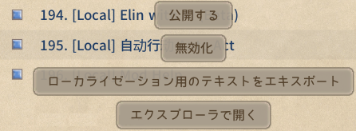

# ソースシート翻訳

ソースシートには、`name` と `name_JP`、`aka` と `aka_JP` のように、英語列と日本語列が標準で含まれています。

ソースシートは `EN` または `JP` フォルダに配置してください。

## 自分の Mod に翻訳を追加する

英語と日本語以外の言語向けに、自分の Mod のソースシート翻訳を追加するには:

1. ゲームを対象言語に切り替えます。
2. ゲームを再起動して、翻訳可能な項目をエクスポートします。

すると、Mod の `LangMod/XX` フォルダに `SourceLocalization.json` が生成されます。`XX` は現在の言語コードで、たとえば中国語（簡体字）は `CN` です。

この `json` ファイルを編集して、ソースシートを翻訳してください。

> [!NOTE] ヒント
> ドラマシートと `dialog.xlsx` の翻訳については、[こちらのセクション](#drama-and-dialog)を参照してください。

## 他人の Mod に翻訳を提供する {#translating-other-mods}

### 翻訳パッチ Mod を公開する

他人の Mod に翻訳を提供したい場合:

1. 元の Mod をローカルの `Package` フォルダ（`<ゲームのインストールディレクトリ>/Elin/Package`）にコピーします。
2. 翻訳先の言語でゲームを起動します。

すると、その Mod の `LangMod/XX` フォルダに `SourceLocalization.json` が生成されます。`XX` は現在の言語コードで、たとえば中国語（簡体字）は `CN` です。

この `json` ファイルを編集して、ソースシートを翻訳してください。

ドラマシートと `dialog.xlsx` の翻訳については、[こちらのセクション](#drama-and-dialog)を参照してください。

翻訳が終わったら、次のいずれかを行えます:

- 翻訳ファイルを Mod 作者に送る。
- `SourceLocalization.json` だけを含む独立した翻訳パッチ Mod を公開する。**ソースシートは含めないでください。**

翻訳パッチ Mod の公開方法については、[Elin Mod パッケージ](../2_Getting%20Started/basic_mod)を参照してください。

### 翻訳パッチ Mod を更新する

元の Mod が更新されたら:

1. 最新版の元 Mod をローカルの `Package` フォルダに入れます。
2. 既存の `SourceLocalization.json` を元 Mod の `LangMod/XX` フォルダに戻します。
3. ゲームを起動します。

ゲームは `SourceLocalization.json` に、新しく追加された未翻訳のソースシート項目を自動で追記します。

追加分を翻訳したら、自分の Mod を更新してください。更新方法については、[Elin Mod パッケージ](../2_Getting%20Started/basic_mod)の `アップロードと更新` セクションを参照してください。

> [!NOTE] ヒント
> ドラマシートと `dialog.xlsx` には新しい内容が自動追加されないため、手動で比較して翻訳する必要があります。

## ドラマシートと `dialog.xlsx` を翻訳する {#drama-and-dialog}

ドラマシートと `dialog.xlsx` は `json` では翻訳しません。代わりに、対応するシートを直接翻訳します。厳密には、これらはソースシートでもありません。

自分の Mod に翻訳を追加する場合:

以下の Tiny Mita サンプル Mod を参考にできます:

<LinkCard t="CWLサンプル：Tiny Mita" u="https://steamcommunity.com/sharedfiles/filedetails/?id=3396774199" i="https://raw.githubusercontent.com/gottyduke/Elin.Plugins/refs/heads/master/CwlExamples/TinyMita/preview.jpg" />

詳しくは [Chara キャラ](../10_Source%20Sheets/character) と [Drama ドラマ](../10_Source%20Sheets/drama) を参照してください。

他人の Mod を翻訳する場合:

1. 元の Mod のドラマシートと `dialog.xlsx` を、対象言語フォルダ内の対応するパスへコピーします。たとえば `EN` または `JP` から `CN` へコピーします。
2. 対応する言語列を追加します。たとえば中国語なら `text_CN` を追加します。上の Tiny Mita サンプル Mod と関連記事を参考にしてください。
3. `text_EN` と `text_JP` は削除しますが、`text` 列は残してください。

## 補足

### 既存の `json` ファイルを強制的に上書きする

::: details クリックして展開

通常、ゲームを起動すると `SourceLocalization.json` には未翻訳の新規項目だけが追加されます。

ファイル全体を再エクスポートしたい場合は:

1. Mod を `<ゲームのインストールディレクトリ>/Elin/Package` に入れます。
2. Mod 名に `[Local]` プレフィックスが付いていること、そして Mod が有効（青字表示）になっていることを確認します。
3. ゲームを対象言語に切り替えます。
4. Mod をクリックし、**ローカライゼーション用のテキストをエクスポート** を選びます。

<!-- このボタンの中国語 / 英語 / 日本語表記:
导出本地化文本
Export texts for localization
ローカライゼーション用のテキストをエクスポート -->

`LangMod/XX/SourceLocalization.json` が再生成されます。

> [!WARNING] 注意
> この操作は既存の `SourceLocalization.json` を上書きするため、事前にバックアップしてください。
:::

### ソースシートを翻訳する別の方法

::: details クリックして展開
#### ソースシートを翻訳する別の方法

上のように `json` ファイルを直接翻訳する以外に、先にソースシート側を翻訳してから `json` としてエクスポートする方法もあります。

ここでは `name_JP` と `name` のような列の組を例にします:

+ `_JP` 接尾辞が付いている列は日本語列です。
+ 同じ組で接尾辞のない列は英語列ですが、翻訳列として使うこともできます。
+ この組に属さず、かつ接尾辞のない列はゲームデータ列などなので、翻訳しないでください。
+ たとえば `aka_JP` と `aka` も、同じ種類の日本語列と翻訳列の組です。

そのため、まずソースシートを `LangMod/XX` フォルダにコピーしてから翻訳することもできます。

対象言語が中国語の場合の例:

+ `LangMod/EN` または `LangMod/JP` にあるソースシートを `LangMod/CN` にコピーします。
+ 各組の接尾辞なし翻訳列を翻訳します。
+ 翻訳後、上の上書き手順に従って `json` を再生成し、最後に `LangMod/CN` へコピーしたソースシートを削除します。

Mod 内に必要なのはソースシート 1 式だけで、それが `EN` または `JP` のどちらかに入っていれば十分です。他人の Mod に翻訳を提供する場合は、翻訳パッチにソースシートを含める必要はありません。元の Mod に既にソースシートがあるため、対応する言語フォルダに `json` 翻訳ファイルだけを入れれば大丈夫です。

[JSONLint](https://jsonlint.com/) を使えば、`json` の形式が正しいか確認できます。

この方法は、シートを見ながら手作業で翻訳したいときに向いています。上の [JSON を先にエクスポートする方法](#translating-other-mods) は、AI 翻訳を使う場合により向いています。AI を使うなら、用語集も一緒に作っておくと便利です。

#### 手順 2: ドラマシートと `dialog.xlsx`

この時点でソースシートの翻訳は終わっていますが、ドラマシートと `dialog.xlsx` を忘れないでください。これらは `json` では翻訳しません。

[こちらのセクション](#drama-and-dialog)に戻って、その翻訳も仕上げてください。

AI 翻訳を使う場合は、手順 1 で作った用語集をここでも使ってください。
:::

## ツール

コードエディターを使っていない場合は、[JSONLint](https://jsonlint.com/) で JSON を検証できます。
