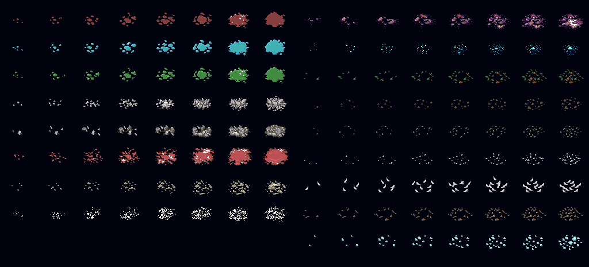

# マテリアルシート

<LinkCard t="SourceBlock/Material" u="https://docs.google.com/spreadsheets/d/13oxL_cQEqoTUlcWsjKZyNuAaITFGK56v/edit?gid=580505110#gid=580505110" />

ソーステーブルを作成するときは、**必ず公式ソーステーブルの最初の3行をそのままコピー**して、4行目以降にデータを入力してください。列の順番は絶対に変えないでください。

## シートの列

|列|タイプ|説明|
|-|-|-|
|id|整数|マテリアルの一意の数値識別子。バニラのエントリまたは他のModのエントリIDと一致する場合、最後にロードされたシートが他を上書きします。重複しないよう、十分に大きく一意な値を設定してください。|
|alias|テキスト|マテリアルのエイリアス。他のシート（例：Thingの `defMat` 列）での参照に使用されます。|
|name_JP|テキスト|日本語の表示名。|
|name|テキスト|英語の表示名。その他の言語については [`SourceLocalization`](./localization) を使用してください。|
|category|テキスト|マテリアルのカテゴリ（例：`metal`、`wood`、`stone`、`leather`、`cloth`）。|
|tag|テキスト[]|特殊な動作のためのタグ。カスタムマテリアルの色を定義するには、`addColorMain(RRGGBBAA)` と `addColorAlt(RRGGBBAA)` を使用します。下記の [カスタムマテリアル](#カスタムマテリアル) を参照してください。|
|thing|テキスト|このマテリアルを解体した際の関連Thing ID。|
|goods|テキスト[]|未使用と見なしてください。|
|minerals|テキスト[]|未使用と見なしてください。|
|decal|整数|デカール/血液オーバーレイID。[Decal](#decal) を参照してください。|
|decay|整数|このマテリアルで作られたアイテムの劣化速度。|
|grass|整数|未使用と見なしてください。|
|defFloor|整数|デフォルトのSourceFloorタイルID。|
|defBlock|整数|デフォルトのSourceBlockタイルID。|
|edge|整数|未使用と見なしてください。|
|ramp|整数|坂道ブロックのタイルID。|
|idSound|テキスト|衝撃音ID。カスタムサウンドは `Sound/Material/` フォルダに配置します。|
|soundFoot|テキスト|足音ID。カスタムサウンドは `Sound/Footstep/` フォルダに配置します。|
|hardness|整数|マテリアルの硬度。採掘や加工に必要な道具に影響します。|
|groups|テキスト[]|マテリアルのティアグループ（例：`metal`、`leather`）。|
|tier|整数|ティアグループ内でのマテリアルティア。|
|chance|整数|ティアグループ内でのランダム抽選重み。|
|weight|整数|マテリアル自体の重さ。|
|value|整数|マテリアルの価値。|
|quality|整数|マテリアルの品質補正値。|
|atk|整数|装備の素材として使用した際の攻撃力ボーナス。|
|dmg|整数|装備の素材として使用した際のダメージボーナス。|
|dv|整数|装備の素材として使用した際のDVボーナス。|
|pv|整数|装備の素材として使用した際のPVボーナス。|
|dice|整数|ダメージ計算用のダイス次元補正値。|
|bits|テキスト[]|火や酸に対する耐性。|
|elements|エレメント|装備の素材として使用した際のSourceElementボーナス。|
|altName|テキスト[]|未使用と見なしてください。|
|altName_JP|テキスト[]|未使用と見なしてください。|

## カスタムマテリアル

デフォルトでは、ゲームはカラーマッピングが存在しないため、カスタムマテリアルを読み込むことができません。カスタムマテリアルを正しく表示するには、`tag` 列で色を定義する必要があります。

### カラータグ

マテリアル行の `tag` 列に **`addColorMain(color_hex)`** と **`addColorAlt(color_hex)`** を使用して、マテリアルのメインカラーと代替カラーを定義します。

色の形式は **RRGGBBAA**（8桁の16進数）です：
- **RR**：赤（`00`–`ff`）
- **GG**：緑（`00`–`ff`）
- **BB**：青（`00`–`ff`）
- **AA**：アルファ/不透明度（`00`–`ff`）

例：
```
addColorMain(ffff00ff),addColorAlt(ff0000ff)
```

これはメインカラーを黄色（完全に不透明）、代替カラーを赤（完全に不透明）に設定します。

::: warning 色の形式
色の16進数文字列は**大文字小文字を区別せず**、`#` や `0x` で**始めない**でください。
:::

## Decal



インデックスは左上の2から始まります。各行には2つのデカールグループがあり、それぞれ個別の番号インデックスを持ちます。
