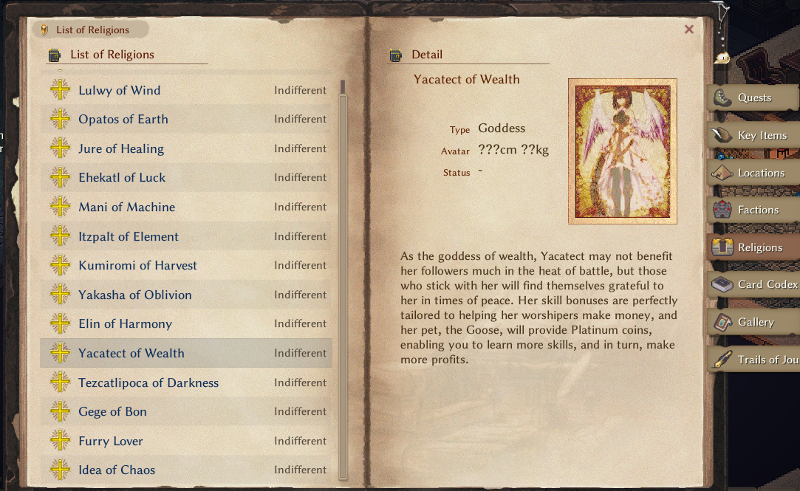
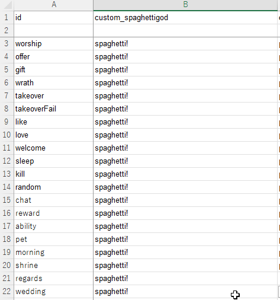

# 信仰テーブル

<LinkCard t="SourceGame/Religion" u="https://docs.google.com/spreadsheets/d/16-LkHtVqjuN9U0rripjBn-nYwyqqSGg_" />

ソーステーブルを作成する際は、必ず公式行から最初の3行をコピーし、4行目以降にデータを入力してください。列の順序は変更しないでください。

::: warning CWL旧フォーマット
CWLフォーマットはWikiから削除されました。CWL仕様のModも `cwl_xxx#minor#cannot` のような形式で引き続き互換性がありますが、新形式への移行をお勧めします。
:::

## テーブル説明

|列名|タイプ|説明|
|-|-|-|
|id|string|カスタム信仰のIDは **custom** で始める必要があります（例：**custom_spaghettigod**）|
|name_JP|string|日本語表示名|
|name|string|英語表示名。その他の言語については [`SourceLocalization`](./localization) を使用してください|
|name2_JP|string[]|領域名・略称（日本語）|
|name2|string[]|領域名・略称（英語）|
|type|string|カスタム信仰の場合は `ReligionCustom` を使用するか、カスタムC# Religionクラスの完全修飾名を入力してください|
|idMaterial|string|祭壇のマテリアルエイリアス|
|faith|string|未使用|
|domain|string|未使用|
|tax|int|信仰税のパーセンテージ|
|relation|int|初期関係値|
|elements|int[]|キャラクターに付与する信仰エレメントボーナス|
|cat_offer|string[]|供物のカテゴリ|
|rewards|string[]|贈り物レベル1と2の報酬|
|textType_JP|string|アバタータイプ（日本語）|
|textType|string|アバタータイプ（英語）|
|textAvatar|string|アバター情報|
|detail_JP|string|詳細（日本語）|
|detail|string|詳細（英語）|
|textBenefit_JP|string|祝福情報（日本語）|
|textBenefit|string|祝福情報（英語）|
|textPet_JP|string|神寵情報（日本語）|
|textPet|string|神寵情報（英語）|

## 肖像

信仰用のカスタム肖像を作成する場合、**Texture** フォルダに **.png** 画像を配置してください。ファイル名は信仰IDと一致させる必要があります（例：**custom_spaghettigod.png**）。



## 神会話

信仰を正常に動作させるには、`LangMod/**/Data` フォルダに `god_talk.xlsx` テーブルを配置する必要があります。ゲーム本体のテーブルを参考にしてください：**Elin/Package/_Elona/Lang/EN/Data/god_talk.xlsx**。



## 信仰データ

`LangMod/**/Data/` フォルダに `religion_data.json` という名前のシンプルなJSONファイルを提供することで、補足的な信仰データを定義できます。
```json
{
    "custom_spaghettigod": {
        "CanJoin": true,
        "IsMinorGod": false,
        "NoPunish": false,
        "NoPunishTakeover": false,
        "Artifacts": [
            "my_awesome_weapon",
            "my_awesome_armor"
        ],
        "Elements": [
            "vopal",
            "eleLightning",
            "bane_all",
            "r_life"
        ],
        "GodAbilities": [
            "my_awesome_ability"
        ],
        "OfferingMtp": {
            "spaghetti": 20
        },
        "OfferingValue": {
            "mushroom": "base * 16 + 520 + lv * 3 + rarity * 2"
        }
    },
    "custom_example_religion2": {
        data...
    }
}
```

* `CanJoin`
  その信仰に加入可能かどうか。
  デフォルト値：`true`
* `IsMinorGod`
  マイナー神かどうか。
  デフォルト値：`false`
* `NoPunish`
  信仰を離脱する際にペナルティを適用しないかどうか。
  デフォルト値：`false`
* `NoPunishTakeover`
  乗っ取り時にペナルティを適用しないかどうか。
* `Artifacts`
  神器として扱うアイテムIDのリスト。`godArtifact,religion_id` タグ規約を使用するCWL Modは自動的に追加されます。
* `Elements`
  その信仰がアクティブな場合にのみ神器に適用されるエレメントエイリアスのリスト。`religion_elements.json` の旧規約を使用するCWL Modは自動的に追加されます。
* `GodAbilities`
  神の能力として扱われるエレメントエイリアスのリスト。発動時に `ability` タイプの神会話がトリガーされます。`godAbility,religion_id` の旧タグ規約を使用するCWL Modは自動的に追加されます。
* `OfferingMtp`
  特定のアイテムIDに対する供物倍率の上書き。`religion_offerings.json` の旧規約を使用するCWL Modは自動的に追加されます。
* `OfferingValue`
  特定のアイテムIDに対する供物価値の上書き。算術式を使用します。
  パラメータ：`base`（基本価格）、`lv`（アイテムレベル）、`rarity`（アイテムレアリティ）
* 任意のフィールドを省略してデフォルト値を使用できます。
```