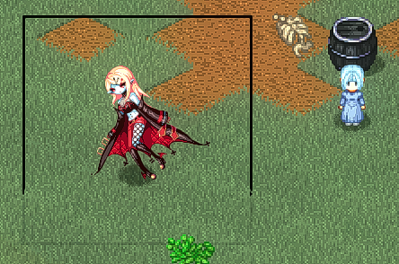

# より大きなスペースが必要な場合

デフォルトのキャンバスサイズ 128x128 では、描画のニーズを満たせない場合があります。

大きなキャンバスを使用する場合は、中央揃え（ピボットを中心に）してください：

|**128x128**|**256*256**|
|-|-|
|||

キャラクターやアイテムがアイコンやアバターとして正しく表示されるように、[pref ファイル](./pref) で `pivotX`、`pivotY`、`scaleIcon` を適宜調整してください。
+ 例えば、住人掲示板のアバターがずれている場合は、上記の設定を調整してください。

> 256 アート by Veila