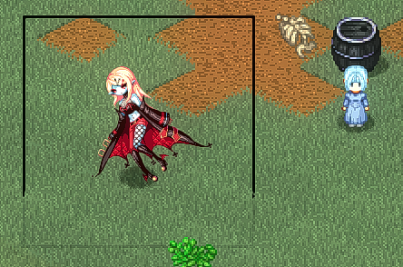

# より大きなスペースが必要な場合

デフォルトのキャンバスサイズ 128x128 では、描画のニーズを満たせない場合があります。

大きなキャンバスを使用する場合は、中央揃え（ピボットを中心に）してください：

|**128x128**|**256*256**|
|-|-|
|||

キャラクターやアイテムがアイコンやアバターとして正しく表示されるように、[pref ファイル](./pref) で `pivotX`、`pivotY`、`scaleIcon` を適宜調整してください。
+ 例えば、住人掲示板のアバターがずれている場合は、上記の設定を調整してください。

::: tip 大きなキャンバスか、鮮明なスプライトか
キャンバスを大きくすると、スプライトはゲーム内で**より広いスペースを占める**ようになります。本ページで扱っているのはこちらです。

一方、*同じ大きさ*のまま解像度を上げたい場合は、キャンバスの比率を保ったうえで [`scaleTex`](./pref) で密度を宣言してください。256x256 のテクスチャに `scaleTex = 200` を指定すると、128x128 と全く同じ大きさで、より鮮明に描画されます。pref の他の値を調整し直す必要もありません。
:::

> 256 アート by Veila