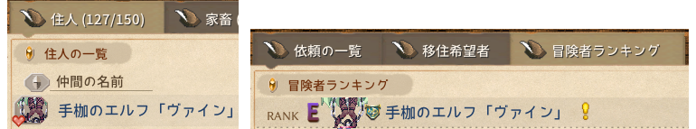
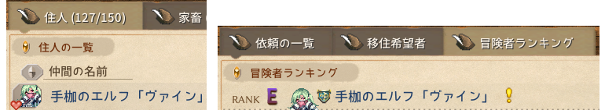

# Pref ファイル

デフォルトのレンダリング設定がスプライトに適さない場合があります。そのようなときは `.pref` ファイルを作成してカスタマイズしましょう。

スプライト、影、住人掲示板の NPC アバター用小アイコン、冒険者ランキングのアイコンなどの微調整に使用できます。

`.pref` ファイルを作成するには、`.txt` ファイルを作成し、ファイル名を `id.pref` に変更します（拡張子を `.txt` から `.pref` に変更し、`id` にはキャラクターまたはアイテムのスプライト ID を指定します）。メモ帳などのテキストエディタで編集できます。

::: tip
`.pref` ファイルはホットロードされます。つまり、値を変更した後、ゲームを再起動せずにリアルタイムで効果をプレビューできます。

そのため、まず `.pref` ファイルを作成し、ゲーム内での表示効果を確認しながら値を繰り返しテストできます。
:::

## ファイル内容

完全なファイルは以下の通りですが、使用しない行は省略できます。

INI 形式で記述し、値は整数のみ使用可能です。`;` によるコメントも使用できます。

```ini
x = 0
y = 0
z = 0
pivotX = 0
pivotY = 0
shadow = 0
shadowX = 0
shadowY = 0
shadowRX = 0
shadowRY = 0
shadowBX = 0
shadowBY = 0
shadowBRX = 0
shadowBRY = 0
height = 0
heightFix = 0
scaleIcon = -40
liquidMod = 0
liquidModMax = 0
hatY = 0
equipX = 0
equipY = 0
stackX = 0
```

各行の説明は、下記の詳細説明セクションを参照してください。

## 詳細説明

+ `x`, `y`, `z` 位置オフセット
+ `pivotX`, `pivotY` ピボットオフセット。住人掲示板のアバターなどの小さいスプライトで使用
+ `shadow` 影データ ID （下記セクション参照）
+ `shadowX`, `shadowY` 影の位置オフセット
+ `shadowRX`, `shadowRY` 影の反転
+ `shadowBX`, `shadowBY` 影の背面
+ `shadowBRX`, `shadowBRY` 影の背面反転
+ `height` タイルの高さ補正値
+ `heightFix` テキストコンポーネントの高さオフセット（浮遊ウィジェット用）
+ `scaleIcon` アイコンのサイズ倍率
+ `liquidMod` タイルの液体レベル補正値（負の値も可）
+ `liquidModMax` タイルの液体レベル上限
+ `hatY` 帽子レンダラーの Y 位置オフセット
+ `equipX`, `equipY` 手持ちアイテムの位置オフセット
+ `stackX` タイル積み重ねの X 位置オフセット

## 影データ ID

<!--@include: ./assets/shadow_data.md-->

## サンプル Mod

### 影の修正

<LinkCard t="Keeper of Garden Pole Dance" u="https://steamcommunity.com/sharedfiles/filedetails/?id=3711895231" i="/pole.gif" />

この Mod は `.pref` ファイルの `shadow` を使用して影を修正しています。

### 小アイコン

<LinkCard t="Lost Case Monster Girl Takeover" u="https://steamcommunity.com/sharedfiles/filedetails/?id=3609895215" i="https://images.steamusercontent.com/ugc/13866943819130003260/AF709B61B8CC0DB914A09239906A08359D2B0316/?imw=5000&imh=5000&ima=fit&impolicy=Letterbox&imcolor=%23000000&letterbox=false" />

この Mod は住人掲示板と冒険者ランキングでのキャラクターアイコンの表示を変更します。`.pref` ファイルの `pivotX` と `pivotY` を使用しています。

**キャラクターアイコン修正前：**



<p align="center" style="font-size: 14px; color: var(--vp-c-text-3);">左が住人掲示板、右が冒険者ランキング</p>

**`.pref` ファイルでキャラクターアイコン修正後：**



<p align="center" style="font-size: 14px; color: var(--vp-c-text-3);">左が住人掲示板、右が冒険者ランキング</p>

この Mod でこのキャラクターに使用されている pref の値：

```ini
pivotX=0
pivotY=-37
```

注意点：

* `.pref` のファイル名、スプライトのファイル名、Mod 読み込み用 Excel の id 列は、すべて完全に一致している必要があります。
* `pivotX` と `pivotY` は住人掲示板と冒険者ランキングの両方に同時に影響するため、値をテストする際は両方を考慮してください。
* `.pref` ファイルはホットロードされるため、ゲームを再起動する必要はなく、リアルタイムで効果をプレビューしながら微調整できます。