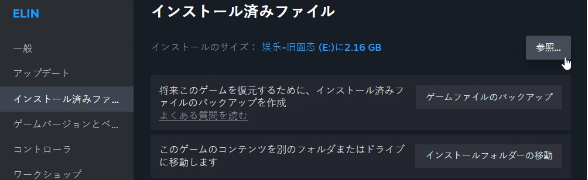
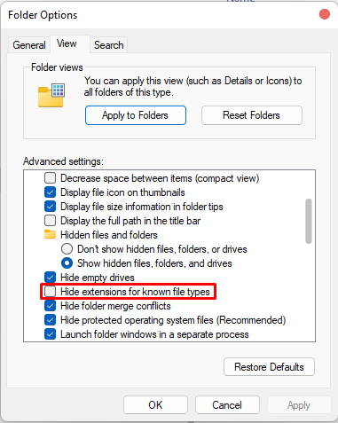
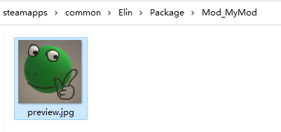
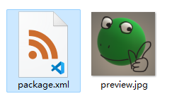

# Elin Mod パッケージ

Elin はさまざまな種類の Mod をサポートしています。ここでは、基本的なサンプル Mod を作成する手順を紹介します。

## Mod フォルダ

ローカルで開発する Mod は `<ElinGamePath>/Package/<ModName>` フォルダ内に配置してください。

場所が分からない場合は、Steam ライブラリで Elin を右クリックし、`プロパティ` → `インストール済みファイル` を開いてください。


`参照` をクリックして `Package` フォルダを開きます。ここにはローカル Mod のほか、Elin 本体のコアファイルも含まれています。新しいフォルダを作成し、その中に Mod のファイルを配置してください。


## ファイル拡張子を表示する

作業を進めやすくするため、ファイル拡張子を非表示にしないよう設定してください。


::: details Windows 10
+ エクスプローラーを開きます。タスクバーにアイコンがない場合は、スタートメニュー → Windows システム ツール → エクスプローラーを開いてください。
+ エクスプローラー上部の「表示」タブをクリックします。
+ 「ファイル名拡張子」にチェックを入れると、拡張子が表示されます。
:::

::: details Windows 11
+ エクスプローラーを開きます。タスクバーにアイコンがない場合は、スタートメニュー → Windows システム ツール → エクスプローラーを開いてください。
+ エクスプローラー上部の「表示」ドロップダウンをクリックします。
+ 「表示」→「ファイル名拡張子」を有効にしてください。
:::

## プレビュー画像 / サムネイル （preview.jpg）

プレビュー画像は Workshop ページでサムネイルとして使用されます。

ファイル名は `preview`、形式は `.jpg` にしてください。また、アップロード時の問題を避けるため、サイズはできれば 1MB 未満にしてください。


## package.xml を作成する

`package.xml` は Mod の情報を記述するファイルです。

Mod フォルダ内に新しいテキストファイルを作成し、**ファイル名と拡張子の両方**を `package.xml` に変更してください。


Chrome やブラウザではなく、テキストエディタで開き、以下の内容を入力します。

```xml
<?xml version="1.0" encoding="utf-8"?>
<Meta>
  <title>My Elin Mod</title>
  <id>my.veryunique.modid</id>
  <author>Me</author>
  <loadPriority>100</loadPriority>
  <version>0.23.50</version>
  <tags></tags>
  <description>
  </description>
  <builtin>false</builtin>
</Meta>
```

### title

Mod のタイトルです。

このタグ内に Mod のタイトルを入力してください。Workshop に初めてアップロードする際、このテキストが Mod のタイトルとして表示されます。

ただし、既存 Mod を更新する場合、この値は無視されます。タイトルを変更したい場合は Workshop 側で変更してください。

例: `<title>My Elin Mod</title>`

### id

Mod を識別するための一意の ID を指定します。

既存の Mod と重複するとアップロードに失敗します。他の Mod と衝突しにくい名前を設定してください。

例: `<id>my.veryunique.modid</id>`

::: danger Mod 更新時の注意
公開後は Mod の **`id`** を変更しないでください。変更すると別の Mod として扱われ、更新できなくなります。
:::

### author

作者名を入力します。

ここには任意の文字列を記述できます。

例: `<author>Me, Myself, and I</author>`

### loadPriority

Mod の読み込み順を指定します。

任意の数値（0 以上など）を入力してください。値が小さい Mod ほど先に読み込まれます。

例: `<loadPriority>100</loadPriority>`

### version

この Mod が最後に動作確認された Elin 本体のバージョンを記述します。

現時点では、必要がない限り頻繁に更新する必要はありません。将来的に Elin 本体で Mod システムに大きな変更が入った場合、本体バージョンより古い `version` を持つ Mod は読み込まれなくなります。

::: warning
これは **Mod 自身のバージョンではありません！**  
ゲーム本体のバージョンを設定してください。
:::

例: `<version>0.23.212</version>`

### tags

Workshop 用のタグを指定します。複数指定する場合はカンマ（`,`）で区切ってください。

タグは自由に設定できますが、公式タグを使用すると Workshop のカテゴリに表示されるようになります。

<LinkCard t="公式タグ一覧" u="https://docs.google.com/document/d/e/2PACX-1vR7MjQ_5hAmavFB8iMW6xm7vSYJg_g8I1s8KtvjBO-N_zNATnsmdmyQsmxQ8z9yEpZxNoc-TTdZm8so/pub"/>

例: `<tags>General,QoL,Utility,My Fun Mods,Use With Caution</tags>`

### description

Mod の説明文を入力します。

このテキストは Workshop に初回アップロードした際の説明文として使用されます。

ただし、更新時には無視されます。説明文を変更したい場合は Workshop 側で編集してください。

例: `<description />`

説明文の編集は Workshop ページで行ってください。

### builtin

`false` に設定してください。

気にしなくて大丈夫です。考えないでください。

例: `<builtin>false</builtin>`

### オプション: visibility

アップロード時の公開範囲を指定します。

指定可能な値は以下の通りです。

+ `Public`
+ `Unlisted`
+ `Private`
+ `FriendsOnly`

このタグを省略した場合、デフォルトで `Public` としてアップロードされます。

例: `<visibility>Unlisted</visibility>`

## アップロードと更新

以上で、何もしない空の基本 Mod が完成しました。

Elin を起動し、Mod Viewer を開いてください。作成した Mod が表示され、`Package` フォルダ内のローカル Mod であるため `[Local]` と表示されるはずです。

Mod をクリックすると `公开する` ボタンが表示されます。

まだ Workshop に公開されていない場合は **新規公開** されます。すでに公開済みの場合は **更新** が行われます。

