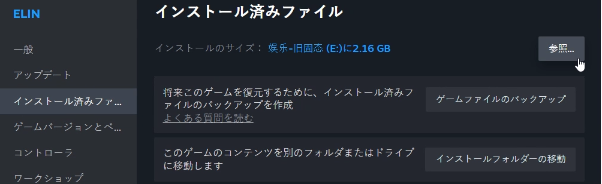
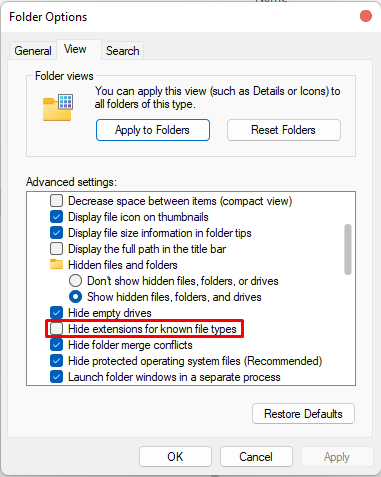
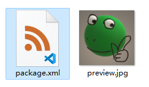

# Elin Mod パッケージ

Elin はさまざまな種類の Mod をサポートしています。ここでは、基本的なサンプル Mod を作成する手順を紹介します。

## Mod フォルダ

ローカルで開発する Mod は `<ElinGamePath>/Package/<ModName>` フォルダ内に配置してください。

場所が分からない場合は、Steam ライブラリで Elin を右クリックし、`プロパティ` → `インストール済みファイル` を開いてください。


`参照` をクリックして `Package` フォルダを開きます。ここにはローカル Mod のほか、Elin 本体のコアファイルも含まれています。新しいフォルダを作成し、その中に Mod のファイルを配置してください。


## ファイル拡張子を表示する

作業を進めやすくするため、ファイル拡張子を非表示にしないよう設定してください。


::: details Windows 10
+ エクスプローラーを開きます。タスクバーにアイコンがない場合は、スタートメニュー → Windows システム ツール → エクスプローラーを開いてください。
+ エクスプローラー上部の「表示」タブをクリックします。
+ 「ファイル名拡張子」にチェックを入れると、拡張子が表示されます。
:::

::: details Windows 11
+ エクスプローラーを開きます。タスクバーにアイコンがない場合は、スタートメニュー → Windows システム ツール → エクスプローラーを開いてください。
+ エクスプローラー上部の「表示」ドロップダウンをクリックします。
+ 「表示」→「ファイル名拡張子」を有効にしてください。
:::

## プレビュー画像 / サムネイル （preview.jpg）

プレビュー画像は Workshop ページでサムネイルとして使用されます。

ファイル名は `preview`、形式は `.jpg` にしてください。また、アップロード時の問題を避けるため、サイズはできれば 1MB 未満にしてください。


## package.xml を作成する

`package.xml` は Mod の情報を記述するファイルです。

Mod フォルダ内に新しいテキストファイルを作成し、**ファイル名と拡張子の両方**を `package.xml` に変更してください。


Chrome やブラウザではなく、テキストエディタで開き、以下の内容を入力します。

```xml
<?xml version="1.0" encoding="utf-8"?>
<Meta>
  <title>My Elin Mod</title>
  <id>my.veryunique.modid</id>
  <author>Me</author>
  <loadPriority>100</loadPriority>
  <version>0.23.50</version>
  <tags></tags>
  <description>
  </description>
  <builtin>false</builtin>
</Meta>
```

### title

Mod のタイトルです。

このタグ内に Mod のタイトルを入力してください。Workshop に初めてアップロードする際、このテキストが Mod のタイトルとして表示されます。

ただし、既存 Mod を更新する場合、この値は無視されます。タイトルを変更したい場合は Workshop 側で変更してください。

例: `<title>My Elin Mod</title>`

### id

Mod を識別するための一意の ID を指定します。

既存の Mod と重複するとアップロードに失敗します。他の Mod と衝突しにくい名前を設定してください。

例: `<id>my.veryunique.modid</id>`

::: danger Mod 更新時の注意
公開後は Mod の **`id`** を変更しないでください。変更すると別の Mod として扱われ、更新できなくなります。
:::

### author

作者名を入力します。

ここには任意の文字列を記述できます。

例: `<author>Me, Myself, and I</author>`

### loadPriority

Mod の読み込み順を指定します。

任意の数値を入力してください。値が小さい Mod ほど先に読み込まれます。値は `-999` ... `999` の範囲に丸められ、数値として解釈できない場合は既定値の `100` になります。

`loadPriority` が効くのは、ゲームがその Mod を**初めて**認識したときの位置だけです。Mod 一覧で並べ替えたり有効・無効を切り替えたりすると `loadorder.txt` に記録され、以後は保存された順序が優先されます。

例: `<loadPriority>100</loadPriority>`

### version

この Mod が最後に動作確認された Elin 本体のバージョンを記述します。

現時点では、必要がない限り頻繁に更新する必要はありません。将来的に Elin 本体で Mod システムに大きな変更が入った場合、本体バージョンより古い `version` を持つ Mod は読み込まれなくなります。

::: warning
これは **Mod 自身のバージョンではありません！**  
ゲーム本体のバージョンを設定してください。
:::

例: `<version>0.23.212</version>`

### tags

Workshop 用のタグを指定します。複数指定する場合はカンマ（`,`）で区切ってください。

タグは自由に設定できますが、公式タグを使用すると Workshop のカテゴリに表示されるようになります。

<LinkCard t="公式タグ一覧" u="https://docs.google.com/document/d/e/2PACX-1vR7MjQ_5hAmavFB8iMW6xm7vSYJg_g8I1s8KtvjBO-N_zNATnsmdmyQsmxQ8z9yEpZxNoc-TTdZm8so/pub"/>

例: `<tags>General,QoL,Utility,My Fun Mods,Use With Caution</tags>`

### description

Mod の説明文を入力します。

このテキストは Workshop に初回アップロードした際の説明文として使用されます。

ただし、更新時には無視されます。説明文を変更したい場合は Workshop 側で編集してください。

例: `<description />`

説明文の編集は Workshop ページで行ってください。

### builtin

`false` に設定してください。

気にしなくて大丈夫です。考えないでください。

例: `<builtin>false</builtin>`

### オプション: visibility

アップロード時の公開範囲を指定します。

指定可能な値は以下の通りです。

+ `Public`
+ `Unlisted`
+ `Private`
+ `FriendsOnly`

このタグを省略した場合、デフォルトで `Public` としてアップロードされます。

例: `<visibility>Unlisted</visibility>`

### オプション: dependency

自分の Mod より先に読み込まれる必要がある Mod を宣言します。対象 Mod の id は `id` **属性**に書きます。タグ内に書いたテキストは無視されます。

```xml
<dependency id="dk.elinplugins.customwhateverloader" />
```

+ id は前後の空白が除去され、大文字小文字は区別されません。`id=" Foo.Bar "` と `foo.bar` は同じ Mod を指します。
+ 1 つの属性にカンマ（`,`）区切りで複数の id を書いた場合、**そのうちどれか 1 つ**を満たせば条件成立です： `<dependency id="mod.a,mod.b" />`
+ **すべて**必要な場合はタグを複数回書いてください：
  ```xml
  <dependency id="mod.a" />
  <dependency id="mod.b" />
  ```
+ dependency は `loadAfter` も兼ねます。対象 Mod は自動的に自分より前に並べられます。
+ 条件を満たせない場合、その Mod は**読み込まれません**。Mod 一覧には不足している Mod が表示されます。

::: warning 組み込みパッケージへの依存は不可
組み込みパッケージ（`_Elona`、`_Lang_Chinese`、`_ModdingKit`、`Mod_Slot`）は依存先として指定できません。指定すると自分の Mod が読み込まれなくなります。
:::

例: `<dependency id="dk.elinplugins.customwhateverloader" />`

### オプション: incompatible

自分の Mod と同時に読み込んではいけない Mod を宣言します。書式は `dependency` と同じです。

```xml
<incompatible id="some.other.mod" />
```

+ この宣言は**双方向**に働きます。どちらか一方が宣言していれば十分です。
+ **先に読み込まれた**ほうが優先され、もう一方はブロックされます。Mod 一覧にはどの Mod にブロックされたかが表示されます。
+ 自分自身の id の宣言は無視されます。組み込みパッケージの宣言も無視されます。
+ 互換性の無い 2 つの Mod の間では `loadAfter` / `loadBefore` は効きません。

例: `<incompatible id="mod.a,mod.b" />`

### オプション: loadAfter / loadBefore

並び順のヒントのみを与えます。`dependency` と違い、読み込み自体を止めることはありません。

```xml
<loadAfter id="mod.that.loads.first" />
<loadBefore id="mod.that.loads.later" />
```

+ `id` 属性の書式は `dependency` と同じです（カンマ区切り、複数回記述可）。
+ 未インストールの対象は無視されるため、任意の Mod を指定しても安全です。
+ 組み込みパッケージは対象に指定できません。

例: `<loadAfter id="dk.elinplugins.customwhateverloader" />`

## アップロードと更新

以上で、何もしない空の基本 Mod が完成しました。

Elin を起動し、Mod Viewer を開いてください。作成した Mod が表示され、`Package` フォルダ内のローカル Mod であるため `[Local]` と表示されるはずです。

Mod をクリックすると `公开する` ボタンが表示されます。

まだ Workshop に公開されていない場合は **新規公開** されます。すでに公開済みの場合は **更新** が行われます。

