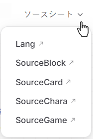
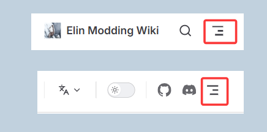
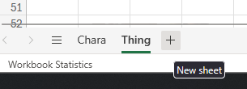
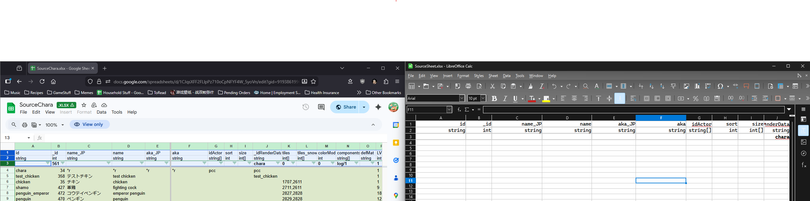

# はじめに

ElinのほとんどのMODでは、プログラミング（コーディング）の知識は必要ありません！

必要なファイルを含んだ [MODパッケージ](./basic_mod) を作成し、フォーマットされたxlsxファイルを使用することで、Elinにあらゆる種類の要素を追加することができます。

xlsxファイルの具体的な記入方法については、メニューの「`ソースシート`」セクションを参照してください。

::: details 仕組みの概要
+ MODパッケージ内の `package.xml` と `preview.jpg` により、ElinがMODを読み込み、カバー画像を表示できるようになります。当然ながら、MODパッケージが正しいファイルパスに配置されている必要があります。
+ フォーマットされたxlsxファイルによって、ゲーム内にSourceData（ソースデータ）が追加されます。
:::

## MODセットアップの例

完全なフォルダ構成は以下の通りですが、MODフォルダ自体（MODパッケージ）、`package.xml`、および `preview.jpg` を除き、使用しないフォルダは省略して構いません。


**LangMod** フォルダには言語コード名のサブフォルダが含まれていますが、まずは `EN` または `JP` を使用するだけで十分です。言語コードフォルダの中に、Excelファイル（**.xlsx**）などのMODデータを配置します。このExcelファイルがソースシートとして機能します。

## Source Sheets（ソースシート）

ナビゲーションバーのドロップダウンにある公式の「ソースシート」を確認してください。



::: details 見つからない場合
画面サイズが小さいか、ズーム倍率が高すぎる場合、このボタンが隠れていることがあります。ハンバーガーメニュー（3本の水平線）をクリックして **Sources** を探してください。

:::

ここでは、モッダーが参考にするために開発者がアップロードしたすべてのソースシートを見つけることができます。

xlsxファイルを読み書きできる環境を用意してください。これらは標準的なXMLベースのスプレッドシートです。
この種類のファイルを扱う最も一般的な方法は Microsoft Excel です。その他の選択肢としては、LibreOffice Calc や Google スプレッドシート（Google Sheets）などがあります。

ドライブには、カテゴリごとに分類された複数のソースファイルがあります。各カテゴリには複数のシートが含まれています。いずれかのファイルを開くと、下部に含まれているソースシートが表示されます。
これらのシート名が、オリジナルのシート名（例：Chara、Race、Jobなど）のいずれかと一致していることを確認してください。

独自のソースシートファイルを作成する際は、フォーマットが正しいことを確認する必要があります。
MOD全体で、内部にさまざまなシートを含む単一の `Source.xlsx` ファイルを持たせることができます。

必要に応じて新しいシートを追加し（「+」ボタンをクリック）、下部で名前を変更（右クリック）して、オリジナルのソースシート名に合わせてください。

|Excel|LibreOffice|
|-|-|
|||

サポートされている `SourceData` は以下の通りです： 
```txt:no-line-numbers
Chara, CharaText, Tactics, Race, Job, Hobby
Thing, ThingV, Food, Recipe, SpawnList, Category, Collectible, KeyItem
Element, Calc, Stat, Check, Faction, Religion, Zone, ZoneAffix, Quest, Area, HomeResource, Research, Person
GlobalTile, Block, Floor, Obj, CellEffect, Material
```

サポートされている `SourceLang` は以下の通りです： 
```txt:no-line-numbers
General, Game, List, Word, Note
```

これはファイル名ではなく、**シート名**であることに注意してください。

整理のために：
+ これらのシートをすべて1つのxlsxファイルにまとめることができます。
+ シートを複数のxlsxファイルに分割することもできます。

## データ行（Data Rows）

すべてのソースシートのデータ行は4行目から開始する必要があります（dialog.xlsxは例外ですが、これについては後ほど説明します）。  
+ **1行目** はヘッダー（見出し）で、各列が何を表しているかが含まれています。これは変更しないでください。  
+ **2行目** はデータ型（Type）で、各列のデータの種類が含まれています。  
+ **3行目** はその列のデフォルト値（初期値）です。  
+ **4行目** から、ゲームにMODとして導入したい内容を記入し始めることができます。

シートを設定する際は、オリジナルのシートに移動し、最初の3行を自分のシートにコピーしてください。必ず行全体をコピーするようにしてください。


## クイックサマリー（簡易概要）

### Lang
- 言語ファイル。説明が少し難しいですが、これらはログからUI要素に至るまで、プレイヤーであるあなたが目にするすべての言葉です。
大規模な新規コンテンツの追加を計画しているモッダーはこのファイルに慣れる必要がありますが、コードを書く予定がないのであれば、ここで多くの作業を行う必要はおそらくありません。

### SourceCard
- Thing - アイテム。
- ThingV - アイテムの家具バリエーション。
- Food - 食料アイテムとそのステータス。
- Recipe - 製作レシピ（クラフトレシピ）。
- SpawnList - ショップの在庫や、どのエリアにどのモンスターがスポーンするかなどのスポーンリスト。
- Category - アイテムカテゴリ。
- Collectible - 主に装飾やクエスト用のジャンクアイテム。
- KeyItem - 貴重品（キーアイテム）。

### SourceChara
- Chara - キャラクターのエントリ。
- CharaText - 吹き出しとしてキャラクターの頭上に表示されたり、シナリオに基づいてログに表示されたりするセリフ（台詞テキスト）。
- Tactics - 戦闘AI。各タクティクススタイルが特定のターンにどのような行動をとるかの重み付け。
- Race - キャラクターの種族。
- Job - キャラクターの職業（ジョブ）。クラス（Class）とも呼ばれます。
- Hobby - キャラクターの趣味。各キャラクターは少なくとも2つの趣味を持っています。

### SourceGame
- Element - 基本的にすべての能力値/スキル/フィート/魔法/アビリティがここに格納されます。
- Calc - さまざまな魔法やアビリティのダイス計算。
- Stat - バフやデバフなどの状態異常（コンディション）。
- Check - これについては気にする必要はありません。
- Faction - ゲーム内の派閥（ファクション）。この部分は大部分がハードコードされています。
- Religion - ゲーム内の宗教。
- Zone - ゾーン（エリア）データ。
- ZoneAffix - ランダムネフィア用で、接頭辞（形容詞）を追加します。
- Quest - クエストの説明、依頼者、クエスト名などのクエストデータ。
- Area - 指定可能な部屋の用途。
- HomeResource - ゾーンのさまざまな統計情報（リソース）。
- Research - ライセンスと報酬（研究）。
- Person - 明示的に定義されたドラマ（イベント）の登場人物。使用は必須ではありません。

### SourceBlock
- GlobalTile - ワールドマップで使用されるタイル。進入したときにどのゾーンを生成するかを指定します。これにはプレハブの場所（例：都市、ダンジョン、ネフィアなど）は含まれません。
- Block - ブロック、壁、屋根、階段。建築用。
- Floor - 床データ。文字通りの意味です。
- Obj - オブジェクトデータ。
- CellEffect - タイルに適用される追加エフェクト。
- Material - ゲーム内で利用可能になる素材（マテリアル）。

## 日英以外の言語について

### 前提知識

まずは `name_JP` と `name` のような列グループを例に挙げて、いくつかの基本を理解しましょう：
+ グループ内で `_JP` という接尾辞（サフィックス）が付いている列が日本語の列です。
+ 接尾辞がない列は英語の列であり、翻訳列としても機能します。

### 例

中国語（`CN`）を例として、`CN` フォルダを作成します。
1. `EN` または `JP` フォルダのいずれかでソースシートを記入し、それを `CN` フォルダにコピーします。ソースシートの記入に関する詳細な手順については、メインメニューの「`Source Sheets`」セクションを参照してください。
2. ソースシートの翻訳を開始します。日本語の列は変更せず、代わりに「翻訳列」（上記で述べた接尾辞のない列）を目的の言語に翻訳します。
3. その後、`SourceLocalization.json` 翻訳ファイルとしてエクスポートし、`CN` フォルダ内のソースシートを削除します。`json` のエクスポート方法の詳細については、[Translation 翻訳](../10_Source%20Sheets/localization) ページを参照してください。 

あるいは、最初に `SourceLocalization.json` ファイルをエクスポートして、`json` ファイル内で直接翻訳することもできます。詳細については、[Translation 翻訳](../10_Source%20Sheets/localization) ページを参照してください。