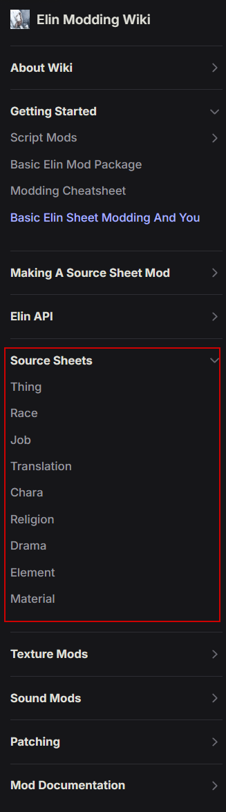
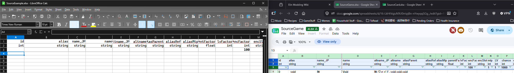
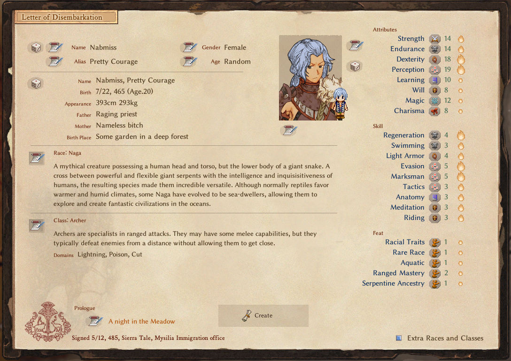
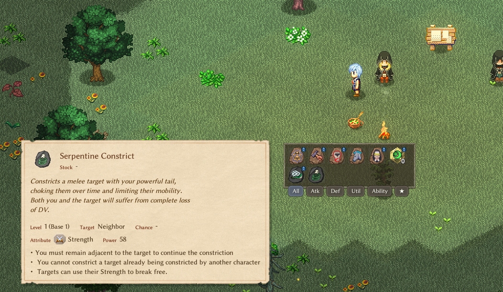
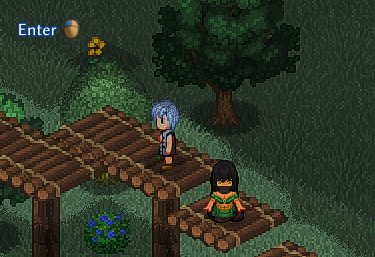
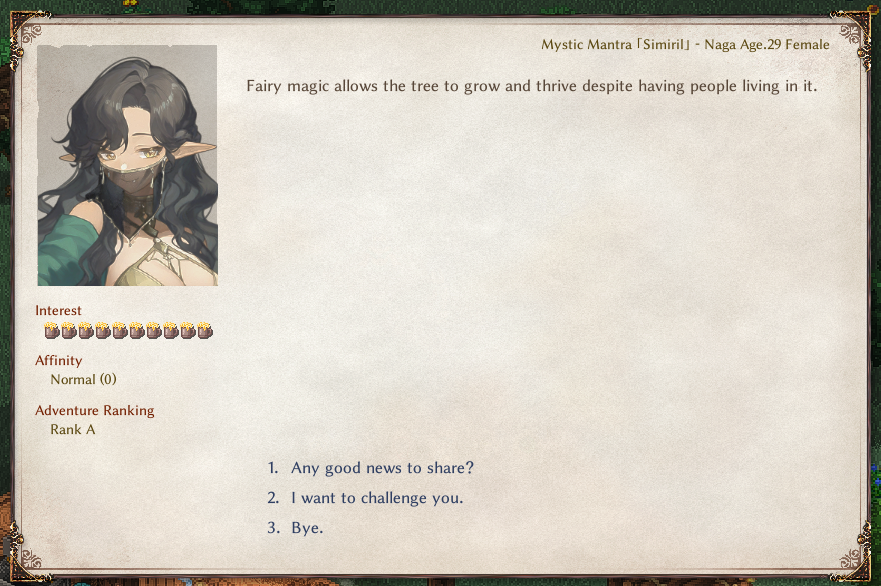

# Welcome to the Common Use Case Sheet Mod Tutorial

| Table of Contents |
| ----------- |
| [Introduction](#introduction) |
| [Prerequisites and Setup](#prerequisites-and-setup) |
| [Sheet Editing: Creating a new Race](#sheet-editing-creating-a-new-race) |
| [Sheet Editing: Creating the Feat and the Abilities](#sheet-editing-creating-the-feat-and-the-abilities) |
| [Sheet Editing: Creating the Conditions applied by the new Abilities](#sheet-editing-creating-the-conditions-applied-by-the-new-abilities) |
| [Coding: The Abilities and Conditions](#coding-the-abilities-and-conditions) |
| [Coding: The Feat](#coding-the-feat) |
| [Sheet Editing: Creating a Custom Adventurer](#sheet-editing-creating-a-custom-adventurer) |
| [Sheet Editing: Creating a Custom Weapon for the Adventurer](#sheet-editing-creating-a-custom-weapon-for-the-adventurer) |
| [Misc: Finishing Touches](#misc-finishing-touches) |

## Introduction
This tutorial will go through some common types of mods people would like to make.  
We will first off create a custom race, complete with their own racial feat and racial abilities.  
We will create a custom adventurer for that race that you can meet in game and recruit.
That custom adventurer will have a custom artifact weapon unique to them.

## Prerequisites and Setup
It is recommended you go through these tutorials first:
1) [Basic Elin Mod Package](https://elin-modding-resources.github.io/Elin.Docs/articles/2_Getting%20Started/basic_mod) will teach you how to set up your Mod Package in terms of layout and directory structure.
2) [Basic Elin Sheet Modding And You](https://elin-modding-resources.github.io/Elin.Docs/articles/2_Getting%20Started/sourcesheet_setup) will teach you what Source Sheets are and how they are used to load data.

In the Elin Modding Wiki, there is a Source Sheets section. Each of these pages target a specific Source Sheet type and go into depth explaining what each column does.

  

Also, this is a very text heavy tutorial, and you will need to know a small degree of C# coding, which will increase based on the complexity you seek in your mod.

### Setup your workspace.
1) Set up your new mod package as you've learned from the Basic Mod and SourceSheet Setup links in the Prerequisite section.
2) Get your favorite coding platform ready (VSCode and Jetbrains Rider are both free options.)
3) Get your preferred spreadsheet (.xlsx) editing tool ready (Microsoft Excel is the norm, Libreoffice is free.)
4) For the sake of this tutorial, the Source.xlsx file I have will have Element, Stat, Race, Chara, and Thing.  

5) To set up each of the sheets, either export the Source sheets via launch arguments, or go to the example google document repository noa has provided, then copy the first three rows of each of these sheets.  


## Sheet Editing: Creating a new Race
In your Source Sheet, set up a new sheet for Race. For this tutorial I will be creating the Naga Race.

*"A mythical creature possessing a human head and torso, but the lower body of a giant snake. A cross between powerful and flexible giant serpents with the intelligence and inquisisitiveness of humans, the resulting species made them incredible versatile. Although normally reptiles favor warmer and humid climates, some Naga have evolved to be sea-dwellers, allowing them to explore and create fantastic civilizations in the oceans."*

Nagas are very simillar to the vanilla "Mermaid" race, so I've copied that entire row from the Race sheet to start. Then I updated the existing statlines to better fit this race.
- Balanced their stats. Nagas have lower Charisma, but are focused on magic and endurance. Being snakes they are incredibly perceptive.
- Increased their inherent DV and Speed.
- Reduced the Aquatic Feat to 1 from 2, but the rest is pretty much the same for a Snake.
- Added resPoison/20 to make them immune to poison, cause snek.
- Set the playable to 5 so that it can be selected through "Advanced Classes and Races."
- Under the elements column, in preparation for my racial feat, I added FeatNaga/1.

<details>
<summary>Naga Race Sheet Data</summary>

| ColumnId | Value |
| ----------- | ----------- |
| `id` | naga |
| `name` | Naga |
| `playable` | 5 |
| `tag` | humanSpeak,ride,water,sand |
| `life` | 100 |
| `mana` | 120 |
| `vigor` | 100 |
| `DV` | 25 |
| `PV` | 0 |
| `PDR` | 0 |
| `EDR` | 0 |
| `EP` | 0 |
| `STR` | 8 |
| `END` | 10 |
| `DEX` | 10 |
| `PER` | 14 |
| `LER` | 8 |
| `WIL` | 8 |
| `MAG` | 12 |
| `CHA` | 8 |
| `SPD` | 100 |
| `elements` | featAquatic/1,featRoran/1,FeatNaga/1,regeneration/4,meditation/3,tactics/3,swimming/3,resPoison/20 |
| `figure` | 頭|首|体|背|手|手|指|指|腕| |
| `geneCap` | 6 |
| `height` | 450 |
| `detail` | A mythical creature possessing a human head and torso, but the lower body of a giant snake. A cross between powerful and flexible giant serpents with the intelligence and inquisisitiveness of humans, the resulting species made them incredible versatile. Although normally reptiles favor warmer and humid climates, some Naga have evolved to be sea-dwellers, allowing them to explore and create fantastic civilizations in the oceans. |

</details>

### Subsection: Creating a Custom Job
If you've set up a Custom Race, creating a Custom Job is very simillar honestly. They function in the same way, with Job feats being able to be added in the elements column in the Job Sheet.

## Sheet Editing: Creating the Feat and the Abilities
In your Source Sheet, set up a new sheet for Element. Remember to start on row 4!

**An Important Note:**
The `id` used in this tutorial is an example, but these are pretty important when it comes to multiple mods.
1) Try not using an id already used by another mod. A duplicate Id will result in either your mod or their mod overwriting each other for that entry and could cause unwanted results.
2) To not conflict with the vanilla game, try to keep all your ids after 60000.
3) A good idea would be to create yourself a unique number, like your birthday scrambled or something, and use that as a prefix. (e.g. Using 890621 as a prefix, your ids will go from 890621001 to 890621999.)

There's a saying, "Don't Re-invent the wheel." To make things easier, we can copy existing data from the original Element Source Sheet, then edit them as we want to ensure we got the columns filled out properly. For this tutorial, I'm going to add 1 Feat and 2 Abilities, so I start out by making a copy of the FeatVampire row, then two copies of the ActBladeStorm row.

Expand each section below to see the data I have used for each row.

<details>
<summary>Serpentine Ancestry Feat Sheet Data</summary>

### Racial Feat: Serpentine Ancestry
| ColumnId | Value |
| ----------- | ----------- |
| `id` | 89062101 |
| `alias` | FeatNaga |
| `name` | Serpentine Ancestry |
| `type` | FeatNaga |
| `detail` | A trait inherited from race. |
| `textPhase` | You are descended from Great Serpents. |
| `textExtra` | Grants use of the Serpentine Agility ability,Grants use of the Serpentine Constrict ability |

</details>

<details>
<summary>Serpentine Agility Ability Sheet Data</summary>

### Racial Ability: Serpentine Agility
| ColumnId | Value |
| ----------- | ----------- |
| `id` | 89062102 |
| `alias` | ActSerpentineAgility |
| `name` | Serpentine Agility |
| `aliasParent` | DEX |
| `target` | Self |
| `proc` | Buff,ConSerpentineAgility |
| `type` | Ability |
| `abilityType` | buff |
| `tag` | noRandomAbility,noShop,noCopy,noCostInc,keepInvisi |
| `cooldown` | 5 |
| `detail` | Focus on your lower body mobility, greatly increasing speed and evasion until you perform a hostile action. |

</details>

<details>
<summary>Serpentine Constrict Ability Sheet Data</summary>

### Racial Ability: Serpentine Constrict
| ColumnId | Value |
| ----------- | ----------- |
| `id` | 89062103 |
| `alias` | ActSerpentineConstriction |
| `name` | Serpentine Constrict |
| `aliasParent` | STR |
| `target` | Neighbor |
| `proc` | Debuff,ConSerpentConstriction |
| `type` | ActSerpentineConstriction |
| `categorySub` | attack |
| `abilityType` | debuff |
| `tag` | neg,specialAbility,noRandomAbility,noCostInc |
| `detail` | Constricts a melee target with your powerful tail, choking them over time and limiting their mobility. Both you and the target will suffer from complete loss of DV. |
| `textExtra` | You must remain adjacent to the target to continue the constriction, You cannot constrict a target already being constricted by another character, Targets can use their Strength to break free. |

</details>


## Sheet Editing: Creating the Conditions applied by the new Abilities

My racial abilities apply a Buff and Debuff respectively, so for this reason I will also need entries into the Stat Sheet. Set up the Stat Sheet, and for my purposes I'm going to add 3 rows worth of data.

*Note: For the sake of this tutorial I am keeping these conditions simple. Balancewise, they should probably scale off of power, and personally I would probably do them as multipliers, but that is a little more complicated and out of scope for this tutorial.*

<details>
<summary>Serpentine Agility Condition Sheet Data</summary>

### Buff Condition: Serpentine Agility
Serpentine Agility is simple enough, it's a speed and evasion buff that gets cancelled when doing hostile actions, allowing the Naga to ambush or escape situations quickly.

| ColumnId | Value |
| ----------- | ----------- |
| `id` | 89062104 |
| `alias` | ConSerpentineAgility |
| `name` | Serpentine Agility |
| `type` | ConSerpentineAgility |
| `group` | Buff |
| `duration` | 1 |
| `elements` | SPD,50,DV,50 |
| `colors` | buff |
| `element` | ConSerpentineAgility |
| `strPhase` | Serpentine Agility |
| `textPhase` | #1 lower(s) their body to focus on mobilty. |
| `textEnd` | #1 return(s) to an upgright position. |
| `gradient` | condition |
| `invert` | False |
| `detail` | A condition where you are focusing on your lower serpentine body to maximize your movement. |

</details>

<details>
<summary>Serpent Constricted Condition Sheet Data</summary>

### Debuff Condition: Serpent Constricted
Serpent Constriction is simple enough. Since they aren't able to really move, it lowers their speed, evasion, and accuracy.

| ColumnId | Value |
| ----------- | ----------- |
| `id` | 89062105 |
| `alias` | ConSerpentConstriction |
| `name` | Serpent Constricted |
| `type` | ConSerpentConstriction |
| `group` | Debuff |
| `duration` | 1 |
| `elements` | SPD,-25,DV,-100,HIT,-25 |
| `colors` | fear |
| `element` | ConSerpentConstriction |
| `strPhase` | Serpent Constricted |
| `textPhase` | #1 are/is constricted. |
| `textEnd` | #1 are/is no longer constricted |
| `gradient` | condition |
| `invert` | False |
| `detail` | A condition where you are being constricted violently. |

</details>

<details>
<summary>Serpent Constricting Condition Sheet Data</summary>

### Debuff Condition: Serpent Constricting
Serpent Constricted is a condition that's added on the Naga themselves when the Naga uses Serpentine Constriction on a victim, limiting their own evasiveness and leaving them open to attack. However, since they're only using their lower body to hold them still, they can still strike at full speed with their humanoid parts.
| ColumnId | Value |
| ----------- | ----------- |
| `id` | 89062106 |
| `alias` | ConSerpentConstricting |
| `name` | Serpent Constricting |
| `type` | ConSerpentConstricting |
| `group` | Stance |
| `duration` | 1 |
| `elements` | DV,-100 |
| `colors` | stance |
| `element` | ConSerpentConstricting |
| `strPhase` | Serpent Constricting |
| `textPhase` | #1 constrict(s) their target. |
| `textEnd` | #1 are/is no longer constricting a target. |
| `gradient` | condition |
| `invert` | False |
| `detail` | A condition where you are focused on constricting a target. |

</details>

## Coding: The Abilities and Conditions

These are a little more complex, and mostly tailored to my specific scenario. If you want to focus on the Feat itself rather than the abilities and the conditions, [skip this section.](#coding-the-feat)

I tried to be as thorough as possible in terms of adding extra comments to help explain what each line does.

<details>
<summary>Serpentine Agility Code</summary>

The ConSerpentineAgility.cs class itself is pretty short.

```C#
namespace MyMod.Stats;

public class ConSerpentineAgility : BaseBuff
{
    public override ConditionType Type => ConditionType.Buff;
    
    // Overriding TimeBased to be true allows this condition to tick on the global turn timer instead of individual ticks
    public override bool TimeBased => true;
    
    // Since this is more of a "Toggle" ability, this hides the number that normally would show the duration.
    public override string TextDuration => "";
    
    public override void Tick()
    {
        // I overrided the base Tick() function with an empty function. My reasoning is that this ability will remain active until the Naga actually performs a different action.
    }
}
```

However, to complete its implementation, I will need to add a small Patch Class to cancel it when the user makes a hostile action. So I also add CharaPatches.cs with the following code.

```C#
using HarmonyLib;
using MyMod.Stats;
namespace MyMod.Patches;

[HarmonyPatch(typeof(Chara))]
internal class CharaPatches : EClass
{
    // Prefixes run before the specified original function, so when a character performs a hostile action, this function is called first.
    [HarmonyPatch(nameof(Chara.DoHostileAction))]
    [HarmonyPrefix]
    internal static bool DoHostileAction_Prefix(Chara __instance, Card _tg, bool immediate = false)
    {
        // Naga - Cancel out Serpentine Agility upon doing a hostile action.
        ConSerpentineAgility serpentineAgility = __instance.GetCondition<ConSerpentineAgility>();
        serpentineAgility?.Kill();

        // Returning true in a Prefix will resume execution of the original function.
        return true;
    }
}
```

</details>
<details>
<summary>Serpentine Constricting and Constriction Code</summary>
To reduce some duplicate code, I've created a HelperFunctioncs.cs class and dropped the following function into it.

```C#
using System.Linq;

namespace MyMod.Common;

public static class HelperFunctions
{    
    /// <summary>
    /// This is a helper function to search for the carrier of the linked condition.
    /// It is used both on the dealing and receiving end.
    /// </summary>
    /// <param name="conditionCarrier">The character that has a condition that has a linked condition on another character.</param>
    /// <param name="linkedUID">The UID of the character that is being looked for.</param>
    /// <returns>If found, the character object that possesses the linked condition.</returns>
    internal static Chara? FindLinkedConditionCarrier(Chara conditionCarrier, int linkedUID)
    {
        Chara linkedCarrier = null;
        conditionCarrier.pos.ForeachNeighbor(delegate(Point p)
        {
            // ForeachNeighbor actually also grabs the original position too, so skip it if it's the same position as the victim.
            if (!p.Equals(conditionCarrier.pos))
            {
                // Look to see if any of the neighboring characters is the character linked.
                foreach (Chara potentialLink in p.Charas.Where(potentialLink => potentialLink.uid == linkedUID))
                {
                    linkedCarrier = potentialLink;
                    break;
                }
            }
        });
        
        return linkedCarrier;
    }
}
```

Let's start with Serpent Constriction

```C#
using Newtonsoft.Json;
using MyMod.Common;
namespace MyMod.Stats;

public class ConSerpentConstriction : BaseDebuff
{
    // Similar to being suffocated, Prevent Regeneration while being constricted. 
    public override bool PreventRegen => true;
    
    // Realistically, a Naga can only constrict a single target at a time.
    // Using a JsonProperty, I am able to modify the condition to point towards a Unique Identifier.
    // This way the condition can keep track of what character is being choked.
    // Make sure when we add this condition that we set this property.
    [JsonProperty(PropertyName = "L")] public int LinkedUID;
    
    public override ConditionType Type => ConditionType.Debuff;
    
    // Since this is more of a "Toggle" ability, this hides the number that normally would show the duration.
    public override string TextDuration => "";
    
    // When this Condition is removed, we want to remove the linked condition on the character doing the constricting.
    public override void OnRemoved()
    {
        Chara? linkedChara = HelperFunctions.FindLinkedConditionCarrier(owner, LinkedUID);
        linkedChara?.RemoveCondition<ConSerpentConstricting>();
    }

    public override void Tick()
    {
        // You're probably not going to be choking someone in the world map, so I'll end this condition if the owner is in the world map.
        if (EClass._zone.IsRegion)
        {
            this.Kill();
            return;
        }
        
        // I want to give the victim a chance to escape.
        // First, find the Naga currently constricting the target. We know this condition can only be applied in melee range, so I can simply look into the neighboring tiles.
        Chara? constrictor = HelperFunctions.FindLinkedConditionCarrier(owner, LinkedUID);
        
        // If the victim is being choked by a nonexistent or Dead Naga, go ahead and remove this condition.
        if (constrictor is not { IsAliveInCurrentZone: true })
        {
            this.Kill();
            return;
        }
        
        // EClass.rnd simply returns a random number between 0 and the provided number
        // EClass.rndHalf first divides the value in half, then adds a random number between 0 and the halved amount to the original half, guaranteeing half of the value at least.
        // So this section basically pits the victim's strength against the constrictor's strength, where the constrictor has an advantage.
        // Then, if if the victim has lower overall strength than their constrictor, they must win a 25% roll to escape.
        if (EClass.rnd(owner.Evalue(SKILL.STR)) > EClass.rndHalf(constrictor.Evalue(SKILL.STR)) &&
            (owner.Evalue(SKILL.STR) > constrictor.Evalue(SKILL.STR) || EClass.rnd(4) == 0))
        {
            // They have successfully broken free! End this condition.
            CC.Say("serpentine_constriction_escape".langGame(owner.NameSimple, constrictor.NameSimple));
            this.Kill();
        }
        else
        {
            // Whoops, looks like they're still being choked. Real Shame.
            // Force Apply ConEntangle to the victim.
            owner.AddCondition<ConEntangle>(this.power, force: true);
            CC.Say("serpentine_constriction_damage".langGame(owner.NameSimple));
            // They will take choking damage relevant to their Max HP.
            owner.DamageHP(10 + owner.MaxHP / 20, AttackSource.Condition);   
        }
    }
}
```

Serpent Constricting is not as complicated as the victim condition and shares quite a bit of the same code.

```C#
using Newtonsoft.Json;
using MyMod.Common;
namespace MyMod.Stats;

public class ConSerpentConstricting : BaseDebuff
{
    // Realistically, a Naga can only constrict a single target at a time.
    // Using a JsonProperty, I am able to modify the condition to point towards a Unique Identifier.
    // This way the condition can keep track of what character is being choked.
    // Make sure when we add this condition that we set this property.
    [JsonProperty(PropertyName = "L")] public int LinkedUID;

    // The user can simply choose to stop constricting the target.
    public override bool CanManualRemove => true;

    public override ConditionType Type => ConditionType.Debuff;
    
    public override string TextDuration => "";

    // When this Condition is removed, we want to remove the linked condition on the Victim.
    public override void OnRemoved()
    {
        Chara? linkedChara = HelperFunctions.FindLinkedConditionCarrier(owner, LinkedUID);
        linkedChara?.RemoveCondition<ConSerpentConstriction>();
    }
    
    public override void Tick()
    {
        // You're probably not going to be choking someone in the world map, so I'll end this condition if the owner is in the world map.
        if (EClass._zone.IsRegion)
        {
            this.Kill();
        }
        
        // Make sure the victim is still neighboring the Naga and hasn't teleported away or something.
        Chara? victim = HelperFunctions.FindLinkedConditionCarrier(owner, LinkedUID);
        
        // If the Naga is choking a nonexistent or dead character, go ahead and remove this condition.
        if (victim is not { IsAliveInCurrentZone: true })
        {
            this.Kill();
            return;
        }
        
        // Let's give the Naga a little big of exp in the Constricting Skill for continually choking someone.
        owner.elements.ModExp(891179, 20f);
    }
}
```

</details>


<details>
<summary>Serpentine Constriction Ability Code</summary>

```C#
using MyMod.Stats;
namespace MyMod.Elements;

public class ActSerpentineConstriction : Ability
{
    public override bool IsHostileAct => true;
    
    public override bool CanPerform()
    {
        // This ability must be used on a character target.
        // We should not allow for Ouroboros where the Nagas decide to choke themselves...?
        if (TC is not { isChara: true } || TC == CC)
        {
            return false;
        }
        
        // We cannot have multiple Nagas choking the same individual.
        // I realize now that having recursive choking is technically now a thing, but the thought of that makes me chuckle, so I'm leaving it in.
        // However, we SHOULD allow it so that if the Naga is currently choking a foo, using the ability on them again will end the bondage.
        ConSerpentConstriction existingConstriction = TC.GetCondition<ConSerpentConstriction>();
        return existingConstriction == null || existingConstriction.LinkedUID == CC.uid;
    }
    
    public override bool Perform()
    {
        // If the Naga re-uses the ability on the same target, end the constriction and that's it.
        ConSerpentConstricting existingConstricting = CC.GetCondition<ConSerpentConstricting>();
        if (existingConstricting != null) {
            if (existingConstricting.LinkedUID == TC.uid)
            {
                CC.RemoveCondition<ConSerpentConstricting>();
                CC.Say("serpentine_constriction_release".langGame(CC.NameSimple, TC.NameSimple));
                return true;
            }
            else
            {
                // We want to make sure the Naga isn't trying to choke multiple targets.
                // If the user already has the Constricting Condition, and it isn't the target, remove the condition (which will end the existing link) and add a new one.
                Chara? previousTarget = HelperFunctions.FindLinkedConditionCarrier(CC, existingConstricting.LinkedUID);
                if (previousTarget != null) CC.Say("serpentine_constriction_release".langGame(CC.NameSimple, previousTarget.NameSimple));
                CC.RemoveCondition<ConSerpentConstricting>();
            }
        }
        
        // Add the Constriction Condition and the Linked UID, then add the Constricting Condition.
        ConSerpentConstriction victimCondition = TC.Chara.AddCondition<ConSerpentConstriction>(this.GetPower(CC), force:true) as ConSerpentConstriction;
        if (victimCondition != null)
        {
            victimCondition.LinkedUID = CC.uid;
            ConSerpentConstricting userCondition = CC.Chara.AddCondition<ConSerpentConstricting>(force: true) as ConSerpentConstricting;
            userCondition.LinkedUID = TC.uid;
            CC.Say("serpentine_constriction_start".langGame(CC.NameSimple, TC.NameSimple));
        }
        
        return true;
    }
}
```
</details>

## Coding: The Feat
Create a new class file for your Feat.

<details>
<summary>Template for MyFeat.cs</summary>

```C#
// The namespace is used to organize related code in your mod. Since this is an Elements class, it makes sense to add it under Elements.
namespace MyMod.Elements;

// Make sure to match the Type defined in the Sheet section above. It inherits off the base "Feat" class used in Elin.
public class MyFeat : Feat
{
    // I am overriding the Apply function to allow my mod to add functionality to my Feat. See Feat.cs in the base code to see what goes in there!
    // int a - The amount of this Feat that will be applied to whoever is gaining/losing this feat. If a is negative, that means the feat is being removed.
    // ElementContainer owner - The object that this feat is being applied to.
    // bool hint - If this is meant to be called to show hint text or not for this feat.
    public override List<string> Apply(int a, ElementContainer owner, bool hint = false)
    {
        // For my purposes, I don't need any hint text outside the ones I defined in textPhase and textExtra above. So I go ahead and return immediately if this is a hint.
        if (hint) return;
        
        // I add two skeleton sections, one to handle if I am adding the feat...
        if (a == 1)
        {
        }
        // and one to handle if the feat is being removed.
        else if (a == -1)
        {
        }
    }
}
```

</details>

At this point, I will have another example that a lot of people might find helpful.
With the advent of Slime, it is possible to gain a spell as an ability, thus bypassing the spellstock requirement.
So if you want a specific Feat to add an unlimited use spell, this is also where we would add it.

For Nagas, they are snakes after all, so to make them venemous, they will start with Poison Intonation (I know Poison isn't Venom, but I'm making do with what we got okay?)

I add a quick Constants class to make it look a little cleaner, then flesh out FeatNaga.cs to make it actually add the abilities to the character when they have the Feat.

<details>
<summary>Code for Constants.cs and FeatNaga.cs</summary>

```C#
namespace MyMod.Common;
public class Constants
{
    // Important thing to note, these 3 are the same Ids I've defined my rows with in the Elements Source.
    public const int FeatNaga = 89062101; 
    public const int ActSerpentineAgility = 89062102;
    public const int ActSerpentineConstriction = 89062103;
}
```

```C#
using MyMod.Common;
namespace MyMod.Elements;

public class FeatNaga : Feat
{
    public override List<string> Apply(int a, ElementContainer owner, bool hint = false)
    {
        if (hint) return;
        
        if (a)
        {
            // Players and NPCs are slightly different when gaining abilities.
            // The NPCs maintain a list of abilities they can use, while Players are dependent more on the Element Container.
            // So when this Feat is added, I need to change the behavior on how it is applied to the character depending on whether the character is player controlled or not.
            if (owner.Chara.IsPC)
            {
                if (!owner.Chara.HasElement(Constants.ActSerpentineConstriction)) owner.Chara.AddElement(Constants.ActSerpentineConstriction);
                if (!owner.Chara.HasElement(Constants.ActSerpentineAgility)) owner.Chara.AddElement(Constants.ActSerpentineAgility);

                // This is the process used to add a permanent spell to the PC.
                owner.Chara._listAbility ??= new List<int>();
                owner.Chara._listAbility.Add(SPELL.weapon_Poison);
                if (owner.Chara.elements.GetElement(SPELL.weapon_Poison) == null) owner.Chara.elements.ModBase(SPELL.weapon_Poison, 1);
            }
            else
            {
                if (!owner.Chara.ability.Has(Constants.ActSerpentineConstriction)) owner.Chara.ability.Add(Constants.ActSerpentineConstriction, 100, false);
                if (!owner.Chara.ability.Has(Constants.ActSerpentineAgility)) owner.Chara.ability.Add(Constants.ActSerpentineAgility, 100, false);
                owner.Chara.ability.Add(SPELL.weapon_Poison, 100, false);
            }
        }
        else if (a == -1)
        {
            // Simillar to above, removing also requires me to remove it from different places.
            if (owner.Chara.IsPC)
            {
                owner.Chara.elements.Remove(Constants.ActSerpentineConstriction);
                owner.Chara.elements.Remove(Constants.ActSerpentineAgility);

                // This is the process to remove a permanent spell from the PC.
                owner.Chara._listAbility.Remove(id);
                if (owner.Chara._listAbility.Count == 0) owner.Chara._listAbility = (List<int>) null;
            }
            else
            {
                if (owner.Chara.ability.Has(Constants.ActSerpentineConstriction)) owner.Chara.ability.Remove(Constants.ActSerpentineConstriction);
                if (owner.Chara.ability.Has(Constants.ActSerpentineAgility)) owner.Chara.ability.Remove(Constants.ActSerpentineAgility);
            }
        }
    }
}
```

</details>

## Sheet Editing: Creating a Custom Adventurer

Now that we have a Custom Race Set up, let's bring it to life with a Custom Adventurer! Create and set up the Chara sheet in your Source.xlsx file, and start filling out your custom character. This part is mostly going to be your own imagination, but you still want to fill everything out properly. For this example, I'm going to add a Naga Bard, Sirimil.

A very important column to call out is the `tag` column. You can read more details about the column [here](https://elin-modding-resources.github.io/Elin.Docs/articles/10_Source%20Sheets/character#spawn-setting).
- addZone(specwing) will make my custom character spawn in the fairy city of Specwing.
- addBio(simiril) will link a biography file I can include to flesh out her background a bit more.
- addThing(instrument_violin) will give her a violin to start, which makes sense for a pianist.
- addThing(cloak_feather#Normal) will give her a Feather Cloak.
- addThing(sword_nagawhip) will give her a unique weapon I will define in the next section.

<details>
<summary>Custom Naga Adventurer: Sirimil</summary>

| ColumnId | Value |
| ----------- | ----------- |
| `id` | sirimil |
| `_id` | 89062107 |
| `name` | Sirimil |
| `aka` | Mystic Mantra |
| `renderData` | @chara |
| `colorMod` | 0 |
| `LV` | 40 |
| `chance` | 0 |
| `quality` | 4 |
| `hostility` | Friend |
| `tag` | addZone(specwing),addBio(simiril),addThing(instrument_violin),addThing(martial_chakram#Superior),addThing(cloak_feather#Normal),addThing(sword_nagawhip) |
| `trait` | AdventurerCustom |
| `race` | naga |
| `job` | pianist |
| `tactics` | summoner |
| `actCombat` | SongValor,ActGazeDim/50,SpSummonShadow/30 |
| `elements` | weaponSword/20,music/40,evasion/10,evasionPlus/5,eyeofmind/5 |
| `category` | chara |
| `bio` | f/29/550/470/friendly|私|君 |
| `works` | Instrument |
| `idText` | bard |

</details>

<details>
<summary>bio_simiril.json</summary>

```
{
    "BirthDay": 21,
    "BirthMonth": 6,
    "BirthYear": 389,
    "BirthPlace": "Zersh Oasis",
    "BirthLocation": "Kjaraht",
    "Mom": "Temple Guardian",
    "Dad": "Temple Guardian",
    "Background": "A traveling musician from a far away desert region. Although initially people are frightened by her monstrous body, they are quickly won over when witnessing her enchanting performance of dance and song. Her presence is a welcome one for any bar, bringing up the spirits all the patrons.
    "FavFood": "yakiimo",
    "FavCategory": "booze",
    "LikeThing": "goods_charm",
    "LikeHobby": "music"
}
```

</details>

## Sheet Editing: Creating a Custom Weapon for the Adventurer

Let's give our custom pianist a little more flair. I'm going to create a unique sword for her, a Naga Swordwhip.

<details>
<summary>Custom Weapon: Naga Whipsword</summary>

| ColumnId | Value |
| ----------- | ----------- |
| `id` | sword_nagawhip |
| `name` | Naga Whipsword |
| `unknown` | serpent adorned sword |
| `category` | sword |
| `renderData` | @obj_S flat |
| `colorMod` | 100 |
| `recipeKey` | - |
| `defMat` | steel |
| `tierGroup` | metal |
| `value` | 10000 |
| `LV` | 40 |
| `chance` | 0 |
| `quality` | 4 |
| `weight` | 2500 |
| `elements` | meleeDistance/2,negateParry/10,eleCut/25 |
| `range` | 1 |
| `attackType` | Slash |
| `offense` | 6,6,5,0 |
| `substats` | 20 |
| `detail` | A unique hybrid between a sword and a whip, chaining multiple bladed segments together. The extreme flexibility and versatility allows a user to strike from a distance. |

</details>

## Misc: Finishing Touches

Create/Source some sprites for your work, and drop them all into the correct locations, then that actually should be it!
Build your package and load Elin. After selecting Extra races and classes you should be able to see the newly made Naga class.


Upon selecting Naga and loading in your game, in your ability bar you should have all 3 of the abilities we wanted them to have.




Then, head to Specwing, and you should be able to find your new custom adventurer hanging around!  




