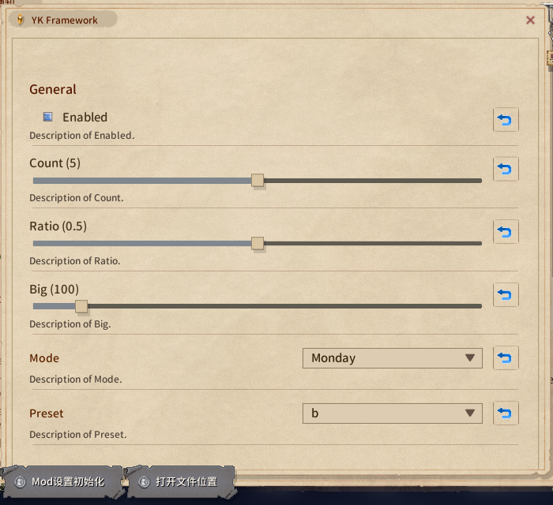

# Mod 設定ページ

どの mod も自分の設定ページを持てます。Mod ビューアのその mod の行から開きます。BepInEx プラグインは `Config.Bind` した項目から自動生成されます。`IModConfig` を実装して自分でレイアウトすることもできます。


生成されたページ：



## 自分でレイアウト：`IModConfig`

`IModConfig` を実装したプラグインには、ページは**自動生成されません**。`OnBuildConfig` で自分で組み立てます：

| 拡張メソッド（`using EModding;`） | 得られるもの |
|-|-|
| `note.AddAll(Config)` | 自動生成ページ全体。セクション込み |
| `note.Add(entry)` | 1 項目。ウィジェットは型で決まる |
| `note.AddSlider(entry, min, max, label = null)` | ここで渡した範囲のスライダー。項目側の宣言は無視。値が範囲外なら丸めた値を表示し、ドラッグするまで書き換えない |
| `note.AddDropdown(entry, values, label = null)` | この選択肢のドロップダウン。項目の型は問わない。現在値が選択肢になければ先頭に並ぶ |

どれも項目を直接読み書きし、`SaveOnConfigSet` に従います。ラベルは `Lang.Get` を通ります。ページは表示のたびに作り直されるので、ウィジェットの参照はキャッシュしないでください。`ConfigEntry` でない状態は自分のフィールドに持ち、コールバックで読み書きします。

```cs
using System.Collections.Generic;
using BepInEx;
using BepInEx.Configuration;
using EModding;

[BepInPlugin("author.example", "Example", "1.0.0")]
public class ExamplePlugin : BaseUnityPlugin, IModConfig {
	public ConfigEntry<bool> enabled;
	public ConfigEntry<int> count;
	public ConfigEntry<string> preset;
	public string mode = "B", name = "hello";

	void Awake() {
		enabled = Config.Bind("General", "Enabled", true);
		count = Config.Bind("General", "Count", 5);
		preset = Config.Bind("General", "Preset", "b");
	}

	public void OnBuildConfig(UINote note) {
		note.AddHeader("General");
		note.Add(enabled);                                   // トグル
		note.AddSlider(count, 0, 100, "How many");           // スライダー。AcceptableValueRange は不要
		note.AddDropdown(preset, ["a", "b", "c"]); // 固定の選択肢

		note.AddHeader("Advanced");

		// ConfigEntry でない値は普通の UINote メソッドで
		var modes = ["A", "B", "C"];
		var dd = note.AddDropdown("Mode");
		dd.SetList(modes.IndexOf(mode), modes, (m, i) => m, (i, m) => mode = m, false);
		note.AddText("Which mode to use.", FontColor.Passive);

		UIButton b = null;
		b = note.AddButton("Name: " + name, () => Dialog.InputName("Name", name, (cancel, text) => {
			if (cancel) return;
			name = text;
			b.mainText.text = "Name: " + text;
		}, Dialog.InputType.Chat));

		note.AddTopic("Version", Info.Metadata.Version.ToString());
		note.AddButtonLink("Project page", "https://example.com/");
	}
}
```

自動生成ページの後ろに少し足したいだけなら、先に `note.AddAll(Config);` と書いて、その後ろに追加します。


自分の状態もリセットボタンの対象にしたいなら、パッケージの `onResetConfig` にデリゲートを追加します。BepInEx の項目はすでに繋がっている（`Config` の全項目。ページに描いたかどうかは関係なし）ので、ここでは自分の分だけ扱います：

```cs
void Start() {
	var pkg = ModUtil.FindFileProviderPackage(new FileInfo(Info.Location));
	if (pkg != null) {
        pkg.onResetConfig += () => mode = "B";
    }
}
```

## `UINote` 早見表

| メソッド | 得られるもの |
|-|-|
| `AddHeader(string)` / `AddHeaderTopic(string)` | セクション見出し（自動生成ページもこれ）/ 小見出し |
| `AddToggle(string label, bool isOn, Action<bool>)` | トグル。`UIButton` を返す（`interactable` で無効化できる） |
| `AddSlider(float value, Func<float,string> action, float min = 0, float max = 1, bool isInt = false)` | スライダー。`action` は値を書いてラベルを返す。構築時にも、範囲に丸めた初期値で 1 回呼ばれる。`Slider` を返す |
| `AddDropdown(string label)` | 左にラベル、右にドロップダウン。`UIDropdown` を返し、`SetList(index, list, getName, onChange, notify: false)` で中身を入れる |
| `AddButton(string text, Action)` | 1 行ぶんのボタン。`UIButton` を返す |
| `AddText(string)` / `AddText(string, FontColor.Passive)` | 本文。折り返して高さが伸びる。`"NoteText_small"` は固定 20px の 1 行用で、複数行はあふれる |
| `AddTopic(string label, string value)` | 左にラベル、右に値 |
| `AddButtonLink(string text, string url)` | リンク |
| `Space(int height)` | 空行 |
| `AddImage(Sprite)` / `AddPrefab(string path)` | 画像 / 自前の prefab |
