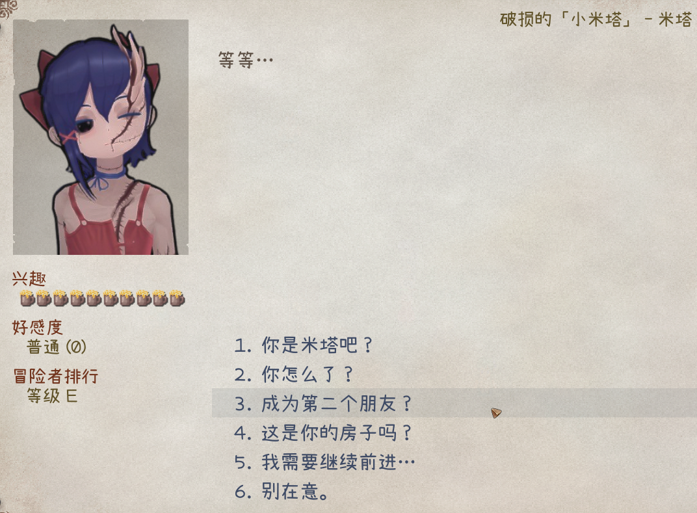

## 剧情

剧情是通过多选项对话和附加动作构成的丰富交互系统。

要为角色指定自定义剧情，请在源表的 `tag` 列中，使用 `addDrama_自定义剧情表名称` 标签；CWL将自动定向至该剧情。

自定义剧情表必须放置在 `LangMod/**/Dialog/Drama/` 文件夹下, 且名称需与标签匹配。例如：使用 `addDrama_drama_example` 标签时需对应`Dialog/Drama/drama_example.xlsx`文件。其中`drama_example`换成你的剧情表名称（英语+数字），此外名称请足够独特。

**重要**: 您只需提供 **1** 份剧情表，它可以放置在任何语言子文件夹中。CWL支持在同一表格内提供多语言的本地化。

制作时可参考游戏内置剧情表 **Elin/Package/_Elona/Lang/_Dialog/Drama**, 或含有模板的Tiny Mita范例：
<LinkCard t="CWL范例：Tiny Mita" u="https://steamcommunity.com/sharedfiles/filedetails/?id=3396774199" i="https://raw.githubusercontent.com/gottyduke/Elin.Plugins/refs/heads/master/CwlExamples/TinyMita/preview.jpg" />

::: tip 热重载
剧情表在游戏运行时编辑保存后会在下一次打开时热重载。
:::

## 基础结构

剧情表按从上至下顺序执行, 由多行剧情单元构成。每行剧情单元包含以下列(由首行定义)：

- `step`：标记后续行为剧情步骤起点, 直至遇到下一个step标记
- `jump`：执行该行时跳转的目标步骤
- `if`/`if2`：执行条件。若同时存在`if2`列, 则需同时满足两个条件
- `action`：执行的动作
- `param`：动作参数
- `actor`：当前说话角色 ID, 用于多人对话场景。默认 `tg`。后缀 `?` 以显示名称为 `???`
- `id`：文本行唯一标识(仅文本行必需)
- `text_XX`/`text_JP`/`text_EN`：实际对话内容。`XX` 为语言代码，例如 `text_CN`, `text_ZHTW`。`text` 列将作为缺失语言代码的备选。

(点击放大)

剧情通过步骤串联执行, 每个步骤包含若干行剧情单元, 可混合对话/动作/条件判断。

`main`是默认起始步骤, `end`是默认结束步骤。自定义步骤名请避免使用下划线`_`或`flag`前缀, 以免与内部步骤冲突。

## Mod Help集成

有时您可能想为玩家提供一些提示，以便他们更好地体验您精彩的剧情故事。通过使用CWL制作模组，您可以使用Mod Help 来提供定制的帮助页面。

<LinkCard t="Mod Help" u="/100_Mod Documentation/Mod Help/2_mod_help_cn.md" i="https://raw.githubusercontent.com/Drakeny/Elin.ModHelp/refs/heads/main/package/ModHelp.png" />
