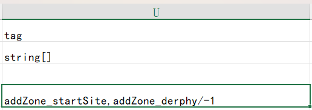

## 导入自定义角色

假设您已经在 Chara 表中定义了您的自定义角色。您可以参考现有的模组或 Elin Sources。
<LinkCard t="Chara表粗略解释" u="/zh/articles/10_Source Sheets/Character/_columns.md" />

## 自动生成/添加到区域

要将角色生成到某个区域，请使用标签 `addZone_*`，并用区域 **id** 替换 `*`（星号），或者保留星号以生成到随机区域。

例如，要在起始原野中生成角色，请使用 `addZone_startSite`。要在特尔斐地下一层生成角色，请使用 `addZone_derphy/-1`。请查看 [SourceGame/Zone](https://docs.google.com/spreadsheets/d/16-LkHtVqjuN9U0rripjBn-nYwyqqSGg_/edit?gid=1819250752#gid=1819250752) 并参考 **id** 列。

每一个 `addZone` 标签都会确保在该区域生成一个角色。例如，`addZone_lumiest,addZone_little_garden,addZone_specwing,addZone_*` 将会在所选的三个区域以及随机一个区域中生成一个角色（同时存在）。

## 添加初始装备/物品

当生成你的角色时，你还可以为该角色定义起始装备和物品，使用标签 `addEq_ItemID#Rarity` 和/或 `addThing_ItemID#Count`。

要为角色分配特定装备，使用标签 `addEq_ItemID#Rarity`，其中 `ItemID` 替换为物品的ID，`Rarity` 为以下之一：**随机（Random）、粗制品,（Crude）、凡品（Normal）、优质品（Superior）、奇迹（Legendary）、神器（Mythical）、特殊物品（Artifact）**。如果省略 `#Rarity`，将使用默认稀有度 `#Random`。

例如，要将奇迹的 `BS_Flydragonsword` 和随机的 `axe_machine` 设置为角色的主要武器：
**addZone_palmia,addEq_BS_Flydragonsword#Legendary,addEq_axe_machine**

要为角色添加起始物品，使用标签 `addThing_ItemID#Count`。如果省略 `#Count`，将生成默认的 `1` 件物品。

例如，要为角色添加 `padoru_gift` x10 和 `援军卷轴` x5：
**addZone_palmia,addThing_padoru_gift#10,addThing_1174#5**

## 创建冒险者

如果您的角色 trait 设定为 **`AdventurerBacker`**，将登录该角色为冒险者，并出现在冒险者排名列表中。

## 使用人类对话

除了在种族 Race 表中添加 `human` 或 `humanSpeak` 标签外，你还可以在角色 Chara 表中使用 `humanSpeak` 标签，让你的角色在对话中不使用括号。

## 定义自定义商人库存

使用此处定义的自定义商人库存数据：[Custom Merchant](./2_merchant)。

## 添加对话/剧情

这里可以添加三种类型的对话：[Dialog & Drama](./1_talks)。
