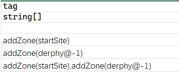
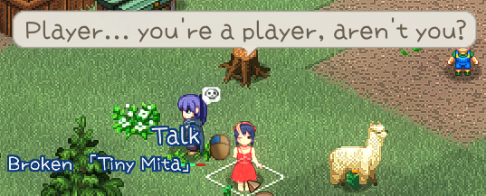
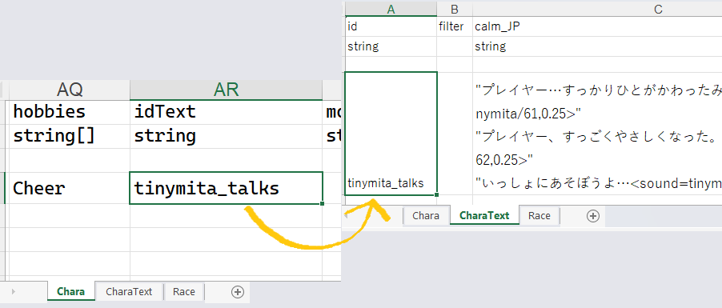
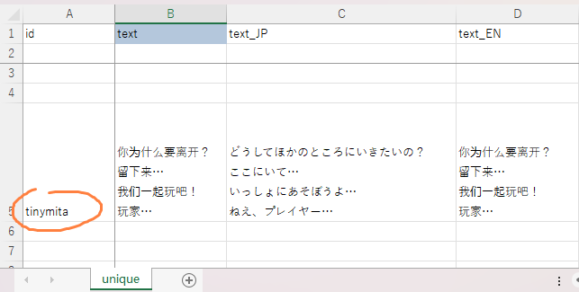

# 角色表 (Chara)

## 表格解释

<LinkCard t="SourceChara" u="https://docs.google.com/spreadsheets/d/1CJqsXFF2FLlpPz710oCpNFYF4W_5yoVn/edit?gid=1953808581#gid=1953808581" />

**制作源表时，必须完整复制官方源表的前三行，并将你的数据从第四行开始录入。**

::: details 关于列、空行和空格子
**缺少的列会被填成空值**，游戏会在日志（Player.log）里输出 `#source ill-format` 警告并继续加载；列顺序被打乱时会按表头名自动重新映射。尽管如此，还是建议把官方表头整行原样复制，从源头避免这两种情况。

**`id` 留空的那一行会中止整张表的读取**，它之后的所有行都不会载入，而且没有任何提示。除非你是有意为之，否则不要用空行给数据分组。

**空格子不等于空值**：游戏会改用第 3 行的默认值。`race` 默认 `norland`、`job` 默认 `none`、`category` 默认 `chara`、`_idRenderData` 默认 `chara`、`LV` 默认 `1`、`chance` 默认 `100`、`tiles` 与 `colorMod` 默认 `0`。

你也可以改第 3 行的默认值，让它作用到其余所有行。
:::

|列|类型|描述|
|-|-|-|
|id|文本|条目的唯一标识，用来在角色表中区分各个条目。如果与原版条目或其他模组条目的 ID 相同，最后加载的表会覆盖其他表。不能包含空格，需要时可以用 snake_case 风格，例如 `mymod_chara_yajyuu_senpai`。|
|_id|整数|图鉴中的排序值，可以填任意数，不必唯一。|
|name_JP|文本|角色在游戏内显示的日文名。|
|name|文本|角色在游戏内显示的英文名。其他语言使用 [SourceLocalization.json](./localization)。|
|aka_JP|文本|角色在游戏内的别名/称号（日文）。|
|aka|文本|角色在游戏内的别名/称号（英文）。其他语言使用 [SourceLocalization.json](./localization)。|
|idActor|文本[]|控制角色是否使用 PCC 部件渲染。示例：`pcc,unique,jure` 会从 `pcc/unique/jure` 加载 PCC 部件。|
|sort|整数|在 SourceChara 中未使用。|
|size|整数[]|角色占用的图块尺寸，通常留空。例如 `2,2` 让角色占用 2×2 图块，并且不会被推挤。|
|_idRenderData|文本|控制精灵表引用。`chara`/`chara_L` 等使用 **Texture Replace** 中的纹理和 `tiles` 中的图块 ID（插槽有限，可被覆盖）。`@chara` 使用 **Texture** 中相同 ID 的纹理。模组角色**必须**使用 `@chara`。注意留空**不等于没有渲染数据**：留空会取第 3 行的默认值 `chara`，也就是图集模式。模组角色不写 `@chara` 时贴图不对，就是这个原因。|
|tiles|整数[]|精灵表的图块 ID，或模组角色的 [skinset](../15_Texture%20Mods/skins)。|
|tiles_snow|整数[]|在雪地地图上使用的替代图块序列。模组角色改为使用 [贴图变体](../15_Texture%20Mods/variation)。|
|colorMod|整数|颜色饱和度修正。目前主要与 `100` 配合使用，让灰度精灵继承 `mainElement` 的颜色。`0` 表示不着色。|
|components|文本[]|在 SourceChara 中未使用。|
|defMat|文本|默认尸体材质，从 SourceBlock 内 Material 分表的 alias 列中选择。留空则使用种族的默认材质。|
|LV|整数|角色的“危险等级”。影响按地图危险度生成时的阈值、奴隶主/驯兽师处的选择成本，以及根据种族/职业特征生成的基础属性。|
|chance|整数|地图生成几率的修正值（可能也影响销售列表）。默认值为 `100`。|
|quality|整数|稀有度等级，留空按 `0` 处理。**制作 mod 时只在 `0`、`3`、`4` 之间选。** `0`：普通。`3`：具名怪物（名字两侧带 `《》`；受精蛋可孵化出同类）。`4`：独特角色（名字两侧带 `『』`；受精蛋仅能孵化出鸡；地图重新生成时不会重复生成）。`3` 与 `4` 都无法使用精灵球捕捉，也无法驯服，但都可以通过好感度招募入队。只要填了非 `0` 的值，这个角色就不会出现在招募名单、狩猎任务目标、奴隶商人这类随机名单里，也不会被随机提升为传说 boss。中间的 `1`、`2` 是游戏在生成角色时随机赋予的档位（到了 `2` 就已经不可捕捉、名字也带 `『』`），写进源表只会关掉这份随机性，因此不要填。自定义冒险者无需填写此列。|
|hostility|文本|对玩家/盟友/旁观者的性情。可填 `Enemy` / `Neutral` / `Friend` / `Ally`。注意敌对写作 `Enemy`，不是 `Hostile`。留空按 `Enemy`（敌对）处理。`Neutral`：除非被攻击否则不会主动攻击。`Friend`：会攻击任何对友方单位敌对的目标；自身被激怒后，也会攻击玩家及其同伴。|
|biome|文本|把随机生成限制在某一种生态里。填了这一列，角色就只在同名的生态中出现；留空则不限生态。这是是/否过滤，不是几率加权。填生态的名字（如 `Water`、`Sand`、`Plain`），**区分大小写**。|
|tag|文本[]|同时承担**行为标签**（裸词）与**生成配置**（带参数，见下文）两件事。行为标签的取值是一份固定清单，写法必须完全一致且**区分大小写**，详见 [行为标签](#行为标签)章节及之后的几个章节。|
|trait|文本[]|角色的特性，对应 `Trait*` C# 类（填写时省略 `Trait` 前缀）。若你的角色是冒险者，请阅读 [创建冒险者](#创建冒险者)章节。**这一列虽然能填多个，但只有第一个生效**，其余的会被静默忽略。|
|race|文本|从 SourceRace 的种族 ID 列中选择。留空时默认为 `norland`：没填种族的角色是北地之民，而不是「没有种族的角色」。|
|job|文本|从 SourceJob 的职业 ID 列中选择；默认为 `none`。|
|tactics|文本|覆盖所分配职业的默认战术。|
|aiIdle|文本|空闲时的移动方式。留空时每回合有小概率随机走动；`stand` 不再随机走动；`root` 在此之上还不跟随主人、不追赶队长。**必须全小写**。写成 `Stand` 不会生效，角色照常随机走动，也不会有任何报错。|
|aiParam|整数[]|三个数值：首选与敌人的距离、每回合移动到该距离的概率，以及（很少使用）再次移动的额外概率。|
|actCombat|文本[]|战斗中可使用的主动能力/魔法，从 SourceElement 条目中选择，用半角逗号分隔。添加 `/N` 可设置固定使用概率。增益效果可添加 `/pt` 使其作用于整个队伍（仅限友方状态）。示例：`ActThrowPotion/30,SpWeakness,SpSpeedDown,SpWisdom/50/pt`。默认概率为 100。|
|mainElement|文本[]|主要元素亲和力：`Fire`、`Cold`、`Lightning`、`Darkness`、`Mind`、`Nether`、`Nerve`、`Sound`、`Chaos`、`Poison`、`Holy`、`Cut`、`Acid`、`Impact`。**可以用逗号填多个**，游戏会按角色 `LV` 与各元素的 `eleP` 加权随机挑一个。加 `/N` 可指定元素等级（不写为 `10`），例如 `Poison/80`。游戏会给填的值加上 `ele` 前缀（`Fire` → `eleFire`），再到 SourceElement 的 alias 列查找，**写错会在角色生成时抛异常**。|
|elements|文本|被动效果，如专长、附魔，从 SourceElement 条目中选择，用半角逗号分隔。使用时添加 `/N` 表示等级/数值。`0` 或负值可修改继承自种族的元素。示例：`invisibility/1` 为启用，`invisibility/0` 为禁用继承效果；`antidote/-30` 会让肉带毒，`antidote/30` 可解毒或抵消种族的 `-30`。|
|equip|文本|覆盖随机的职业装备模板。留空则跟随职业（Job 表的 `equip` 列）；填 `none` 会完全跳过装备生成。真正有效果的取值只有三个，且**区分大小写、均为小写**：`archer`（弓/弩）、`inquisitor` 与 `gunner`（枪）。另外，只要这一列非空，即使种族的 EQ 为空，也会触发装备生成。|
|loot|文本[]|额外掉落物（Thing/ThingV ID），用逗号分隔，**每一项都必须带 `/N`**，漏写会直接出错。`N` 是**千分制**：小于 1000 时表示掉 1 个的概率（`medal/500` = 50%）；大于等于 1000 必定掉落，`N / 1000` 是保底个数，余数是再多掉一个的千分概率（`medal/3000` = 必定 3 个；`medal/2500` = 2 个，另有 50% 概率第 3 个）。玩家阵营的角色和自建地图里不掉落。|
|category|文本|大多数条目使用默认的 `chara`。|
|filter|文本[]|在 SourceChara 中未使用。|
|gachaFilter|文本[]|决定这个角色能不能被扭蛋抽到。**这一列只认两个值：`resident` 与 `livestock`**，可以同时填。扭蛋自身的类别（居民 / 家畜 / 独特）是另一回事：抽居民时要求含 `resident`，抽家畜时要求含 `livestock`，而抽独特时要求含 `resident` **且** `quality` 为 `4`。过滤值里没有 `Unique` 或 `default`。|
|tone|文本|**游戏读取这一列后再没有用到它**，填了不会有任何效果。真正生效的语气是 `bio` 的第 5 段。|
|actIdle|文本[]|非战斗时的行为。**可以用逗号填多个，游戏每次随机取一个**。`readBook`、`buffMage` / `buffThief` / `buffGuildWatch` / `buffHealer`、`torture_snail` / `janitor` / `cast`、`bartender`、`baker`、`butcher`、`banker`、`fisher`。|
|lightData|文本|发光的颜色。对角色同样生效，本体就用了 `wisp`、`wisp_bright`、`fireplace`。|
|idExtra|文本|额外的渲染数据。对角色同样生效（本体：`deep_jellyfish`）。|
|bio|文本|用斜杠分隔的值（无空格）：`gender`（`m`/`f`/`n`）、`age`、`height`、`weight`、来自 `chara_tone.xlsx` 的 `tone`、来自 `chara_talk.xlsx` 的 `talk`。示例：`f/51044/152/46/friendly\|私\|あなた`。可选的段**只能从尾部省略**，详见 [bio 列](#bio-列)。|
|faith|文本|固定的宗教。设置后游戏内无法更改。|
|works|文本[]|从 SourceHobby 的 alias 列中选择。|
|hobbies|文本[]|从 SourceHobby 的 alias 列中选择。|
|idText|文本|对应 `CharaText` 表中的条目，即角色头顶的情景气泡台词，详见 [情景气泡](#情景气泡) 章节。|
|moveAnime|文本|移动动画类型。`hop` 或留空。|
|factory|文本[]|在 SourceChara 中未使用。|
|components|文本[]|在 SourceChara 中未使用；这是重复列。表里出现同名列时，**靠后的那个才生效**。|
|recruitItems|文本[]|特殊招募对话物品，目前仅 mani 使用。|
|detail_JP|文本|在 SourceChara 中未使用；可用于备注。|
|detail|文本|在 SourceChara 中未使用；可用于备注。|

## bio 列

```
性别 / 年龄 / 身高 / 体重 / 语气 / 话题
```

没有哪一段是硬性必填的，但可选的段**只能从尾部省略**，`f////friendly` 这种写法不行。

性别（`m` / `f` / `n`）需要单独说一句，因为「留空」有两种完全不同的含义：

- **整列留空**：包括性别在内的所有内容都随机生成，这是完全正常的写法。
- **只把第一段留空**（比如 `/17/152/46`）**不会**随机。只要这一列非空，游戏就一定会读第一段；既不是 `n` 也不是 `f` 的值会进入兜底分支，得到**男性**。留空或写成 `M` 这种大小写错误，都会静默生成一个男性角色。

另外两件从表上看不出来的事：

- **年龄填的是岁数，不是年份。** 游戏拿它反推出生年（出生年 = 当前年 − 年龄）。身高、体重没有明确单位，游戏原样显示这两个数。
- **填了年龄会关掉随机立绘**，除非角色带 `randomPortrait` 标签。填了年龄还会让游戏去找 `Data/PCC/<id>.txt`，不过那个可以不管。

语气那一段自己还能再用 `|` 分成三节：

```
语气id|第一人称|第二人称
```

`语气id` 取自 `chara_tone.xlsx`，留空按 `default` 处理。后两节用来替换台词里的第一人称和第二人称，但这个替换**只在日文下生效**，其他语言下填了完全没有效果。

这一列和下文的 `addBio(ID)` / `bio_ID.json` 是两回事：这里是**生成**角色时用的参数，那边是角色资料页里显示的传记文本。

## 行为标签

`tag` 列里不带括号的裸词就是行为标签。可用的标签是下面这份固定清单，写法必须完全一致，
**区分大小写**。差一个字母就等于这个标签不存在，也不会有任何报错。

::: warning 这份清单与物品共用
清单由物品与角色共用，所以其中有不少取值（`seed`、`gift`、`currency`、`dish_bonus` 等）
只对物品有意义，写在角色上不会有任何效果。
:::

```
important, repeatSwing, nonHold, nonPick, canMelee, boss, currency, randomName,
noDrop, hidden, wilds, neg, replica, seed, rareSeed, gift, ignoreUse,
throwWeapon, throwWeaponEnemy, notHumanMeat, noRandomProduct, suicide, kamikaze,
randomSkin, noPortrait, randomPortrait, rareResource, tourism, staticSkin,
godArtifact, noWish, dish_bonus, dish_fail, random_color, noRandomEnc, noMix,
bigFish, noSkinRecipe, animal, human, undead, machine, horror, fish, fairy, god,
dragon, plant, antiSpider, shield, humanSpeak, throwBall, alwaysDropCorpse,
allowDevour, noRide, ride, allowIngredient
```

其中几个对角色的效果是明确的：

|标签|效果|
|-|-|
|`mini`|身高变成十分之一。|
|`humanSpeak`|对话时不使用括号，详见下一节。|
|`randomPortrait`|即使填了 `bio` 的年龄，仍然随机分配立绘（填了年龄默认会关掉随机立绘）。|
|`water`|**水生行为**：待机时会主动游向深水，随机走动时也不会从深水走上岸。它同时也是下面那种生成过滤标签。|

### 另一类标签：生成过滤

上表里的标签由游戏代码直接读取。还有一类标签**不会出现在代码里**，而是由生成清单
（SpawnList）按名字筛选，链路是「生态 → 生成清单 → 标签」：

```
Snow（雪地生态）  →  生成清单 c_snow  →  要求标签 snow、排除标签 neutral
```

筛选时**同时查看角色自己的 `tag` 与它所属种族的 `tag`**，任一命中即可。常见的有：

|标签|作用|
|-|-|
|`snow`|进入雪地生态的生成池；同时被荒野与地下城的清单排除。|
|`sand`|进入沙地生态的生成池。|
|`water`|进入水域生态的生成池。|
|`randomFish`|进入钓鱼的产出池。|
|`neutral`|进入中立角色的生成池（访客、城镇居民等）。这是本体用得最多的标签。|
|`pawn`|进入随从的生成池。|

留空则不进入任何按标签筛选的清单。这一族标签由数据定义，所以 mod 可以自带生成清单并
自造标签名，上表只列出了本体在用的那些。

## 使用人类对话

除了在种族（Race）表中添加 `human` 或 `humanSpeak` 标签，你也可以在角色（Chara）表中添加 `humanSpeak` 标签，让角色对话时不使用括号。

## 生成配置

生成配置写在 `tag` 列里。

::: warning CWL旧格式
CWL 格式已从 Wiki 中移除。旧格式仍然兼容，但推荐使用本文的新格式。
:::

可用的 tag 操作：
+ `addZone(zoneId@level)`
+ `addEq(ItemId#Rarity)` / `addEquipment(ItemId#Rarity)`
+ `addThing(ItemId#Count)`
+ `addFlag(FlagName)` / `addInt(FlagName=1)`
+ `addFlagValue(FlagName=some_value)` / `addStr(FlagName=some_value)`
+ `addBio(BioFileId)` / `addBiography(BioFileId)`
+ `addStock(StockFileId)`
+ `addDrama(DramaFileId)`

详细说明见下文。

### 自动生成到区域

要把角色生成到某个区域，在角色源表的 `tag` 列添加 `addZone(*)`，把 `*`（星号）换成区域 **id**；保留星号则生成到随机区域。也可以用 `@n` 指定区域层级。

例如，要在起始原野中生成角色，使用 `addZone(startSite)`；要在特尔斐地下一层生成角色，使用 `addZone(derphy@-1)`。区域 ID 见 [SourceGame/Zone](https://docs.google.com/spreadsheets/d/16-LkHtVqjuN9U0rripjBn-nYwyqqSGg_/edit?gid=1819250752#gid=1819250752) 的 **id** 列。



每个 `addZone` 标签都会在对应区域生成一个角色。例如，`addZone(lumiest),addZone(little_garden),addZone(specwing),addZone(*)` 会在指定的三个区域和一个随机区域各生成一个（同时存在）。

`tag` 列的写法：
+ 括号和逗号都用英文半角 `,`  
+ 英文逗号 `,` 用来分隔 tag。
+ 不要连续写两个逗号（如 `,,`），这会插入空值，导致 bug。

### 添加初始装备/物品

你还可以为角色定义生成时自带的起始装备和物品。

要为角色分配特定装备，使用标签 `addEq(ItemID#Rarity)` 或 `addEquipment(ItemID#Rarity)`，把 `ItemID` 换成物品 ID，`Rarity` 取以下之一：随机（Random）、粗制品（Crude）、凡品（Normal）、优质品（Superior）、奇迹（Legendary）、神器（Mythical）、特殊物品（Artifact）。省略 `#Rarity` 时默认为 `#Random`。`Random` 本身不是一档稀有度，表示交给游戏按常规的装备生成规则随机决定。

例如，要将奇迹的 `BS_Flydragonsword` 和随机的 `axe_machine` 设置为角色的主要武器：
```
addEq(BS_Flydragonsword#Legendary),addEq(axe_machine)
```

要为角色添加起始物品，使用标签 `addThing(ItemID#Count)`。省略 `#Count` 时默认生成 `1` 件。

例如，要为角色添加 `padoru_gift` x10 和 `援军卷轴` x5：
```
addThing(padoru_gift#10),addThing(1174#5)
```

### 创建冒险者

::: warning CWL旧格式
CWL 旧格式使用 `AdventurerBacker`，仍然兼容，但推荐使用本文的新格式。
:::

如果角色的 trait 列填写 **`AdventurerCustom`**，该角色会登记为冒险者，并出现在冒险者排行榜中。

不想让冒险者角色随机移动时，使用标签 `addFlag(StayHomeZone)`。

## 自定义商人库存

用 `addStock` 标签配合库存文件，可以给商人定义自定义库存。

库存文件是一个简单的 JSON 文件，放在 `LangMod/**/Data/` 文件夹中，文件名为 `stock_ID.json`，其中 ID 是库存文件或角色的唯一标识，例如 `stock_my_cnpc.json` 或 `stock_unique_armor.json`。

`addStock` 不带 ID 时默认使用角色 ID。也可以写多个标签来指定或组合多个库存文件，例如：
`addStock,addStock(unique_items),addStock(unique_armor)`。

### 库存结构

```json
{
  "Items": [
    {
      "Id": "example_item",
      "Material": "",
      "Num": 1,
      "Restock": true,
      "Type": "Item",
      "Rarity": "Random",
      "IdentifyLevel": "Identified"
    },
    {
      "Id": "example_item_limited",
      "Material": "granite",
      "Num": 1,
      "Restock": false,
      "Type": "Item",
      "Rarity": "Artifact",
      "IdentifyLevel": "Identified"
    },
    {
      "Id": "example_item_craftable",
      "Material": "",
      "Num": 1,
      "Restock": false,
      "Type": "Recipe",
      "Rarity": "Random",
      "IdentifyLevel": "Identified"
    },
    {
      "Id": "SpShutterHex",
      "Num": 5,
      "Type": "Spell"
    }
  ]
}
```

::: tip 字段名的大小写不重要
游戏读取时不区分字段名的大小写，所以 `Items` 与 `items`、`Id` 与 `id` 都能读。
本文统一按首字母大写书写，现有 mod 里两种风格都有，沿用哪种都可以。
:::

* `Items` 是库存物品数组。
* `Id`  
  物品（Thing）的 ID，**必填**。  
  某些库存类型下，这里可以填元素别名、数字 ID 或名称。
* `Material`  
  物品的材质。留空则使用 Thing 数据中定义的默认材质。  
  默认值：`""`
* `Num`  
  物品数量。  
  默认值：`1`
* `Lv`  
  物品等级。留 `-1` 则跟随商店等级，填其他值则覆盖它。  
  默认值：`-1`
* `Restock`  
  物品是否补货。  
  设为 `false` 表示限量，只能购买一次。  
  默认值：`true`
* `Type`  
  详见下文的 Type 说明表。
* `Rarity`  
  可选值：`Random`、`Crude`、`Normal`、`Superior`、`Legendary`、`Mythical`、`Artifact`  
  默认值：`Normal`
* `IdentifyLevel`  
  物品的初始鉴定状态。  
  可选值：`Identified`、`RequireSuperiorIdentify`、`KnowQuality`、`Unknown`  
  默认值：`Identified`
* `BlessedState`  
  物品的祝福状态。  
  可选值：`Doomed`、`Cursed`、`Normal`、`Blessed`  
  默认值：`Normal`
* `PriceCalc`  
  覆盖物品价格的算术表达式。  
  参数：`base`（基础价格）、`lv`（物品等级）、`rarity`（物品稀有度）  
  示例：`"base * 0.2 + lv * 5"`
* 省略的字段使用默认值。

> [!Note]
> `NoCopy`、`NoRandomSocket`、`Sockets`、`MapStr`、`MapInt` 属于已注册的 Thing 内容（Thing 表 `tag` 列）的属性，不会应用到商店库存生成的物品上。

### 库存物品类型

|Type|说明|
|-|-|
|Item|标准物品。支持材质、等级和堆叠数量。|
|Block|可放置的方块物品，由方块别名和材质生成。|
|Cassette|音乐磁带。`Id` 为 BGM 数字 ID。**填了不存在的 ID 不会报错，会静默换成一首随机 BGM。**|
|Currency|货币物品。`Id` 可以是 `money`、`money2`、`plat`、`medal`、`casino_coin`、`ecopo`。`Num` 表示金额。|
|Category|从类别生成。`Id` 是类别名称。|
|Filter|从过滤器生成。`Id` 是过滤器名称。|
|Tag|从标签生成。`Id` 是标签名称。|
|Letter|信件物品。`Id` 为信件 ID，txt 文本放在 `LangMod/XX/Text/Scroll` 中。|
|Map|地图物品。`Id` 为地图 ID。|
|Perfume|香水。`Id` 为元素别名或 ID。|
|Plan|计划书。`Id` 为元素别名或 ID。|
|Potion|药水物品。`Id` 为元素别名或 ID。|
|Recipe|用于合成的配方物品。|
|RedBook|红皮书物品。`Id` 为书籍 ID，txt 文本放在 `LangMod/XX/Text/Book` 中。|
|Rod|魔杖物品。`Id` 为元素别名或 ID。`Num` 定义充能次数。|
|Rune|符文物品。`Id` 为元素别名或 ID。|
|RuneFree|免费符文物品。`Id` 为元素别名或 ID。|
|Scroll|卷轴物品。`Id` 为元素别名或 ID。|
|Skill|技能书。`Id` 为元素别名或 ID。|
|Spell|法术书。`Id` 为元素别名或 ID。|
|Usuihon|特殊物品。`Id` 为宗教 ID。|

如果你没有使用代码编辑器，可以使用 [JSONLint](https://jsonlint.com/) 来验证你的 JSON 格式。

## 对话 & 气泡

### 情景气泡

某些情况下，角色会说出特定台词，以气泡形式显示在头顶。



这些台词写在 **CharaText** 表中，角色在 **idText** 列填入对应的 ID 即可关联。



|列|情景|
|-|-|
|calm|平常时|
|fov|出现在视野中时|
|aggro|进入战斗时|
|dead|死亡时|
|kill|击杀单位时|

### 来聊天吧

要给角色添加 **来聊天吧** 的对话，在 `LangMod/**/Dialog/` 文件夹中准备一个 `dialog.xlsx` 表格。

格式与游戏的对话表 **Elin/Package/_Elona/Lang/_Dialog/dialog.xlsx** 相同，但只需要 `unique` 表和你的角色 ID 所在的那一行。



这里的 ID 就是角色 ID。

::: warning 格式
dialog.xlsx 的文本数据从第 5 行开始，而不是源表的第 4 行。
:::

## 剧情

剧情是由多选项对话和附加动作组成的交互系统。

剧情的说明在单独的章节中。

<LinkCard t="剧情系统" u="/10_Source Sheets/drama.md" />

## 自定义传记

想给角色增添更多风味，可以用标签 `addBio(ID)` 指定自定义传记。传记文件是 JSON 文件，放在 `LangMod/**/Data/` 文件夹中，文件名为 `bio_ID.json`，ID 是传记文件的唯一 ID，例如 `addBio(MyChara)` 对应 `bio_MyChara.json`。

```json
{
    "Birthday": 11,
    "Birthmonth": 4,
    "Birthyear": 514,
    "Birthplace": "地球",
    "Birthlocation": "咩咩村",
    "Mom": "最棒的母亲",
    "Dad": "最棒的爹地",
    "Background": "背景故事",
    "FavFood": "mushroom_rare",
    "FavCategory": "mushroom",
    "LikeThing": "stethoscope",
    "LikeHobby": "martial"
}
```

+ `FavFood`: Thing表/ThingV表/Food表中的id。
+ `FavCategory`: Category表中的id。
+ `LikeThing`: 喜欢的物品id。
+ `LikeHobby`: Element表中的alias。

如果你没有使用代码编辑器，可以使用 [JSONLint](https://jsonlint.com/) 来验证你的 JSON 格式。

## 肖像与贴图

### 肖像

肖像也叫立绘，是与角色对话时弹窗左侧显示的图片。

肖像放在 `Portrait` 文件夹中，`Portrait` 文件夹位于你的[模组包](../2_Getting%20Started/basic_mod)里。

肖像的详细说明见 [肖像](../15_Texture%20Mods/portraits#新角色Mod的肖像) 中的角色 mod 肖像章节。

### 贴图（Sprite）

角色在地图上的贴图，准确的说法是精灵图（Sprite）。

给 mod 角色提供新的贴图时，先在源表的 `_idRenderData` 列填入 `@chara`。

角色贴图是一张透明背景的 `.png` 图片，放在 `Texture` 文件夹中；`Texture` 文件夹位于 `游戏安装目录/Elin/Package/自定义的mod文件夹名字` 下（其中 `自定义的mod文件夹名字` 就是你的 [模组包](../2_Getting%20Started/basic_mod)）。

贴图一般命名为 `ID.png`，ID 即角色 ID。

你还可以使用动画贴图、更大的画布，以及随条件变化的贴图变体，详见总目录的 `贴图模组` 分区。<!--Menu=总目录=メニュー。Texture Mods=贴图模组=テクスチャMOD--> 

### 示例

肖像和贴图可以参考 Tiny Mita 范例：

<LinkCard t="CWL范例：Tiny Mita" u="https://steamcommunity.com/sharedfiles/filedetails/?id=3396774199" i="https://raw.githubusercontent.com/gottyduke/Elin.Plugins/refs/heads/master/CwlExamples/TinyMita/preview.jpg" />