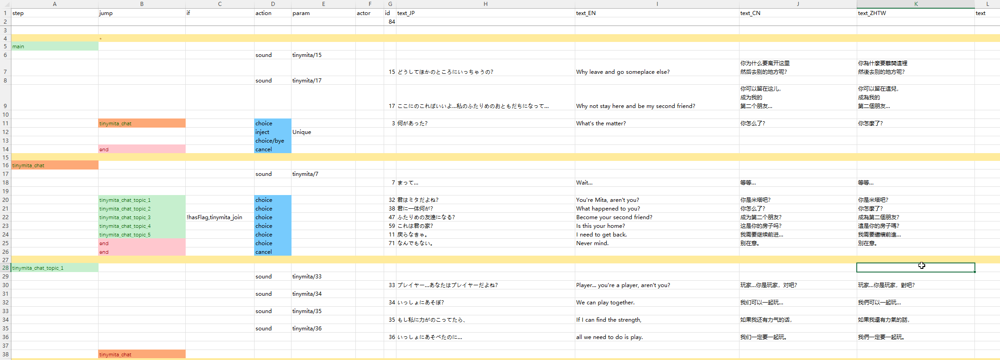

# 剧情

剧情是通过多选项对话和附加动作构成的丰富交互系统。


## 添加剧情

要为角色指定默认剧情，请将 `id.xlsx` 文件放置在 `LangMod/**/Dialog/Drama/` 文件夹下，并以角色 ID 作为文件名（例如，`tinymita` 角色对应 `tinymita.xlsx`）。

若要使用其他剧情文件，请在角色源表的标签列添加 `addDrama(DramaFileId)` 标签。

你也可以使用 C# API `chara.SetDramaOverride(DramaFileId)` 或 `chara.ShowDialog(DramaId, step)`。

制作新剧情表时可参考游戏内置表 `Elin/Package/_Lang_Chinese/Lang/CN/Dialog/Drama`，或下载 Tiny Mita 示例作为模板。

<LinkCard t="CWL 示例：Tiny Mita" u="https://steamcommunity.com/sharedfiles/filedetails/?id=3396774199" i="https://raw.githubusercontent.com/gottyduke/Elin.Plugins/refs/heads/master/CwlExamples/TinyMita/preview.jpg" />

::: tip 热重载
剧情表可在游戏运行时编辑。更改将在下次打开对话时自动生效。
:::

## 定义

### 行

剧情表按从上至下顺序读取，由多行构成。每行包含以下字段（由首行定义）：

* **step**：标记步骤起点；后续行均属于该步骤，直到出现下一个 `step`。
* **jump**：本行执行后跳转的目标步骤。
* **if / if2**：执行前需检查的条件。若存在 `if2`，则两者必须同时满足。
* **action**：要执行的动作。
* **param**：动作参数。
* **actor**：动作或对话行的说话者。
  * `?`：显示为 `???`。
  * `tg`：剧情目标角色。`actor` 为空时默认使用。
  * `narrator`：默认旁白。
  * `pc`：玩家。
* **id**：唯一标识，`text` 和 `choice` 行<span style="color: red;">必须</span>填写。其他行无需填写。
* **text_XX / text_JP / text_EN / text**：对话内容。`XX` 为语言代码（例如 `text_CN`、`text_ZHTW`）。若缺少对应非内置语言，则使用 `text` 作为备选。`text_JP` 和 `text_EN` 是必须填写的，但你可以不提供翻译。

（点击放大）


### 步骤

剧情流程由多个步骤组成。每个步骤可包含一行或多行对话、动作与条件。

`main` 是默认起始步骤，`end` 用于退出剧情。

创建表时请避免使用以 `_` 或 `flag` 开头的步骤名，以免与内部步骤冲突。

#### 内置步骤

::: details 内置步骤
执行 `inject/Unique` 动作后，大量内置剧情步骤将被注入当前剧情表。只需将它们设为 `jump` 目标即可使用。部分步骤已在默认 `inject/Unique` 对话中使用，通常无需重复使用。

|步骤名|用途|
|-|-|
|`_banish`|结束剧情|
|`_bye`|结束剧情|
|`_toggleSharedEquip`|切换 `tg` 的共享装备状态|
|`_daMakeMaid`|将 `tg` 设为女仆|
|`_joinParty`|若 `tg` 的特质允许加入，则将其设为队伍成员。**这不是邀请！**|
|`_leaveParty`|将 `tg` 从队伍移除，并送回据点区域|
|`_makeLivestock`|将 `tg` 设为派系家畜|
|`_makeResident`|将 `tg` 设为派系居民|
|`_depart`|将 `tg` 从派系移除|
|`_rumor`|查看流言|
|`_sleepBeside`|切换 `tg` 是否在玩家旁睡觉|
|`_disableLoyal`|切换 `tg` 忠诚心状态|
|`_suck`|`tg` 吸血或吸猫。**优先吸血，其次吸猫**|
|`_insult`|切换 `tg` 嘲讽状态|
|`_makeHome`|将当前区域分支设为 `tg` 的家|
|`_invite`|尝试邀请 `tg` 成为同伴，会检查玩家属性和 `tg` 可邀请状态。无条件邀请入队请使用拓展动作 [`join_party()`](#拓展动作)|
|`_Guide`|引导玩家前往一系列地点|
|`_tail`|纯洁的肉体关系|
|`_whore`|有金钱交易的肉体关系|
|`_bloom`|加深与 `tg` 的羁绊|
|`_buy`|从 `tg` 购买物品|
|`_buyPlan`|从 `tg` 购买研究图纸|
|`_give`|给 `tg` 物品|
|`_blessing`|对队伍施加祝福|
|`_train`|与 `tg` 进行技能训练|
|`_changeDomain`|改变 `tg` 的领域|
|`_revive`|复活死亡的同伴|
|`_buySlave`|从 `tg` 购买奴隶|
|`_trade`|与 `tg` 交换物品|
|`_identify`|与 `tg` 鉴定物品|
|`_identifyAll`|与 `tg` 鉴定所有物品|
|`_identifySP`|与 `tg` 使用高级技能鉴定物品|
|`_bout`|发起决斗|
|`_news`|在地图上生成随机地城|
|`_heal`|治疗玩家|
|`_food`|从 `tg` 购买食物|
|`_deposit`|向 `tg` 存款|
|`_withdraw`|向 `tg` 取款|
|`_copyItem`|与 `tg` 复制物品|
|`_extraTax`|缴纳额外税金|
|`_upgradeHearth`|升级炉石|
|`_sellFame`|出售声望|
|`_investZone`|投资当前区域|
|`_investShop`|投资 `tg` 的商店|
|`_changeTitle`|更改玩家称号|
|`_buyLand`|扩展当前区域地图|
|`_disableMove`|使 `tg` 无法移动|
|`_enableMove`|使 `tg` 可以移动|
:::

## 文本

在 `text_JP`、`text_EN`、`text_XX` 列中的文本将用作对话事件，玩家必须点击或按键才能继续。除非动作另有说明，否则不能将动作行与文本行合并。

### 随机话题

`$topic` 将从 `chara_talk.xlsx` 中定义的话题随机选取一行，该文件可以是 Elin 默认文件 `Package/_Lang_Chinese/Lang/CN/Data/chara_talk.xlsx`，也可以是 `LangMod/**/Data/chara_talk.xlsx`。例如，`$sup` 将随机播放以下行之一：
```
什么？
什么东西？
哦？
咦？
喂！
哦哦。
咦。
嗯？
```

### 替换

| 文本 | 替换值 |
|--------|--------|
| `#tg_his` | `tg` 的所有格代词 |
| `#tg_him` | `tg` 的宾格代词 |
| `#tg` | `tg` 角色名 |
| `#last_choice` | 上一次选项的文本 |
| `#newline` | 换行符 |
| `#costHire` | 雇佣 `tg` 的花费（数值本地化） |
| `#self` / `#me` | 角色 `tg` 的全名（含头衔） |
| `#his` | `tg` 的所有格代词 |
| `#him` | `tg` 的宾格代词 |
| `#1` ~ `#5` | 外部变量 `refDrama1`~`refDrama5`（数字自动格式化） |
| `#god` | 神名称（若 `tg` 不为空用其信仰，否则随机宗教） |
| `#player` / `#title` | 玩家头衔 |
| `#zone` | 当前区域名 |
| `#guild_title` | 当前剧情关联公会的头衔 |
| `#guild` | 当前剧情公会名 |
| `#race` | 玩家种族名 |
| `#pc` | 玩家简名 |
| `#pc_full` | 玩家全名（含头衔） |
| `#pc_his` | 玩家的所有格代词 |
| `#pc_him` | 玩家的宾格代词 |
| `#pc_race` | 玩家种族 |
| `#aka` | 玩家别名 |
| `#bigdaddy` | 本地化字符串 `"bigdaddy"` |
| `#festival` | 节日名（若区域有节日则用对应节日名，否则通用） |
| `#brother2` | “兄弟”或“姐妹”（根据玩家性别） |
| `#brother` | 兄弟/姐妹随机称呼（`bro` 或 `sis` 列表随机） |
| `#onii2` | 哥哥/姐姐随机称呼（列表 `onii2`/`onee2`） |
| `#onii` | 哥哥/姐姐随机称呼（列表 `onii`/`onee`） |
| `#gender` | 玩家性别对应的随机称呼（`gendersDrama` 列表） |
| `#he` | “他”或“她”（根据玩家性别） |
| `#He` | 同上，首字母大写 |

这些替换，在 `dialog.xlsx` 内也可以使用。

### 动态内容

**以** `#eval <此处为 C# 脚本..>` **开头**并返回 `string` 类型的文本列，能够动态生成文本内容。

## 动作

**文本行** 最常见，仅包含 `id`、`text` 列（可选 `if` 条件）。执行时需要玩家输入（点击或按键）才能继续。

**动作行**（`choice` 除外）自动执行，无需输入。若同一行同时存在 `action` 和 `text`，则通常忽略 `text`。

例如，文本行后的动作行需先点击文本行才能执行。

### 内置动作

::: details 内置动作
|动作|参数|说明|
|-|-|-|
|`inject`|`Unique`|插入“来聊聊吧！”及大量实用步骤|
|`choice`||为上一个文本行添加选项。需配合 `text` 和 `jump` 使用|
|`choice/bye`||插入默认告别选项|
|`cancel`||设置右键/ESC 键行为。需配合 `jump`，通常设为 `end`|
|`setFlag`|flag 名称,值(可选)|设置 flag 值，未提供值时默认为 1|
|`reload`||重新加载剧情，以便应用当前剧情中所做的 flag 更改。需配合 `jump`，通常设为 `main`。**这不是指热重载，开发时热重载只需保存文件更改并再次打开对话即可**|
|`enableTone`||为整个剧情启用对话语气转换|
|`addActor`||添加剧情角色以供后续使用，`text` 可用于设置名称覆盖。当你在 `actor` 单元格填写新 ID 时会自动触发。`actor` 需填写[角色 ID][character-id-link]|
|`invoke`|方法名|调用方法。全部为本体Elin特定用途。|
|`setBG`|图片名(可选)|设置背景图，留空则清除。支持在 **Texture** 文件夹提供自定义 png|
|`BGM`|BGM ID|切换至指定 BGM。自定义 BGM 详见 [音频/BGM 页面](../20_Sound%20Mods/0_sound)|
|`stopBGM`||停止 BGM 且不继续|
|`lastBGM`||停止 BGM 并继续播放上一个|
|`sound`|音频 ID|播放指定音频。自定义音频详见 [音频/BGM 页面](../20_Sound%20Mods/0_sound)|
|`wait`|时长|暂停执行指定秒数，适合等待动画完成|
|`alphaIn` `alphaOut`|时长|透明度过渡（秒）|
|`alphaInOut`|时长,等待时间|`alphaIn` 先执行，等待指定秒数，再执行 `alphaOut`|
|`fadeIn` `fadeOut`|时长,`white`/`black`(可选)|淡入淡出过渡（秒）|
|`fadeInOut`|时长,等待时间,`white`/`black`(可选)|先 `fadeIn`，等待指定秒数，再 `fadeOut`|
|`hideUI`|过渡时间|以过渡效果隐藏 HUD 元素，退出剧情时恢复|
|`hideDialog`||隐藏剧情对话框以便制作过场动画，但文本行会强制显示对话框，需配合 `wait` 使用|
|`end`||直接结束剧情，等同于 `jump` 至 `end` 步骤|
|`addKeyItem`|[关键物品 ID](https://docs.google.com/spreadsheets/d/175DaEeB-8qU3N4iBTnaal1ZcP5SU6S_Z/edit?gid=836018107#gid=836018107)|给予玩家关键物品|
|`drop`|[物品 ID][item-id-link]|在玩家位置掉落奖励物品|
|`addResource`|[资源名称](https://gist.github.com/gottyduke/6e2847e37d205a5621bfd0615e5bd9e7#file-homeresource-md),数量|添加家园资源|
|`shake`||屏幕震动|
|`slap`||扇剧情所有者角色|
|`destroyItem`|[物品 ID][item-id-link]|从玩家背包中查找并销毁指定物品|
|`focus`||立即将镜头聚焦到剧情所有者角色|
|`focusChara`|[角色 ID][character-id-link],速度(可选)|将镜头移动并聚焦到**同地图角色**|
|`focusPC`|速度(可选)|将镜头聚焦到玩家|
|`unfocus`||重置并取消聚焦镜头|
|`destroy`|[角色 ID][character-id-link]|移除**同地图角色**|
|`save`||存档|
|`setHour`|小时数|设置游戏时间|

提供多个参数时，使用**半角逗号（`,`）分隔，中间不要有空格**。
:::

## 条件

条件用于判断该行是否执行。

### 静态条件

静态条件在加载时**仅判定一次**。

使用 `if`（可选 `if2`）列为任意行附加条件。

|条件|参数|说明|
|-|-|-|
|`hasFlag`|flag 名称|玩家拥有该 flag 且值不为 0|
|`!hasFlag`|flag 名称|玩家没有该 flag 或值为 0|
|`hasMelilithCurse`||玩家拥有 Melilith 诅咒|
|`merchant`||玩家在商人公会|
|`fighter`||玩家在战士公会|
|`thief`||玩家在盗贼公会|
|`mage`||玩家在法师公会|
|`hasItem`|物品 ID|玩家背包中拥有该物品|
|`isCompleted`|任务 ID|玩家已完成指定任务|

**简单值检查**（最常用于 flag/计数器）：
```
=,example_flag,1
>,example_counter,20
!,example_flag,69
```

大多数行只需使用 `if` 列。若需多条件判断，可添加 `if2` 列。

### 动态条件

若要让某行能够动态启用或禁用，请使用：
- `invoke*` 条件表达式，或
- 返回 `bool` 的 `eval` 动作


## 分支

将 `jump` 设置为剧情步骤即可跳转至该步骤。

将 `jump` 设置为 `eval_result`，并使用返回 `string` 的 `eval` 动作，可动态选择跳转目标。


## invoke* 表达式

在剧情表中，可使用特殊动作 `invoke*`（或简写 `i*`）调用拓展方法：


### 语法

伪代码语法简单：将 `action` 设为 `invoke*` 或 `i*`，`param` 设为有效方法之一：

|动作|参数|actor|
|-|-|-|
|`invoke*`/`i*`|`honk_honk(arg1, arg2)`|`pc`|

这将调用名为 `honk_honk` 的方法，传入 `arg1` 和 `arg2` 两个参数。

### 参数

参数用半角逗号 `,` 分隔，并写在拓展方法的括号内，类似代码语法。若无参数，请使用空括号 `()`。

大多数方法还会将 `actor` 单元格作为目标角色执行，例如 `pc`、`tg`（剧情目标角色）或任何有效的[角色 ID][character-id-link]。默认值为 `tg`。

若同一行中的 `jump` 单元格有值，则拓展方法的返回值将决定是否执行该 `jump`。返回 `true` 时执行跳转，否则不执行。

### 数值表达式语法

`DramaValueExpression` 用于判定或赋值。

示例：

|表达式|含义|
|-|-|
|`69`|赋值为 `69`|
|`=69`|赋值为 `69`|
|`+5`|在原值基础上增加 `5`|
|`-3`|在原值基础上减少 `3`|
|`*10`|在原值基础上乘以 `10`|
|`/2`|在原值基础上除以 `2`|
|`==69`|判断是否等于 `69`|
|`!=114`|判断是否不等于 `114`|
|`>10`|判断是否大于 `10`|
|`>=20`|判断是否大于等于 `20`|
|`<5`|判断是否小于 `5`|
|`<=3`|判断是否小于等于 `3`|

### 拓展动作

|方法|参数|说明|跳转条件|
|-|-|-|-|
|`add_item`|[物品 ID][item-id-link], [材质 alias][material-alias-link](可选), 等级(可选), 数量(可选)|为 `actor` 添加指定物品，默认随机材质、自动等级、数量 `1`|总是|
|`equip_item`|[物品 ID][item-id-link], [材质 alias][material-alias-link](可选), 等级(可选)|为 `actor` 装备指定物品，默认随机材质、自动等级|总是|
|`destroy_item`|[物品 ID][item-id-link], 数量(可选)|从 `actor` 销毁指定物品，默认数量 `1`|总是|
|`join_faith`|[信仰 ID][religion-id-link](可选)|使 `actor` 加入指定信仰，留空则退出当前信仰|成功时|
|`join_party`||无条件使 `actor` 加入玩家队伍|总是|
|`apply_condition`|[状态 alias][condition-alias-link], 强度|为 `actor` 施加状态，默认强度 `100`|总是|
|`remove_condition`|[状态 alias][condition-alias-link]|移除 `actor` 的状态|总是|

### 拓展演出

|方法|参数|说明|跳转条件|
|-|-|-|-|
|`move_next_to`|[角色 ID][character-id-link]|使 `actor` 移动到**同地图角色**身旁|总是|
|`move_tile`|X 偏移, Y 偏移|使 `actor` 进行**相对坐标**移动，例如 `1,1` 或 `2,-1`|总是|
|`move_to`|X, Y|使 `actor` 进行**绝对坐标**移动，例如 `64,44` 或 `12,0`|总是|
|`move_zone`|[区域 ID][zone-id-link], 层数(可选)|传送 `actor` 到指定区域，默认 `0` 层|成功时|
|`move_zone_2`|区域全名|使用区域全名语法传送 `actor`，例如 `derphy@-1`|成功时|
|`play_anime`|[动画 ID](https://gist.github.com/gottyduke/6e2847e37d205a5621bfd0615e5bd9e7#file-elin-animeid-md)|使 `actor` 执行动画|总是|
|`play_effect`|[特效 ID](https://gist.github.com/gottyduke/6e2847e37d205a5621bfd0615e5bd9e7#file-elin-effects-md)|使 `actor` 播放特效|总是|
|`play_effect_at`|[特效 ID](https://gist.github.com/gottyduke/6e2847e37d205a5621bfd0615e5bd9e7#file-elin-effects-md), X, Y|在地图指定位置播放特效|总是|
|`play_emote`|[表情 ID](https://gist.github.com/gottyduke/6e2847e37d205a5621bfd0615e5bd9e7#file-elin-emo-md)|使 `actor` 显示表情|总是|
|`play_screen_effect`|[屏幕特效 ID](https://gist.github.com/gottyduke/6e2847e37d205a5621bfd0615e5bd9e7#file-screeneffect-md)|播放屏幕特效|总是|
|`pop_text`|文本|使 `actor` 发出喊叫文本（气泡框）|总是|
|`set_portrait`|头像 ID(可选)|设置 `actor` 对话时使用的头像，留空则重置。支持 **Portrait** 文件夹自定义头像，例如 `UN_myChara_happy.png` 可使用 `happy` 或 `UN_myChara_happy`|总是|
|`set_portrait_override`|头像 ID(可选)|设置 `actor` 对话外使用的头像，留空则重置。支持 **Portrait** 文件夹自定义头像，必须使用全名。此设置不会影响当前对话头像|总是|
|`set_sprite`|贴图 ID(可选)|设置 `actor` 的自定义贴图，留空则重置。从 **Texture** 文件夹获取|总是|
|`show_book`|分类/书籍 ID|打开一本书，支持 **LangMod/_*_*/Text** 文件夹，例如使用 `Book/ok` 对应 `Text/Book/ok.txt`|成功时|

### 拓展修改

|方法|参数|说明|跳转条件|
|-|-|-|-|
|`mod_affinity`|数值表达式|使用数值表达式调整 `actor` 好感度|成功时|
|`mod_currency`|货币种类, 数值表达式|使用数值表达式修改 `actor` 的货币。`money` `money2` `plat` `medal` `influence` `casino_coin` `ecopo`|总是|
|`mod_element`|[元素 alias][element-alias-link], 强度(可选), 潜能(可选)|为 `actor` 修改指定元素（特质/抗性/技能等），默认强度 `1`，潜能 `100`。不同类型元素的强度缩放规则不同|总是|
|`mod_element_exp`|[元素 alias][element-alias-link], 数值表达式|修改 `actor` 指定元素的经验值|成功时|
|`mod_fame`|数值表达式|使用数值表达式修改玩家声望|总是|
|`mod_flag`|flag, 数值表达式|使用数值表达式修改 `actor` 的 flag 值，例如 `+1`、`=1`、`0`。支持非玩家角色|总是|
|`mod_keyitem`|[关键物品 alias](https://docs.google.com/spreadsheets/d/175DaEeB-8qU3N4iBTnaal1ZcP5SU6S_Z/edit?gid=836018107#gid=836018107), 数值表达式(可选)|使用表达式修改玩家关键物品值，默认 `=1`|成功时|

### 拓展条件

这些也是通过 `invoke*` 动作调用的拓展方法，但返回值具有特殊意义。

|方法|参数|说明|跳转条件|
|-|-|-|-|
|`if_affinity`|数值表达式|使用表达式检查 `actor` 好感度，例如 `<5`、`>=90`、`!=0`|满足时|
|`if_condition`|[状态 alias][condition-alias-link]|检查 `actor` 是否拥有指定状态|拥有时|
|`if_currency`|货币种类, 数值表达式|使用表达式检查 `actor` 的货币。`money` `money2` `plat` `medal` `influence` `casino_coin` `ecopo`|满足时|
|`if_element`|[元素 alias][element-alias-link], 数值表达式|使用表达式检查 `actor` 的元素|满足时|
|`if_faith`|[信仰 ID][religion-id-link], 奉献等级(可选)|检查 `actor` 是否加入特定信仰且等级不低于指定值，默认 `>0`|满足时|
|`if_fame`|数值表达式|使用表达式检查玩家声望|满足时|
|`if_flag`|flag 名称, 数值表达式|使用表达式检查 `actor` 的 flag 值，例如 `=5`、`1`、`!=0`|满足时|
|`if_lv`|数值表达式|使用表达式检查 `actor` 的等级|满足时|
|`if_has_item`|[物品 ID][item-id-link], 数值表达式(可选)|检查 `actor` 是否拥有符合表达式的物品数量，默认 `>=1`|满足时|
|`if_hostility`|阵营数值表达式|检查 `actor` 是否符合特定阵营，例如 `=Ally` 或 `>Enemy`。阵营值从小到大依次为 `Enemy`、`Neutral`、`Friend`、`Ally`|满足时|
|`if_in_party`|`true` 或 `false`(可选)|检查 `actor` 是否在玩家队伍中，默认 `true`|满足时|
|`if_keyitem`|[关键物品 alias](https://docs.google.com/spreadsheets/d/175DaEeB-8qU3N4iBTnaal1ZcP5SU6S_Z/edit?gid=836018107#gid=836018107), 数值表达式(可选)|检查玩家是否拥有符合表达式的关键物品，默认 `>0`|满足时|
|`if_race`|[种族 ID](https://docs.google.com/spreadsheets/d/1CJqsXFF2FLlpPz710oCpNFYF4W_5yoVn/edit?gid=140821251#gid=140821251)|检查 `actor` 是否为对应种族|满足时|
|`if_tag`|标签|检查 `actor` 是否拥有 Chara 行中定义的标签|满足时|
|`if_zone`|[区域 ID][zone-id-link], 层数(可选)|检查 `actor` 是否处于指定区域（可选检查层数）|满足时|
|`if_zone_2`|区域全名|使用区域全名语法检查 `actor` 是否处于指定区域，例如 `derphy@-1`|满足时|

### 特殊方法

|方法|参数|说明|跳转条件|
|-|-|-|-|
|`console_cmd`|控制台命令 参数1 参数2...|执行控制台命令|总是|
|`eval`|C# 脚本或使用 `<<<path.cs` 语法指定文件|执行 C# 脚本。**推荐**使用 `eval` 动作（而非 `invoke*` 调用 `eval()`）|返回 `true` 时|
|`and`|`and(if_flag(flag1, >0), if_flag(flag2, <0)...)`|将 invoke* 表达式作为参数，评估全部条件|全部满足时|
|`or`|`or(if_race(lich), if_race(snail)...)`|将 invoke* 表达式作为参数，评估全部条件|任意满足时|
|`not`|`not(if_zone(dungeon), if_zone(field), if_zone(underground)...)`|将 invoke* 表达式作为参数，评估全部条件|全部不满足时|

### API

Elin 提供了简单的 API，允许你从自己的脚本 DLL 中添加自定义拓展方法。

#### 动作解析器

解析器在加载剧情时被调用，负责处理非内置的已注册动作行，并创建事件。

```cs
[ElinDramaActionParser("my_action")]
public static bool ExampleParser(DramaManager dm, Dictionary<string, string> line) 
{
    dm.AddEvent(new DramaEventTalk(line["actor"], () => {
        // 处理逻辑
        return "一行文本！";
    }));
    // 该行已处理
    return true;
}
// 或手动注册
CustomDramaExpansion.AddDramaActionParser("my_action", ExampleParser);
```

#### 动作调用

调用方法会自动编译为 `invoke*` 表达式，并在剧情执行该行时被调用。

::: code-group
```cs [自动转换参数]
[ElinDramaActionInvoke]
public static bool add_item(DramaManager dm, Dictionary<string, string> line,
                            string itemId,
                            string materialAlias = "wood",
                            int lv = -1,
                            int count = 1)
{
    var chara = dm.GetChara(line["actor"]);

    var mat = sources.materials.alias.TryGetValue(materialAlias, "wood");
    var item = ThingGen.Create(itemId, mat.id, lv).SetNum(count);
    chara.Pick(item);

    return true;
}

[ElinDramaActionInvoke("nodiscard")]
public static bool if_element(DramaManager dm, Dictionary<string, string> line,
                              string elementAlias,
                              DramaValueExpression expr) 
{
    var chara = dm.GetChara(line["actor"]);
    return chara.HasElement(elementAlias) && expr.Compare(chara.Evalue(elementAlias));
}
```

```cs [不解包参数]
[ElinDramaActionInvoke]
public static bool console_cmd(DramaManager dm, Dictionary<string, string> line, 
                               params string[] parameters)
{
    string.Join(' ', parameters).EvaluateAsCommand();
    return true;
}
```

:::

剧情调用方法必须为 `static`，返回 `bool`，参数以 `DramaManager dm, Dictionary<string, string> line` 开头。

实际表达式参数可由 Elin 自动转换，或以 `string[]` 形式传入。可自动转换的参数包括内置数据类型、`DramaValueExpression` 或具有 `static bool TryParse(string, out T)` 方法的自定义类型。

更多示例请参阅 `CustomDramaExpansion` 的实现。

## 文字样式

你可以使用如下标签，给文字加上粗体/斜体/颜色 等样式

| 标签 | 说明 | 用法示例 |
|------|------|----------|
| `<b>` `</b>` | 粗体 | `<b>粗体文本</b>` |
| `<i>` `</i>` | 斜体 | `<i>斜体文本</i>` |
| `<size=...>` `</size>` | 字号（百分比） |  `<size=150%>大</size>` |
| `<color=...>` `</color>` | 文字颜色（英文名称/#hex） | `<color=red>红</color>` `<color=#add8e6ff>亮蓝</color>` |

在 `drama`表内对文字使用 `Alt` + `Enter` 的换行，可以显示为一页的不同行文本；这点与 `dialog.xlsx`不同。

此外你还可以使用 `#newline` 来换行。

完整说明，请移步[unity 富文本标签文档](https://docs.unity3d.com/Packages/com.unity.ugui@1.0/manual/StyledText.html)

## 脚本

你可以在剧情表中使用 `eval` 动作直接运行 **C# 代码**。

它提供与常规 C# 相同的脚本能力，但存在以下差异：

- 脚本状态与当前剧情实例绑定（会持续到剧情结束，然后自动重置）。
- 快捷方式：`dm` = DramaManager，`line` = 当前行（`Dictionary<string, string>`），`tg` = 目标 `Chara`，`pc` = 玩家 `Chara`。


**返回值行为：**
- 返回 `bool` + 有效的 `jump` 目标 → 决定是否执行跳转。
- 返回 `string` + `jump` 单元格设置为 `eval_result` → 使用该字符串作为新的跳转目标。
- 没有返回值 → 被视为普通动作执行。

可使用以下方式从同一文件夹导入脚本文件：`<<<script_snippet.cs`

### 传递变量

使用共享的 `Script` 字典：

```cs
// 第一次 eval
var value = EClass.rnd(100) * 5;
Script["random_value"] = value;

// 后续 eval
var value = (int)Script["random_value"];
```

### 常用示例

|功能|代码|
|-|-|
|跳转到指定步骤|`dm.Goto("my_new_step");`|
|添加“来聊聊吧！”选项|`dm.InjectUniqueRumor();`|
|添加临时对话|`dm.AddTempTalk("topic", "actor", "jump");`|
|获取 Chara 实例|`var chara = dm.GetChara("tg");`|
|招募到队伍|`chara.MakeAlly();`|
|修改等级|`chara.SetLv(chara.LV + 5);`|

需要帮助？请在 Elona Discord 上联系：**@freshcloth** 或 [通过邮件](mailto:dk@elin-modding.net)。

[item-id-link]: https://docs.google.com/spreadsheets/d/175DaEeB-8qU3N4iBTnaal1ZcP5SU6S_Z/edit?gid=1479265439#gid=1479265439
[material-alias-link]: https://docs.google.com/spreadsheets/d/13oxL_cQEqoTUlcWsjKZyNuAaITFGK56v/edit?gid=580505110#gid=580505110
[condition-alias-link]: https://docs.google.com/spreadsheets/d/16-LkHtVqjuN9U0rripjBn-nYwyqqSGg_/edit?gid=921112246#gid=921112246
[character-id-link]: https://docs.google.com/spreadsheets/d/1CJqsXFF2FLlpPz710oCpNFYF4W_5yoVn/edit?gid=1622484657#gid=1622484657
[religion-id-link]: https://docs.google.com/spreadsheets/d/16-LkHtVqjuN9U0rripjBn-nYwyqqSGg_/edit?gid=729486062#gid=729486062
[zone-id-link]: https://docs.google.com/spreadsheets/d/16-LkHtVqjuN9U0rripjBn-nYwyqqSGg_/edit?gid=1819250752#gid=1819250752
[element-alias-link]: https://docs.google.com/spreadsheets/d/16-LkHtVqjuN9U0rripjBn-nYwyqqSGg_/edit?gid=1766305727#gid=1766305727