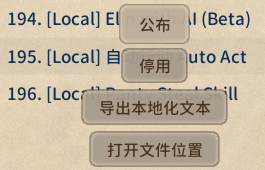

# 源表翻译

默认情况下，源表里包含英文列与日文列，比如 `name` 与 `name_JP`， `aka` 与 `aka_JP`。

源表应放入 `EN` 或 `JP` 文件夹。

## 为您的 Mod 添加翻译

若要为您的mod源表添加，除英语和日语以外的翻译：

1. 将游戏切换至目标语言。
2. 重启游戏以导出可翻译的条目。

此时，您的模组的 `LangMod/XX` 文件夹中，会出现 `SourceLocalization.json` 文件（  `XX` 是当前语言的代码，比如中文是 `CN` ）。

接下来，编辑该 `json` 文件即可翻译源表。

> [!NOTE] 提示
> 如何翻译 drama 表 和 `dialog.xlsx` ，请参阅下方的 [此章节](#drama-and-dialog)。

## 为他人 Mod 添加翻译 {#translating-other-mods}

### 发布翻译补丁 Mod

如果您想为其他 Mod 提供翻译：

1. 复制他人 Mod 的本体，到本地的 Package 文件夹中。（ `<游戏安装目录>/Elin/Package`）
2. 以你想要翻译成的语言启动游戏。

此时，模组的 `LangMod/XX` 文件夹中，会出现 `SourceLocalization.json` 文件（  `XX` 是当前语言的代码，比如中文是 `CN` ）。

接下来，编辑该 `json` 文件即可翻译源表。

而 drama 表和 `dialog.xlsx` 的翻译，请参阅下方的 [此章节](#drama-and-dialog)。

完成翻译后，你可以：
- 将翻译文件发送给 Mod 作者。
- 发布一个独立的翻译补丁 Mod，仅包含 `SourceLocalization.json`，**不要包含源表**。

关于发布翻译补丁 Mod，请参阅：[模组包](../2_Getting%20Started/basic_mod)。

### 更新翻译补丁 Mod

当原 Mod 更新后：

1. 将最新版他人 Mod 放入到本地的 Package 文件夹中。
2. 将您已有的 `SourceLocalization.json` 放回原 Mod 的 `LangMod/XX` 文件夹。
3. 启动游戏。

游戏会自动向 `SourceLocalization.json` 中追加新增但尚未翻译的源表条目。

完成新增内容的翻译后，更新您的mod即可。关于如何更新，请参阅：[模组包](../2_Getting%20Started/basic_mod) 页面的上传与更新章节。

> [!NOTE]提示
> drama 表和 `dialog.xlsx` 不会自动追加新增内容，需要手动比对并翻译。

## 翻译 drama 表和 `dialog.xlsx` {#drama-and-dialog}

drama 表与 `dialog.xlsx` 不使用 `json` 来翻译，而是直接翻译对应的表格。（此外，严格来说，它们也不是源表）

为您的 Mod 添加翻译：

可以参考下面的 Tiny Mita 示例 Mod：

<LinkCard t="CWL 示例：Tiny Mita" u="https://steamcommunity.com/sharedfiles/filedetails/?id=3396774199" i="https://raw.githubusercontent.com/gottyduke/Elin.Plugins/refs/heads/master/CwlExamples/TinyMita/preview.jpg" />

更多信息，请参阅：[Chara 角色](../10_Source%20Sheets/character) 和 [Drama 剧情](../10_Source%20Sheets/drama)

为他人 Mod 提供翻译：

1. 将原 Mod 的 drama 表与 `dialog.xlsx` 复制到目标语言文件夹的对应路径。（例如从 `EN` 或 `JP` 复制到 `CN`。）
2. 新增对应语言列，例如中文新增 `text_CN`。可以参考上章节的 Tiny Mita 示例Mod与文章。
3. 删除 `text_EN` 与 `text_JP`，但保留 `text` 列。

## 扩展知识

### 强制覆盖已有 json 文件

::: details 点击展开

正常情况下，启动游戏只会向 `SourceLocalization.json` 添加尚未翻译的新条目。

如果需要重新导出整个文件，可以：

1. 将 Mod 放入 `<游戏安装目录>/Elin/Package`。
2. 确保 Mod 名称带有 `[Local]` 前缀，并确保 Mod 已启用（蓝色文字）。
3. 将游戏切换至目标语言。
4. 点击 Mod，并选择 **导出本地化文本**。

<!-- 此按钮的中英日语版本：
导出本地化文本
Export texts for localization
ローカライゼーション用のテキストをエクスポート -->

系统会重新生成 `LangMod/XX/SourceLocalization.json`。

> [!WARNING] 注意
> 此操作会覆盖已有的 `SourceLocalization.json`，请提前备份。
:::

### 另一种方法翻译源表

::: details 点击展开
#### 另一种方法翻译源表

除了按照上文操作，直接在json文件里翻译外；您还可以先在源表里翻译，再导出为json文件。

我们先来了解一下前置知识，以 `name_JP` 和 `name` 这样的一组为例子：
+ 组中带有 `_JP` 后缀的是日文列
+ 组中无后缀的是英语列，但也可以当作 **翻译列**使用
+ 如： `aka_JP` 与 `aka`等，也是一组日文列+翻译列。
+ 不在组中且无后缀的，是游戏数据列等，不要翻译。

因此，您可以先将源表复制到 `LangMod/XX` 文件夹中，

以翻译的目标语言为中文时为例：
+ 复制 `LangMod/EN` 或 `LangMod/JP` 文件夹中的源表，粘贴到 `LangMod/CN`中，
+ 对组中无后缀的翻译列进行翻译。
+ 翻译后，按照上文强制覆盖json文档时的操作，点击按钮覆盖已有json，并删除刚刚粘贴过来的源表。

您只需要保证mod内有一份源表，且位于 `EN` 或 `JP` 文件夹之一即可。若您为他人mod提供翻译，则不需要提供源表，只需在对应语言文件夹中放入 `json` 翻译文件即可，因为原mod中已经有一份源表了。

可以使用 [JSONLint](https://jsonlint.com/) 检查 json 格式是否正确。

这种方式适合古法手工翻译。而上文 [先导出json的方式](#translating-other-mods)，更适合ai翻译。ai翻译时记得让ai总结译名表。

#### 步骤二 drama 表和 `dialog.xlsx`

此时源表已经完成翻译，但别忘了 drama 表和 `dialog.xlsx`，它们并不使用 json 来翻译。

请参考上文 [此章节](#drama-and-dialog) 来完成翻译

若以ai翻译，记得使用步骤一 总结的译名表。
:::

## 工具

如果你没有使用代码编辑器，可以使用 [JSONLint](https://jsonlint.com/) 来验证你的 JSON 格式
