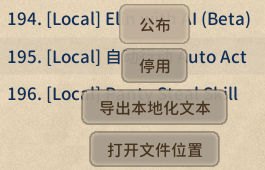

# 源表翻译

源表默认有英文列和日文列，比如 `name` 与 `name_JP`、`aka` 与 `aka_JP`。

源表应放入 `EN` 或 `JP` 文件夹。游戏其实不强制这一点，一个 mod 完全可以只有一份放在 `CN` 里的源表，`name` 列直接写中文；但大家默认会去 `EN` / `JP` 里找。

另外，`SourceLocalization.json` 的优先级永远高于源表里的列，`EN` 和 `JP` 也不例外。如果某条文本在 json 里已经有了，改源表的 `name` 看起来会毫无反应。

## 为您的 Mod 添加翻译

要为您的 Mod 源表添加英语和日语以外的翻译：

1. 确保 Mod 位于本地 `Package` 文件夹中（创意工坊副本不会自动导出）。
2. 将游戏切换至目标语言，可翻译条目会立即导出（重启游戏也可以）。

这时，模组的 `LangMod/XX` 文件夹里会出现 `SourceLocalization.json` 文件（`XX` 是当前语言的代码，比如中文是 `CN`）。

编辑这个 `json` 文件即可翻译源表。

> [!NOTE] 提示
> drama 表和 `dialog.xlsx` 的翻译方法见[下方章节](#drama-and-dialog)。

## 为他人 Mod 添加翻译 {#translating-other-mods}

### 发布翻译补丁 Mod

如果您想为其他 Mod 提供翻译：

1. 把他人 Mod 的本体复制到本地的 Package 文件夹（`<游戏安装目录>/Elin/Package`）。
2. 用目标语言启动游戏。

这时，模组的 `LangMod/XX` 文件夹里会出现 `SourceLocalization.json` 文件（`XX` 是当前语言的代码，比如中文是 `CN`）。

编辑这个 `json` 文件即可翻译源表。

drama 表和 `dialog.xlsx` 的翻译见[下方章节](#drama-and-dialog)。

完成翻译后，你可以：
- 将翻译文件发送给 Mod 作者。
- 发布一个独立的翻译补丁 Mod，仅包含 `SourceLocalization.json`，**不要包含源表**。

关于发布翻译补丁 Mod，请参阅：[模组包](../2_Getting%20Started/basic_mod)。

### 更新翻译补丁 Mod

当原 Mod 更新后：

1. 将他人 Mod 的最新版放入本地的 Package 文件夹。
2. 将您已有的 `SourceLocalization.json` 放回原 Mod 的 `LangMod/XX` 文件夹。
3. 启动游戏。

游戏会自动向 `SourceLocalization.json` 中追加新增但尚未翻译的源表条目，并移除源表中已不存在的条目。

翻译完新增内容后，更新您的 Mod 即可，更新方法见[模组包](../2_Getting%20Started/basic_mod)页面的上传与更新章节。

> [!NOTE]提示
> drama 表和 `dialog.xlsx` 不会自动追加新增内容，需要手动比对并翻译。

## 翻译 drama 表和 `dialog.xlsx` {#drama-and-dialog}

drama 表与 `dialog.xlsx` 不使用 `json` 来翻译，而是直接翻译对应的表格。（严格来说，它们也不是源表。）

为您的 Mod 添加翻译：

可以参考下面的 Tiny Mita 示例 Mod：

<LinkCard t="CWL 示例：Tiny Mita" u="https://steamcommunity.com/sharedfiles/filedetails/?id=3396774199" i="https://raw.githubusercontent.com/gottyduke/Elin.Plugins/refs/heads/master/CwlExamples/TinyMita/preview.jpg" />

更多信息见 [Chara 角色](../10_Source%20Sheets/character) 和 [Drama 剧情](../10_Source%20Sheets/drama)。

为他人 Mod 提供翻译：

1. 将原 Mod 的 drama 表与 `dialog.xlsx` 复制到目标语言文件夹的对应路径。（例如从 `EN` 或 `JP` 复制到 `CN`。）
2. 新增对应语言列，例如中文新增 `text_CN`。可以参考上文的 Tiny Mita 示例 Mod 与相关文章。
3. 删除 `text_EN` 与 `text_JP`，但保留 `text` 列。删之前先确认每一行都填了 `id`：没有 `id` 的行只会读 `text_JP`，删掉那一列它就一个字都不显示了。

## 扩展知识

### 强制覆盖已有 json 文件

::: details 点击展开

正常情况下，启动游戏只会向 `SourceLocalization.json` 添加尚未翻译的新条目（并移除源表中已不存在的条目）。

如果需要重新导出整个文件，可以：

1. 将 Mod 放入 `<游戏安装目录>/Elin/Package`。
2. 确保 Mod 名称带有 `[Local]` 前缀，并确保 Mod 已启用（蓝色文字）。
3. 将游戏切换至目标语言。
4. 点击 Mod，选择**导出本地化文本**。

<!-- 此按钮的中英日语版本：
导出本地化文本
Export texts for localization
ローカライゼーション用のテキストをエキスポート -->

系统会重新生成 `LangMod/XX/SourceLocalization.json`。

> [!WARNING] 注意
> 此操作会整体重写 `SourceLocalization.json`。已加载的翻译会被保留，但游戏上次读取该文件之后手工编辑的内容会丢失，请提前备份。
:::

### 另一种方法翻译源表

::: details 点击展开
#### 另一种方法翻译源表

除了按上文的方法直接在 json 文件里翻译，您还可以先在源表里翻译，再导出为 json 文件。

先了解列的分组规则，以 `name_JP` 和 `name` 这一组为例：
+ 组中带 `_JP` 后缀的是日文列
+ 组中无后缀的是英语列，但也可以当作**翻译列**使用
+ `aka_JP` 与 `aka` 等也是这样一组「日文列 + 翻译列」。
+ 不在组中且无后缀的是游戏数据列等，不要翻译。

因此，您可以先把源表复制到 `LangMod/XX` 文件夹中。

以目标语言为中文为例：
+ 复制 `LangMod/EN` 或 `LangMod/JP` 文件夹中的源表，粘贴到 `LangMod/CN` 中；
+ 翻译各组中无后缀的翻译列；
+ 翻译完成后，按上文「强制覆盖已有 json 文件」的步骤点击按钮覆盖已有 json，再删除刚才粘贴过来的源表。

Mod 里只需要有一份源表，放在 `EN` 或 `JP` 文件夹之一即可。为他人 Mod 提供翻译时不需要附带源表，原 Mod 里已经有一份了，只需在对应语言文件夹中放入 `json` 翻译文件。

可以使用 [JSONLint](https://jsonlint.com/) 检查 json 格式是否正确。

这种方式适合古法手工翻译；上文[先导出 json 的方式](#translating-other-mods)更适合 AI 翻译。用 AI 翻译时，记得让 AI 总结一份译名表。

#### 步骤二 drama 表和 `dialog.xlsx`

此时源表已经翻译完了，但别忘了 drama 表和 `dialog.xlsx`，它们不用 json 翻译。

翻译方法见上文[此章节](#drama-and-dialog)。

如果用 AI 翻译，记得使用步骤一总结的译名表。
:::

## 工具

如果你不用代码编辑器，可以用 [JSONLint](https://jsonlint.com/) 检查 JSON 格式是否正确。
