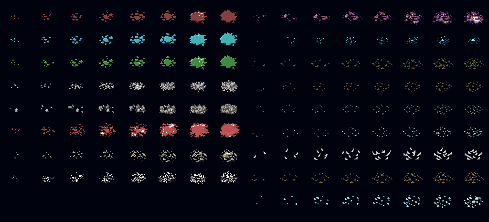

# 材质表 (Material)

<LinkCard t="SourceBlock/Material" u="https://docs.google.com/spreadsheets/d/13oxL_cQEqoTUlcWsjKZyNuAaITFGK56v/edit?gid=580505110#gid=580505110" />

**制作源表时，必须完整复制官方源表的前三行，并将你的数据从第四行开始录入。**

::: details 关于列、空行和空格子
**缺少的列会被静默填成空值**，不会有任何报错——所以请把官方表的表头整行复制过来，不要删列，也不要改变列的顺序。

**`id` 留空的那一行会中止整张表的读取**，它之后的所有行都不会被载入，同样没有提示。除非你是有意为之，否则不要用空行给数据分组。

**空格子不等于空值**——游戏会回落到第 3 行的默认值。本表的默认值有：`thing`=`chunk`、`decal`=2、`defFloor`/`defBlock`=1、`ramp`=6、`hardness`=1、`chance`=1000、`weight`=100、`value`=100、`quality`=1、`dice`=100。

你也可以改第 3 行的默认值，让它作用到其余所有行。你的数据应从第 4 行开始录入。
:::

## 表格列

|列|类型|描述|
|-|-|-|
|id|整数|材质的唯一数字标识符。若与官方条目或其他模组的条目 ID 相同，最后加载的表格将覆盖之前的。请使用足够大且唯一的值以避免冲突。|
|alias|文本|材质别名，用于在其他表格中引用（例如 Thing 的 `defMat` 列）。|
|name_JP|文本|日文显示名称。|
|name|文本|英文显示名称。其他语言请使用 [`SourceLocalization`](./localization)。|
|category|文本|材质类别。本体在用的取值有 `gem`、`soil`、`wood`、`ore`、`fiber`、`rock`、`crystal`、`water`、`grass`、`skin`、`organic`、`bone`。注意金属和皮革不在这里——它们是 `groups` 列的值。|
|tag|文本[]|特殊行为标签。使用 `addColorMain(RRGGBBAA)` 和 `addColorAlt(RRGGBBAA)` 定义自定义材质的颜色。参见下方 [自定义材质](#自定义材质)。|
|thing|文本|该材质拆解时关联的 Thing ID。|
|goods|文本[]|可视为未使用。|
|minerals|文本[]|可视为未使用。|
|decal|整数|贴花/血迹叠加 ID。参见 [Decal](#decal)。|
|decay|整数|使用该材质制作的物品的腐烂速率。|
|grass|整数|可视为未使用。|
|defFloor|整数|默认 SourceFloor 图块 ID。|
|defBlock|整数|默认 SourceBlock 图块 ID。|
|edge|整数|可视为未使用。|
|ramp|整数|斜坡方块图块 ID。|
|idSound|文本|撞击音效 ID。自定义音效放置在 `Sound/Material/` 文件夹中。|
|soundFoot|文本|脚步声 ID。自定义音效放置在 `Sound/Footstep/` 文件夹中。|
|hardness|整数|材质硬度；影响挖掘或加工该材质所需的工具等级。|
|groups|文本[]|材质层级组（例如 `metal`、`leather`）。|
|tier|整数|层级组中的材质等级。|
|chance|整数|层级组内的随机抽选权重。|
|weight|整数|材质自身重量。|
|value|整数|材质价值。|
|quality|整数|材质品质修正值。|
|atk|整数|作为装备材质时提供的攻击力加成。|
|dmg|整数|作为装备材质时提供的伤害加成。|
|dv|整数|作为装备材质时提供的 DV 加成。|
|pv|整数|作为装备材质时提供的 PV 加成。|
|dice|整数|伤害计算的骰子维度修正值。|
|bits|文本[]|防火或耐酸属性。|
|elements|元素|作为装备材质时提供的 SourceElement 加成。|
|altName|文本[]|作为装备材质时的独特名字前缀。|
|altName_JP|文本[]|作为装备材质时的独特名字前缀，日语。|

## 自定义材质

默认情况下，游戏无法加载自定义材质，因为没有对应的颜色映射。要让自定义材质正确显示，必须在 `tag` 列中定义其颜色。

### 颜色标签

在材质行的 `tag` 列中使用 **`addColorMain(color_hex)`** 和 **`addColorAlt(color_hex)`** 来定义材质的主颜色和替代颜色。

颜色格式为 **RRGGBBAA**（8 位十六进制）：
- **RR**：红色（`00`–`ff`）
- **GG**：绿色（`00`–`ff`）
- **BB**：蓝色（`00`–`ff`）
- **AA**：Alpha/不透明度（`00`–`ff`）

示例：
```
addColorMain(ffff00ff),addColorAlt(ff0000ff)
```

这将主颜色设为黄色（完全不透明），替代颜色设为红色（完全不透明）。

::: warning 颜色格式
颜色十六进制字符串**不区分大小写**，且**不能**以 `#` 或 `0x` 开头。
:::

## Decal



索引从左上角的 2 开始。每行包含 2 组贴花，每组有独立的数字索引。
