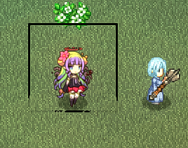

# 我要更大的空间

默认的128x128像素尺寸的画布，可能无法满足您的需求。您可以使用更大尺寸的画布（长宽均大于128的任意矩形）。

若使用更大尺寸的画布，请确保其居中对齐（使图形中心点，位于画布中心位置）：

|**128x128**|**256*256**|
|-|-|
|||

为使您的角色 / 物品，能正确显示为头像和小图标，请在 [pref 文件](./pref) 中调整 `pivotX`, `pivotY`, 和 `scaleIcon` 。
+ 比如：居民告示板显示的头像，若有偏移问题，就需要调整上述内容。

::: tip 是要更大的画布，还是更清晰的贴图？
放大画布会让素材在游戏内**占据更大的空间**，这正是本页讲的内容。

如果你想要的是*尺寸不变*但分辨率更高，请保持画布比例，并用 [`scaleTex`](./pref) 声明贴图密度：一张 256x256 的贴图配 `scaleTex = 200`，渲染出来与 128x128 完全一样大，只是更清晰，而且 pref 里其他数值都不需要重调。
:::

> 256像素图片画师： Veila
