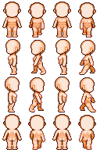

# PCC

玩家的像素小人、衣服等配件都属于PCC（坐骑也是PCC）。

你不仅能做衣服，甚至可以制作人鱼尾、狐狸尾，以及把主角改成史莱姆。

## PCC 画布

PCC 本质是由16个图块构成的精灵表（sprite sheet），每个图块都是32×48像素。

每一行代表一个方向，每一列代表一个帧。

## 图层与路径

PCC 部件采用以下图层顺序:

* hairbk
* mantle
* body
* undie
* boots
* pants
* cloth
* chest
* belt
* glove
* eye
* hair
* subhair
* face
* head
* etc
* mantlebk

`hairbk` 和 `mantlebk` 分别是其对应图层的背面视图

## 图片命名

PCC部件必须遵循此格式:
`pcc_layer_uniqueId.png`

例子:

* `pcc_face_mypccmod01`
* `pcc_cloth_customwardrobe3`

 `uniqueId` 即独特ID，必须遵循下列规则：

* 保持唯一以避免冲突
* 不包含下划线 (`_`)
* 建议不含中文

## 文件位置

把人物 PCC 图片文件放入 `Actor/PCC/female` 文件夹（注意：游戏内无论男女角色，该路径均固定包含 female）；把坐骑的 PCC 图片文件放入 `Actor/PCC/ride` 文件夹。

这两个文件夹都在你的 `游戏安装目录/Elin/Package/自定义mod文件夹名字` 内，详情请移步 [mod package](../2_Getting%20Started/basic_mod)。

## 更大画布

如果要创建大于 32×48 的图块，请安装 Variable Sprite Support 模组。

注意：即使使用了此 Mod，贴图在游戏内仍会缩放到与原版 PCC 相近的大小，无法直接做出“巨人”效果。
