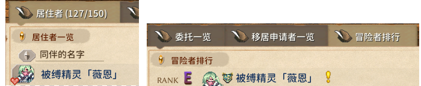

# Pref 文件

当贴图的默认渲染设置不理想时，您可以创建一个与贴图同名的 `.pref` 文件来自定义渲染。

它可以用来调整：贴图、阴影、居民告示板上NPC头像小图标、冒险者排行的图标 等等

创建 `.pref` 文件时，只需创建一个 `.txt` 文件，然后更改后缀为 `.pref`。使用记事本其他文本编辑器均可。

::: tip 提示
`.pref` 文件是热加载的，修改后无需重启游戏，即可实时预览效果。

因此你可以先创建一个 `.pref` 文件，再对照游戏里的显示效果，来不断尝试数值。
:::

## 文件内容

完整的文件如下，但您可以省略任何未使用的行。

英文分号 `;` 开头的注释也可以使用。该文件采用 INI 格式，数值只能是整数。

```ini
x = 0
y = 0
z = 0
pivotX = 0
pivotY = 0
shadow = 0
shadowX = 0
shadowY = 0
shadowRX = 0
shadowRY = 0
shadowBX = 0
shadowBY = 0
shadowBRX = 0
shadowBRY = 0
height = 0
heightFix = 0
scaleIcon = -40
liquidMod = 0
liquidModMax = 0
hatY = 0
equipX = 0
equipY = 0
stackX = 0
```

每行的说明，请看下文详细说明章节。

## 详细说明

+ `x`, `y`, `z` 位置偏移量
+ `pivotX`, `pivotY` 中心点（Pivot）偏移量，如：居民告示板上角色的头像小图标
+ `shadow` 阴影数据 ID （见下面章节）
+ `shadowX`, `shadowY` 阴影位置偏移量
+ `shadowRX`, `shadowRY` 阴影反向偏移量
+ `shadowBX`, `shadowBY` 阴影背面偏移量
+ `shadowBRX`, `shadowBRY` 阴影背面反向偏移量
+ `height` 地块高度修正值
+ `heightFix` 文本组件高度偏移（用于悬浮的小部件）
+ `scaleIcon` 图标缩放比例
+ `liquidMod` 地块液体高度修正值（可为负）
+ `liquidModMax` 地块液体高度上限
+ `hatY` 帽子渲染器的 Y 轴偏移量
+ `equipX`, `equipY` 手持物位置偏移量
+ `stackX` 地块堆叠的 X 轴偏移量


## 阴影数据 ID

<!--@include: ./assets/shadow_data.md-->

## 示例mod

### 修改影子渲染

<LinkCard t="庭院之主钢管舞" u="https://steamcommunity.com/sharedfiles/filedetails/?id=3711895231" i="/pole.gif" />

此mod在`.pref`文件里，使用了 `shadow`修正影子

### 小图标

<LinkCard t="Lost Case Monster Girl Takeover" u="https://steamcommunity.com/sharedfiles/filedetails/?id=3609895215" i="https://images.steamusercontent.com/ugc/13866943819130003260/AF709B61B8CC0DB914A09239906A08359D2B0316/?imw=5000&imh=5000&ima=fit&impolicy=Letterbox&imcolor=%23000000&letterbox=false" />

此mod修改了角色在居民告示板、冒险者排行的图标显示。 在`.pref`文件使用了 `pivotX`和 `pivotY`。

**修正角色图标前：**


<p align="center" style="font-size: 14px; color: var(--vp-c-text-3);">左侧为居民告示板，右侧为冒险者排行</p>

**使用 `.pref`文件修正角色图标后：**



<p align="center" style="font-size: 14px; color: var(--vp-c-text-3);">左侧为居民告示板，右侧为冒险者排行</p>

本mod中此角色使用的pref数值：

```ini
pivotX=0
pivotY=-37
```

注意：
+ `.pref` 的文件名、贴图图片的文件名、加载mod的Excel表里的id列，这三者应一致。
+ `pivotX`和 `pivotY`同时影响居民告示板、冒险者排行；因此测试数值时应兼顾两处。
+ 基于 `.pref` 文件的热加载特性，你无需重启游戏；可对照游戏里的显示效果，来不断尝试数值。