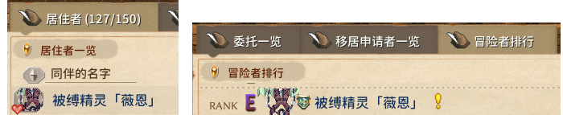
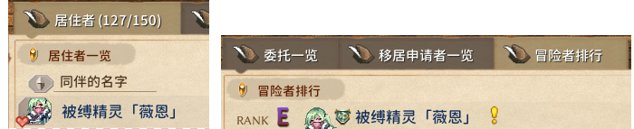

# Pref 文件

当贴图的默认渲染设置不理想时，您可以创建一个 `.pref` 文件来自定义渲染。

它可以用来调整：贴图、阴影、居民告示板上NPC头像小图标、冒险者排行的图标 等等

创建 `.pref` 文件时，只需先创建一个 `.txt` 文本文件，然后将其重命名为 `id.pref`（这里的 `id` 需对应你的角色或物品贴图 ID，文件后缀由 `.txt` 改为 `.pref`）。使用记事本或任何其他文本编辑器均可编辑。

::: tip 提示
`.pref` 文件是热加载的，修改后无需重启游戏，即可实时预览效果。

因此你可以先创建一个 `.pref` 文件，再对照游戏里的显示效果，来不断尝试数值。
:::

## 文件内容

完整的文件如下，但您可以省略任何未使用的行。

英文分号 `;` 开头的注释也可以使用。该文件采用 INI 格式，数值只能是整数。

```ini
x = 0
y = 0
z = 0
pivotX = 0
pivotY = 0
shadow = 0
shadowX = 0
shadowY = 0
shadowRX = 0
shadowRY = 0
shadowBX = 0
shadowBY = 0
shadowBRX = 0
shadowBRY = 0
height = 0
heightFix = 0
scaleIcon = -40
scaleTex = 100
liquidMod = 0
liquidModMax = 0
hatY = 0
equipX = 0
equipY = 0
stackX = 0
```

每行的说明，请看下文详细说明章节。

## 详细说明

+ `x`, `y`, `z` 位置偏移量
+ `pivotX`, `pivotY` 中心点（Pivot）偏移量，如：居民告示板上角色的头像小图标
+ `shadow` 阴影数据 ID （见下面章节）
+ `shadowX`, `shadowY` 阴影位置偏移量
+ `shadowRX`, `shadowRY` 阴影反向偏移量
+ `shadowBX`, `shadowBY` 阴影背面偏移量
+ `shadowBRX`, `shadowBRY` 阴影背面反向偏移量
+ `height` 地块高度修正值
+ `heightFix` 文本组件高度偏移（用于悬浮的小部件）
+ `scaleIcon` 图标缩放比例
+ `scaleTex` 贴图的像素密度，以默认密度的百分比表示（见下面章节）；`0` 和 `100` 都表示默认
+ `liquidMod` 地块液体高度修正值（可为负）
+ `liquidModMax` 地块液体高度上限
+ `hatY` 帽子渲染器的 Y 轴偏移量
+ `equipX`, `equipY` 手持物位置偏移量
+ `stackX` 地块堆叠的 X 轴偏移量

## 高清贴图

默认情况下，贴图按每世界单位 100 像素渲染，所以像素更多的贴图只会**变大**，而不会变清晰。`scaleTex` 用来告诉游戏你的贴图密度是多少，从而让高分辨率贴图在游戏内占据完全相同的尺寸。

规则只有一条公式——保持世界尺寸不变：

```
世界尺寸 = 画布像素 / scaleTex * 100
```

| 原始素材 | 高清版 | scaleTex | 世界高度 | 结果 |
| --- | --- | --- | --- | --- |
| 128x256 | 256x512 | 200 | 2.56 | 尺寸不变，清晰度 2 倍 |
| 128x256 | 512x1024 | 400 | 2.56 | 尺寸不变，清晰度 4 倍 |
| 128x128 | 384x384 | 300 | 1.28 | 尺寸不变，清晰度 3 倍 |

`.pref` 里的其他数值——`y`、`heightFix`、`pivotY`、`shadowX`、`equipY` 等等——都以世界单位表示。只要世界尺寸没变，**它们全部继续有效，无需重新调整**。这正是 `scaleTex` 的意义：换用更清晰的贴图，不应该让你已经调好的位置参数作废。

::: warning
`scaleTex` 必须与你实际放大过的贴图配套。如果保持原贴图不变却设置 `scaleTex = 200`，世界尺寸会减半，素材不仅变小，**还会浮空**——贴图以中心为锚点，缩小时底边会随之上移。

设置 `scaleTex` 后如果出现浮空，几乎总是意味着贴图没有相应放大。
:::

::: tip
建议使用整数倍率（`200`、`300`、`400`）。贴图采用最近邻过滤，`scaleTex = 80` 这样的非整数密度会让一部分像素行占 1 个屏幕像素、另一部分占 2 个，产生不均匀的锯齿边缘。
:::

另外，地块和物件本身是按每世界单位 50 像素绘制的，也就是说它们目前是以 2 倍放大显示的。对这类素材而言，`scaleTex = 200` 能得到屏幕上真正 1:1 的像素映射——完全没有重采样，是最锐利的结果。

## 阴影数据 ID

<!--@include: ./assets/shadow_data.md-->

## 示例mod

### 修改影子渲染

<LinkCard t="庭院之主钢管舞" u="https://steamcommunity.com/sharedfiles/filedetails/?id=3711895231" i="/pole.gif" />

此mod在`.pref`文件里，使用了 `shadow`修正影子

### 小图标

<LinkCard t="Lost Case Monster Girl Takeover" u="https://steamcommunity.com/sharedfiles/filedetails/?id=3609895215" i="https://images.steamusercontent.com/ugc/13866943819130003260/AF709B61B8CC0DB914A09239906A08359D2B0316/?imw=5000&imh=5000&ima=fit&impolicy=Letterbox&imcolor=%23000000&letterbox=false" />

此mod修改了角色在居民告示板、冒险者排行的图标显示。 在`.pref`文件使用了 `pivotX`和 `pivotY`。

**修正角色图标前：**



<p align="center" style="font-size: 14px; color: var(--vp-c-text-3);">左侧为居民告示板，右侧为冒险者排行</p>

**使用 `.pref`文件修正角色图标后：**



<p align="center" style="font-size: 14px; color: var(--vp-c-text-3);">左侧为居民告示板，右侧为冒险者排行</p>

本mod中此角色使用的pref数值：

```ini
pivotX=0
pivotY=-37
```

注意：
+ `.pref` 的文件名、贴图图片的文件名、加载mod的Excel表里的id列，这三者应一致。
+ `pivotX`和 `pivotY`同时影响居民告示板、冒险者排行；因此测试数值时应兼顾两处。
+ 基于 `.pref` 文件的热加载特性，你无需重启游戏；可对照游戏里的显示效果，来不断尝试数值。