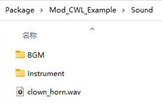

## 自定义音频

音频文件应为 **acc**、**mp3**、**ogg**、**wav** 格式之一，文件名作为音频ID。使用音频时会生成默认的同名元数据JSON，允许您编辑并在在下次游戏启动时应用音频文件元数据。

通过在元数据中设置`"type": "BGM"`，音频将作为 **BGMData** 而不是 **SoundData** 实例化。您还可以在元数据中自定义BGM的小节部分。

**Sound** 文件夹中的子目录将作为音频ID前缀。例如，**AI_PlayMusic** 将使用 **Instrument/sound_id**，因此如果您打算替换乐器音乐，应该将同名音频文件放在 **Instrument** 文件夹中。

**您可以使用相同的ID覆盖现有的游戏内音频**。例如，小鸡的叫声使用ID **Animal/Chicken/chicken**，那么您可以在 **Sound/Animal/Chicken/** 文件夹中准备一个名为 **chicken** 的音频文件来覆盖它。

任何使用音频的地方都可以通过ID播放自定义音频。

例如：

```cs
pc.PlaySound("clown_horn"); // <- Card.PlaySound
SE.PlaySound("clown_horn");
```
