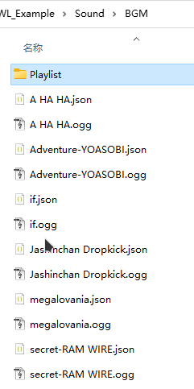

## 自定义BGM

游戏自带100+首BGM，它们拥有一个数字ID和音频ID。
::: details BGM 列表
|BGM ID|音频 ID|BGM 名称|
<!--@include: ./assets/bgm_items.md-->
:::

## 添加新BGM

自定义BGM放置在 **Sound/BGM** 子文件夹中，与自定义音效不同，您需要手动编辑元数据 JSON 中的 `id` 字段。确保先启动游戏一次，以便生成文件。

建议使用 **ogg** 格式，可以避免出现解码错误并启用流式加载。

`id` 是一个任意独特数字，设置为大于游戏最后使用的BGM ID，并足够独特以避免撞车。

**重要说明，** 这个 `id` 仅用于BGM。您的音效 ID 仍然是不含拓展名的文件名，例如 **`BGM/Happy Birthday`**

## 替换BGM

当您将现有的 `id` 分配给您的BGM时，它就会成为全局BGM替换。例如，将 `56` 分配给歌曲元数据 `Adventure-YOASOBI.json`，游戏中的BGM `056 orc01` 将会被 `Adventure-YOASOBI` 替换。这就是为什么您希望您的新BGM（非替换音乐）使用唯一的 `id`，否则下一个具有相同 `id` 的BGM将替换您的音乐。

> `056 orc01` 是标题菜单的BGM。
