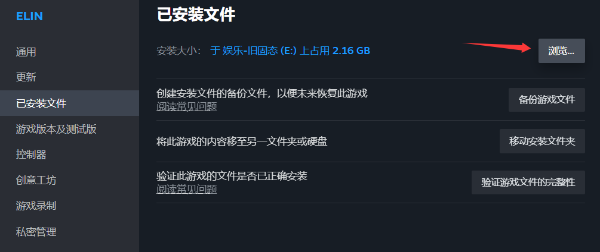
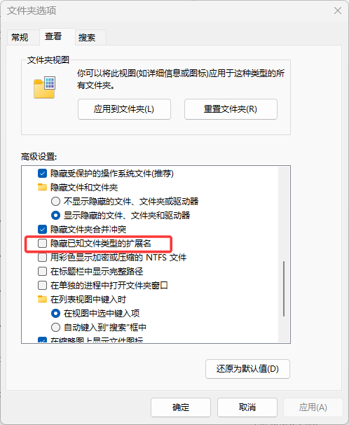
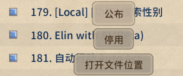

# Elin 模组包 （Mod Package）

Elin 支持多种模组类型，本文介绍创建一个基础示例模组的步骤。

## Mod文件夹

你本地开发的模组应该放在 `游戏安装目录/Elin/Package/<ModName>` 文件夹下。

**打开方式：** 在 Steam 库中右键点击 Elin，选择 **“属性”** > **“已安装文件”**：


然后点击 **“浏览...”** 并打开 `Package` 文件夹。这里是存放本地模组的地方，包括 Elin 自身的核心文件。为你的模组创建一个新文件夹，所有的模组内容都将放在其中。


## 显示文件扩展名

接下来的操作，必须将文件扩展名设置为非隐藏状态：


::: details Windows 10
+ 打开文件资源管理器；如果你任务栏中没有此图标，请点击“开始”，点击“Windows 系统”，然后点击“文件资源管理器”。
+ 点击文件资源管理器中的“查看”选项卡。
+ 勾选“文件扩展名”旁边的复选框以查看文件扩展名。
:::

::: details Windows 11
+ 打开文件资源管理器；如果你任务栏中没有此图标，请点击“开始”，点击“Windows 系统”，然后点击“文件资源管理器”。
+ 点击文件资源管理器中的“查看”下拉菜单。
+ 点击“显示”选项并勾选“文件扩展名”；
:::

## 预览图 / 缩略图 （preview.jpg）

预览图将用作创意工坊页面的缩略图。它必须命名为 `preview`，格式为 `.jpg`，且大小最好在 1MB 以下，否则你可能会遇到上传问题。


## 编写 package.xml

`package.xml` 用于描述该模组。在模组文件夹中创建一个新的txt，并将其**名称**和**扩展名**更改为 `package.xml`：


使用编辑器打开它（不要用 Chrome 或浏览器），并填写以下信息：
```xml
<?xml version="1.0" encoding="utf-8"?>
<Meta>
  <title>模组的标题</title>
  <id>my.veryunique.modid</id>
  <author>作者名字</author>
  <loadPriority>100</loadPriority>
  <version>0.23.50</version>
  <tags></tags>
  <description>
  </description>
  <builtin>false</builtin>
</Meta>
```

（类似 `<id>` 与 `</id>` 是一组标签）

**下面是每行的详细说明：**

### title

你的模组标题。在此标签内输入模组的标题。当你首次将模组上传至创意工坊时，此标签内的文本将显示为模组的标题。

当更新mod时，此文本不会影响创意工坊里的名字，只会影响游戏内mod查看器显示的文本。若想修改创意工坊标题，请去创意工坊修改

例子： `<title>My Elin Mod</title>`

### id

输入一个唯一 ID 来标识您的模组。如果该 ID 与他人的模组冲突，上传将会失败。请选择一个足够特别的 ID ，以避免与其他模组冲突。

例子： `<id>my.veryunique.modid</id>`

::: danger 更新模组时
发布后，不要更改模组的 **`id`** ，否则会被视为新模组而无法更新。
:::

### author

在此处输入mod作者名称（你的网名），你可以随意填写任何内容。

例子： `<author>Me, Myself, and I</author>`

### loadPriority

模组加载的顺序。请输入任意数字（例如0或更大的数值）。数字越小的模组会越先加载。

例子： `<loadPriority>100</loadPriority>`

### version

填写您的模组最后确认可兼容的Elin主游戏版本。目前若非必要，可不必频繁更新此数值。

当Elin主游戏对模组机制进行重大变更时，版本号低于主游戏更新版本的模组将不再被加载。

<del>很多人填1.14.514</del>

::: warning
这**不是**您的模组版本号！请将此版本设置为您的游戏版本。
:::

例子： `<version>0.23.212</version>`

### tags

为创意工坊指定tag，如果使用多个tag，请用英文逗号(`,`)分隔。你可以注册任意喜欢的标签。

使用官方tag，将使你的模组出现在创意工坊分类中。（创意工坊点选分类，就能查看此分类的mod。所以正确打tag，能有更多订阅者）

<LinkCard t="官方tag" u="https://docs.google.com/document/d/e/2PACX-1vR7MjQ_5hAmavFB8iMW6xm7vSYJg_g8I1s8KtvjBO-N_zNATnsmdmyQsmxQ8z9yEpZxNoc-TTdZm8so/pub"/>

例子： `<tags>General,QoL,Utility,My Fun Mods,Use With Caution</tags>` 

### description

你的模组描述。这段文本将作为模组首次上传至创意工坊时显示的描述。

**更新你的模组时**，这段文字将被忽略。如果需要修改描述，请在创意工坊内进行。

例子： `<description />` （请在创意工坊页面填写具体描述）

### builtin

将此设置为 false。别担心，也别多想。

例子： `<builtin>false</builtin>`

### 可选: visibility

指定上传模组的可见性。可选值包括：
+ `Public`
+ `Unlisted`
+ `Private`
+ `FriendsOnly`

如果省略此标签，模组默认将以 `Public` （公开）上传。

例子： `<visibility>Unlisted</visibility>`

## 上传与更新

就这样，一个不执行任何功能的基础空模组已经创建完成。启动 Elin 并打开模组查看器页面，找到你的模组，它应该会显示为 `[Local]` ，因为它此时是位于 `Package` 文件夹的本地模组

点击你的模组，应该能看到 `发布` 按钮. 如果该模组尚未被发布到创意工坊，它将会被发布。

更新模组时，同上操作，点击 `发布`。

发布模组前请将相关应用保存并关闭，如使用Excel填表时若不关闭会导致上传更新失败


