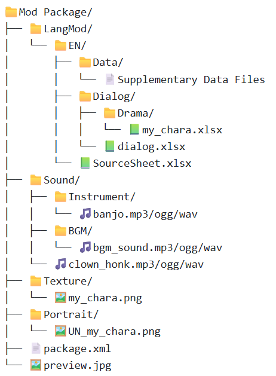
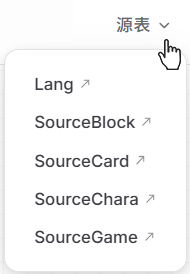
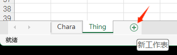
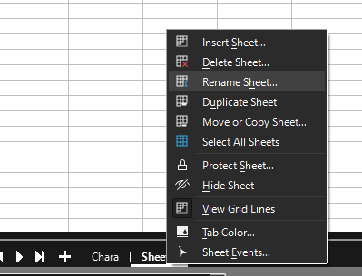

# 简介

无需编程，通过填写Excel表格（xlsx 文件）即可制作大部分mod。

通过创建包含必要文件的[模组包](./basic_mod)，并使用正确的 xlsx 文件，你可以将各种各样的东西添加到 Elin 中。

关于如何填写 xlsx 文件，请移步总目录的 `源表` 分区。<!--Menu=总目录=メニュー。Texture Mods=贴图模组=テクスチャMOD-->

::: details  原理简述
+ 模组包内 package.xml 和 preview.jpg 让Elin能加载你的mod，并形成封面。当然，这需要模组包位于正确的文件路径。
+ 格式化的 xlsx 文件为游戏加入源数据（SourceData）。
:::


## 示例模组设置

完整的文件夹结构如下，但你可以省略除模组文件夹（Mod Package）、package.xml、preview.jpg以外，用不到的文件夹：



**LangMod** 文件夹包含以语言代码命名的子文件夹，不过一开始你只需要使用 `EN` 或 `JP` 之一即可。

在语言代码文件夹内，就是你放置模组数据的地方，比如你的 Excel 文件 (**.xlsx**)。此Excel 文件就是你的源表。

## 源表格 (Source Sheets)

在导航栏【源表】的下拉菜单中，查看 Elin 的官方源表：



::: details  找不到这个按钮？
  如果你屏幕较小，或者缩放太大，都可能看不见这个按钮。请点击汉堡菜单（三条横线），从而找到**源表**。
  
:::

在这里，你将找到开发者上传的所有源表，供模组制作者参考。

::: warning  注意
你可以参考它，来填写自己的源表。但请不要将官方源表已有的数据行，放入你的源表，否则会覆盖官方。

此外关于如何填写源表，请移步总目录的 `源表` 分区，那里有详细解释。
:::

确保你有读写 xlsx 文件的方法。它们是标准的基于 XML 的电子表格。
处理此类文件最常见的方法是使用 Microsoft Excel。其他选项包括 LibreOffice Calc 或 Google 表格。

云盘中有多个按类别划分的源文件。每个类别包含多个工作表（sheets）。当你打开其中一个文件时，在底部你可以看到包含的源表格。
确保这些工作表的名称与原始工作表名称之一匹配（例如 Chara、Race、Job）。

在制作你自己的源表格文件时，你需要确保格式正确。
你的整个模组可以只有一个包含各种工作表的 Source.xlsx 文件。

根据需要添加新工作表（点击 + 按钮）并在底部重命名它们（右键点击）以匹配原始的源表格。

|Excel|LibreOffice|
|-|-|
|||

支持的 `SourceData` 有： 
```txt:no-line-numbers
Chara, CharaText, Tactics, Race, Job, Hobby
Thing, ThingV, Food, Recipe, SpawnList, Category, Collectible, KeyItem
Element, Calc, Stat, Check, Faction, Religion, Zone, ZoneAffix, Quest, Area, HomeResource, Research, Person
GlobalTile, Block, Floor, Obj, CellEffect, Material
```

支持的 `SourceLang` 有： 
```txt:no-line-numbers
General, Game, List, Word, Note
```

请注意，这是**工作表名称**，而不是文件名。

你的源表内的工作表名称，必须与官方一致。而你的源表文件名，可以是 `自定义名称.xlsx` ，自定义名称可以使用 英语/数字，不要使用汉语。

为了方便整理：
+ 你可以将这些工作表放入一个 xlsx 文件中。
+ 也可以将这些工作表拆分到多个 xlsx 文件中。

## 数据行

所有源表格的数据行都应从第 4 行开始。（dialog.xlsx 例外，但我们稍后再讲）  
+ **第 1 行**是表头，包含每列代表的内容。不要更改此行。  
+ **第 2 行**是类型，包含每列应属于的数据类型。  
+ **第 3 行**是该列的默认值。  
+ **第 4 行**是你可以开始填写你想修改进游戏里的内容的地方。

在设置工作表时，你应该转到原始工作表并将前 3 行复制到你自己的工作表中。确保复制了整行。


## 快速总结

### Lang
- 语言文件。这有点难解释，但这些就是玩家将看到的文字，从日志到 UI 元素，包罗万象。
计划添加大量新内容的模组制作者应该熟悉这个文件，但如果你不打算编写代码，可能不需要在这里做太多修改。

### SourceCard
- Thing - 物品。
- ThingV - 物品的家具变体。
- Food - 食物及它们的属性。
- Recipe - 制作配方。
- SpawnList - 商店库存的生成列表，或哪些区域生成哪些怪物的列表。
- Category - 物品类别。
- Collectible - 垃圾物品，主要用于装饰或任务。
- KeyItem - 关键物品。

### SourceChara
- Chara - 角色条目。
- CharaText - 角色头顶上弹出的短语（Bark Text），或根据情景出现在日志中的文本。
- Tactics - 战斗 AI。决定每种战术风格在给定回合中采取哪种行动的权重。
- Race - 角色种族。
- Job - 角色职业。也可以被称为 Classes。
- Hobby - 角色爱好，每个角色至少有两个。

### SourceGame
- Element - 基本上所有的属性/技能/专长/法术/能力都存放在这里。
- Calc - 各种法术或能力的骰子计算。
- Stat - 状态，比如增益和减益效果 (Buffs and Debuffs)。
- Check - 不用管这个。
- Faction - 游戏阵营。这部分被严重硬编码。
- Religion - 游戏宗教（神的信仰）。
- Zone - 区域数据。
- ZoneAffix - 用于随机地牢（奈菲亚/nefias），添加前缀形容词。
- Quest - 任务数据，如描述、任务发布者是谁、任务名称是什么。
- Area - 可能的房间类型指定。
- HomeResource - 区域的各种属性状态。
- Research - 许可证书和奖励。
- Person - 显式定义的剧情演员。不是必须使用的。

### SourceBlock
- GlobalTile - 世界地图上使用的图块，指向当你进入时应该生成什么区域。这不包括预设位置（例如城市、地牢、地宫）。
- Block - 方块、墙壁、屋顶、楼梯。用于建造。
- Floor - 地板数据。不言自明。
- Obj - 物体数据。
- CellEffect - 应用于图块的额外效果。
- Material - 游戏中提供哪些材质。

## 除日语英语外的其他语言

### 前置知识

我们先来了解一下前置知识，以 `name_JP` 和 `name` 这样的一组为例子：
+ 组中带有 `_JP` 后缀的是日文列
+ 组中无后缀的是英语列，也是翻译列。

### 例子

以中文 `CN` 为例，创建一个 CN 文件夹。

1. 在EN 或 JP 文件夹之一填写源表，然后再复制到 CN 文件夹（不是官方源表）。源表的详细填写方法请移步总目录的 `源表` 分区。<!--Menu=总目录=メニュー。Texture Mods=贴图模组=テクスチャMOD-->
2. 开始翻译你的源表，不要动日文列，把上文无后缀的“翻译列”翻译为汉文。（不要动表头，还有其他列作为数据的英语）
3. 然后，你应将其导出为 `SourceLocalization.json` 的翻译文件并删除 `CN`文件夹中的源表。如何导出 `json`详见[Translation 翻译](../10_Source%20Sheets/localization)页面。你也可以先导出 `SourceLocalization.json`文件，再在 `json`文件里翻译为中文。

### 对中国玩家来说
制作mod时还可以：
1. 先在 `CN`文件夹中建立源表。源表的详细填写方法请移步总目录的 `源表` 分区。<!--Menu=总目录=メニュー。Texture Mods=贴图模组=テクスチャMOD-->
2. 在翻译列内写中文
3. 做完后再复制到EN文件夹中，翻译并填充英语列
4. 之后导出 `SourceLocalization.json` 的翻译文件并删除 `CN`文件夹中的源表。如何导出 `json`详见[Translation 翻译](../10_Source%20Sheets/localization)页面。

注意：无论你是否提供其他语言，日文列以及英语列（翻译列）都要填写内容（占位符）。所以过程中你可以先在日文列中填上中文占位。
