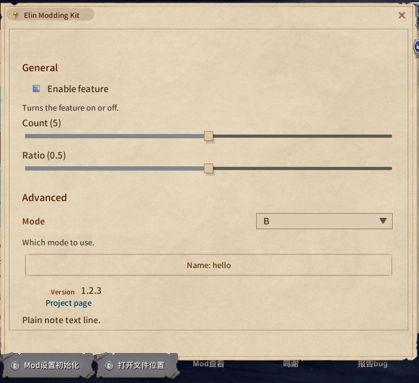

# Mod 配置页

每个 mod 都可以有自己的配置页，从 Mod 查看器里它那一行打开。BepInEx 插件靠 `Config.Bind` 过的条目自动生成；也可以通过实现 `IModConfig` 进行自定义布局设置。


生成的页面：


## 自己排版：`IModConfig`

插件实现 `IModConfig` **不再**自动生成页面：
`OnBuildConfig`：

| 扩展（`using EModding;`） | 得到什么 |
|-|-|
| `note.AddAll(Config)` | 整个自动生成的页面，含分节 |
| `note.Add(entry)` | 一条，控件按类型决定 |
| `note.AddSlider(entry, min, max, label = null)` | 用这里给的区间出滑条，不管条目自己声明了什么；值在区间外时显示夹紧值，拖动前不改它 |
| `note.AddDropdown(entry, values, label = null)` | 用这组候选出下拉，任何条目类型都行；当前值不在候选里时排在第一项 |

它们都直接读写条目、遵守 `SaveOnConfigSet`，标签走 `Lang.Get`。页面每次显示都会重建，所以不要缓存控件引用；不是 `ConfigEntry` 的状态放在自己的字段里，在回调中读写。

```cs
using System.Collections.Generic;
using BepInEx;
using BepInEx.Configuration;
using EModding;

[BepInPlugin("author.example", "Example", "1.0.0")]
public class ExamplePlugin : BaseUnityPlugin, IModConfig {
	public ConfigEntry<bool> enabled;
	public ConfigEntry<int> count;
	public ConfigEntry<string> preset;
	public string mode = "B", name = "hello";

	void Awake() {
		enabled = Config.Bind("General", "Enabled", true);
		count = Config.Bind("General", "Count", 5);
		preset = Config.Bind("General", "Preset", "b");
	}

	public void OnBuildConfig(UINote note) {
		note.AddHeader("General");
		note.Add(enabled);                                   // 开关
		note.AddSlider(count, 0, 100, "How many");           // 滑条，不需要 AcceptableValueRange
		note.AddDropdown(preset, ["a", "b", "c"]); // 固定候选

		note.AddHeader("Advanced");

		// 不是 ConfigEntry 的值用普通的 UINote 方法
		var modes = ["A", "B", "C"];
		var dd = note.AddDropdown("Mode");
		dd.SetList(modes.IndexOf(mode), modes, (m, i) => m, (i, m) => mode = m, false);
		note.AddText("Which mode to use.", FontColor.Passive);

		UIButton b = null;
		b = note.AddButton("Name: " + name, () => Dialog.InputName("Name", name, (cancel, text) => {
			if (cancel) return;
			name = text;
			b.mainText.text = "Name: " + text;
		}, Dialog.InputType.Chat));

		note.AddTopic("Version", Info.Metadata.Version.ToString());
		note.AddButtonLink("Project page", "https://example.com/");
	}
}
```

只想在自动页面后面加几个东西？先写 `note.AddAll(Config);`，然后往后追加。



想让自己的状态也参与重置按钮，把委托追加到包的 `onResetConfig` 上。BepInEx 条目的重置已经挂好了（`Config` 里所有条目，不管有没有画在页面上），这里只处理你自己的：

```cs
void Start() {
	var pkg = ModUtil.FindFileProviderPackage(new FileInfo(Info.Location));
	if (pkg != null) {
        pkg.onResetConfig += () => mode = "B";
    }
}
```

## `UINote` 速查

| 方法 | 得到什么 |
|-|-|
| `AddHeader(string)` / `AddHeaderTopic(string)` | 分节标题（自动页面用的就是它）/ 小标题 |
| `AddToggle(string label, bool isOn, Action<bool>)` | 开关，返回 `UIButton`（`interactable` 可禁用） |
| `AddSlider(float value, Func<float,string> action, float min = 0, float max = 1, bool isInt = false)` | 滑条，`action` 写值并返回标签，构建时也会用夹紧到区间的初始值调用一次，返回 `Slider` |
| `AddDropdown(string label)` | 左标签右下拉，返回 `UIDropdown`，用 `SetList(index, list, getName, onChange, notify: false)` 填 |
| `AddButton(string text, Action)` | 整行按钮，返回 `UIButton` |
| `AddText(string)` / `AddText(string, FontColor.Passive)` | 正文，自动换行撑高；`"NoteText_small"` 是固定 20px 的单行小字，多行会溢出 |
| `AddTopic(string label, string value)` | 左标签右值 |
| `AddButtonLink(string text, string url)` | 链接 |
| `Space(int height)` | 空行 |
| `AddImage(Sprite)` / `AddPrefab(string path)` | 图片 / 自带 prefab |
